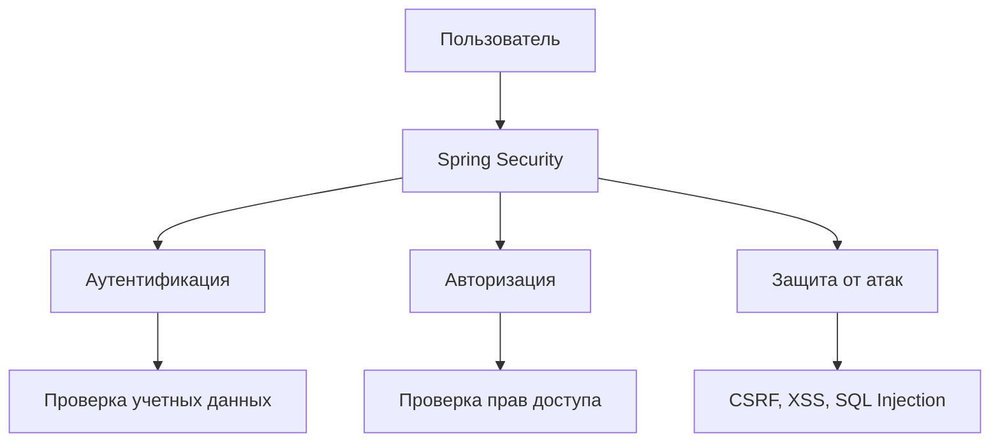
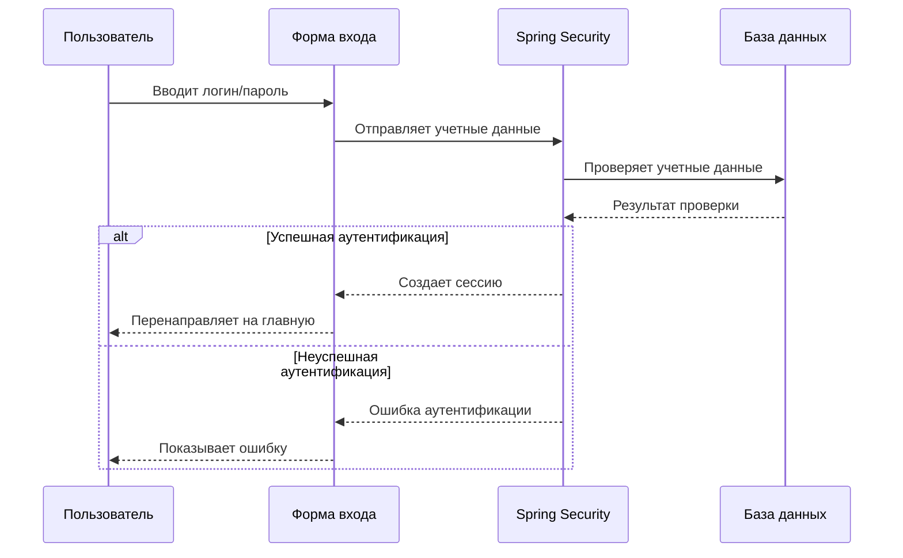
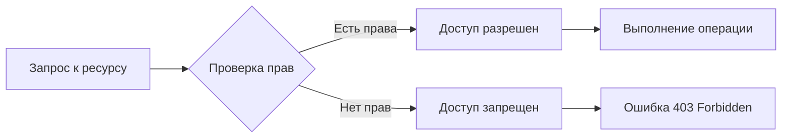
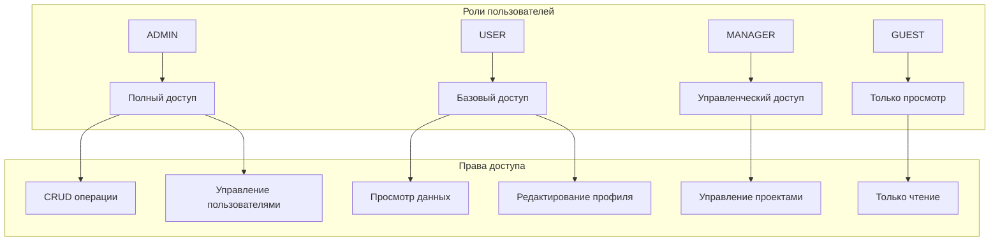
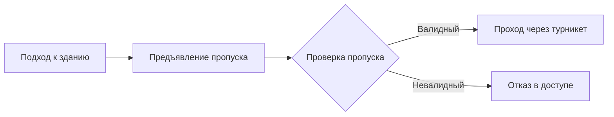
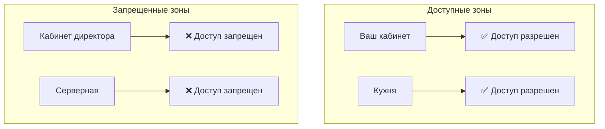
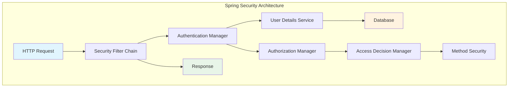
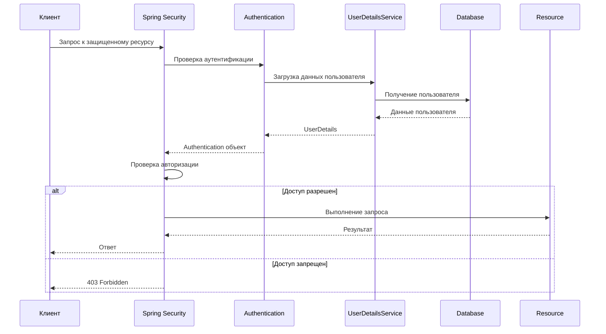

# 🔐 Знакомство со Spring Security

## 📋 Содержание
- [🎯 Что такое Spring Security?](#-что-такое-spring-security)
- [🔑 Основные концепции безопасности](#-основные-концепции-безопасности)
- [👤 Аутентификация](#-аутентификация)
- [🔒 Авторизация](#-авторизация)
- [👥 Роли и права доступа](#-роли-и-права-доступа)
- [🏢 Жизненный пример](#-жизненный-пример)
- [⚙️ Архитектура Spring Security](#️-архитектура-spring-security)
- [🚀 Практический пример](#-практический-пример)
- [📚 Дополнительные ресурсы](#-дополнительные-ресурсы)

---

## 🎯 Что такое Spring Security?

Spring Security — это мощный фреймворк для обеспечения безопасности Java-приложений. Он предоставляет комплексную систему аутентификации, авторизации и защиты от различных типов атак.



---

## 🔑 Основные концепции безопасности

### Ключевые термины:

- **🔐 Безопасность** — защита приложения от несанкционированного доступа
- **👤 Аутентификация** — проверка подлинности пользователя
- **🔒 Авторизация** — проверка прав доступа к ресурсам
- **👥 Роли** — группы пользователей с определенными правами
- **🔑 Учетные данные** — логин и пароль пользователя

---

## 👤 Аутентификация

**Аутентификация** — это процедура проверки подлинности пользователя путем сравнения введенных учетных данных (username и пароля) с данными, хранящимися в базе данных.



### Типы аутентификации:
- **📝 Форма входа** — классический способ с username/password
- **🔑 HTTP Basic** — передача учетных данных в заголовке
- **🎫 JWT токены** — безсостоятельная аутентификация
- **🔐 OAuth 2.0** — аутентификация через сторонние сервисы

---

## 🔒 Авторизация

**Авторизация** — это процедура проверки разрешений на доступ к определенным ресурсам приложения.



### Уровни авторизации:
1. **🌐 URL-уровень** — доступ к определенным страницам
2. **🔧 Метод-уровень** — доступ к определенным функциям
3. **📄 Объект-уровень** — доступ к конкретным данным

---

## 👥 Роли и права доступа

Роли определяют, какие действия может выполнять пользователь в системе.



### Примеры ролей:
- **👑 ADMIN** — администратор системы
- **👤 USER** — обычный пользователь
- **👨‍💼 MANAGER** — менеджер
- **👥 GUEST** — гость (только просмотр)

---

## 🏢 Жизненный пример

> **Сценарий:** Вы работаете в крупной компании и сегодня вам нужно попасть в офис.

### 🔐 Процесс аутентификации:

1. **🏢 Подходите к бизнес-центру**
2. **🆔 Предъявляете пропуск на ресепшене** ← *Это аутентификация*
3. **✅ Охранник проверяет подлинность пропуска**
4. **🚪 Проходите через турникет**



### 🔒 Процесс авторизации:

После входа в здание:
- **✅ Можете зайти в свой кабинет**
- **❌ Не можете зайти в кабинет директора**
- **✅ Можете пользоваться кухней**
- **❌ Не можете зайти в серверную**



### 👥 Роли в офисе:

- **👨‍💼 Бухгалтер** → доступ в бухгалтерию
- **👨‍💻 Программист** → доступ в IT-отдел
- **👨‍🔧 Техник** → доступ в технические помещения
- **👑 Директор** → доступ везде

---

## ⚙️ Архитектура Spring Security



### Основные компоненты:

1. **🔗 Security Filter Chain** — цепочка фильтров безопасности
2. **👤 Authentication Manager** — управление аутентификацией
3. **🔒 Authorization Manager** — управление авторизацией
4. **📊 User Details Service** — загрузка данных пользователя
5. **🎯 Access Decision Manager** — принятие решений о доступе

---

## 🚀 Практический пример

### Настройка Spring Security в проекте:

```xml
<!-- pom.xml -->
<dependency>
    <groupId>org.springframework.boot</groupId>
    <artifactId>spring-boot-starter-security</artifactId>
</dependency>
```

### Конфигурация безопасности:

```java
@Configuration
@EnableWebSecurity
public class SecurityConfig {
    
    @Bean
    public SecurityFilterChain filterChain(HttpSecurity http) throws Exception {
        http
            .authorizeHttpRequests(authz -> authz
                .requestMatchers("/public/**").permitAll()
                .requestMatchers("/admin/**").hasRole("ADMIN")
                .requestMatchers("/user/**").hasRole("USER")
                .anyRequest().authenticated()
            )
            .formLogin(form -> form
                .loginPage("/login")
                .defaultSuccessUrl("/dashboard")
                .permitAll()
            )
            .logout(logout -> logout
                .logoutSuccessUrl("/login?logout")
                .permitAll()
            );
        
        return http.build();
    }
}
```

### Контроллер с защищенными методами:

```java
@RestController
@RequestMapping("/api")
public class UserController {
    
    @GetMapping("/users")
    @PreAuthorize("hasRole('ADMIN')")
    public List<User> getAllUsers() {
        return userService.findAll();
    }
    
    @GetMapping("/profile")
    @PreAuthorize("hasRole('USER')")
    public User getProfile() {
        return getCurrentUser();
    }
    
    @PostMapping("/users")
    @PreAuthorize("hasRole('ADMIN')")
    public User createUser(@RequestBody User user) {
        return userService.save(user);
    }
}
```

### Схема работы защищенного приложения:



---

## 📚 Дополнительные ресурсы

### 📖 Документация:
- [Официальная документация Spring Security](https://docs.spring.io/spring-security/reference/)
- [Spring Security Reference](https://docs.spring.io/spring-security/site/docs/current/reference/html5/)

### 🎥 Видеоуроки:
- Spring Security для начинающих
- Практические примеры аутентификации
- Настройка JWT токенов

### 🔧 Полезные инструменты:
- **Postman** — тестирование API
- **Spring Boot DevTools** — разработка
- **Spring Security Debug** — отладка

### 📝 Чек-лист безопасности:
- [ ] Настроена аутентификация
- [ ] Настроена авторизация
- [ ] Защищены все эндпоинты
- [ ] Настроены роли пользователей
- [ ] Добавлена защита от CSRF
- [ ] Настроено логирование безопасности
- [ ] Протестированы сценарии доступа

---

## 🎯 Заключение

Spring Security предоставляет мощные инструменты для обеспечения безопасности вашего приложения. Понимание основных концепций аутентификации и авторизации поможет вам создавать безопасные и надежные приложения.

**Ключевые моменты для запоминания:**
- 🔐 **Аутентификация** = "Кто вы?"
- 🔒 **Авторизация** = "Что вы можете делать?"
- 👥 **Роли** = группы пользователей с определенными правами
- 🛡️ **Spring Security** = фреймворк для реализации безопасности

---

*📅 Последнее обновление: Декабрь 2024*


