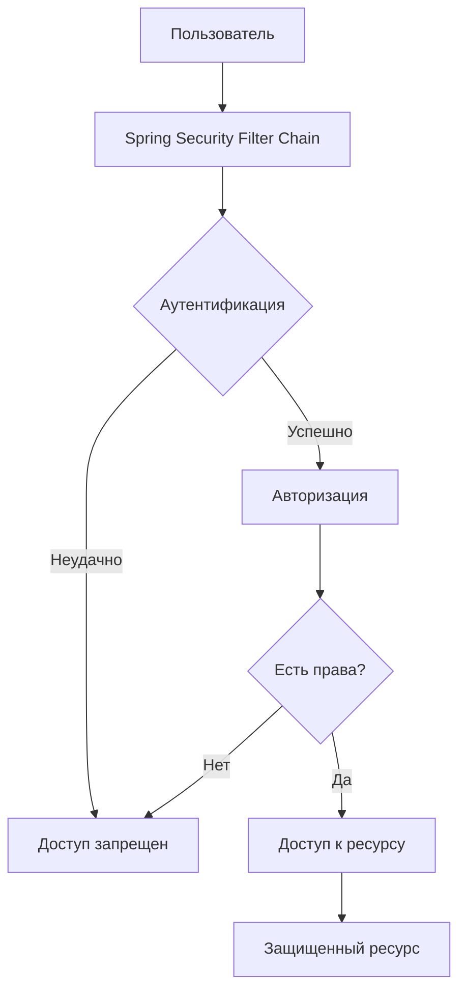
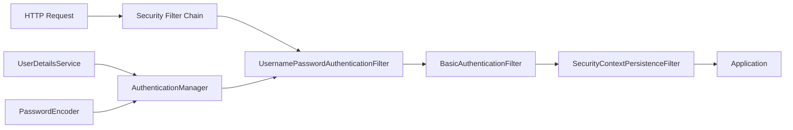
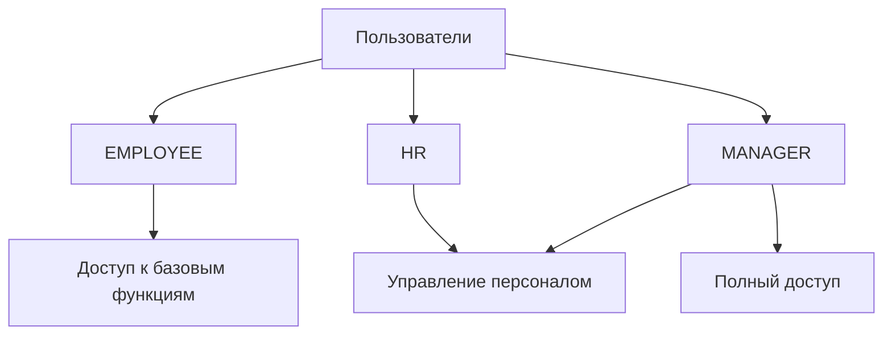
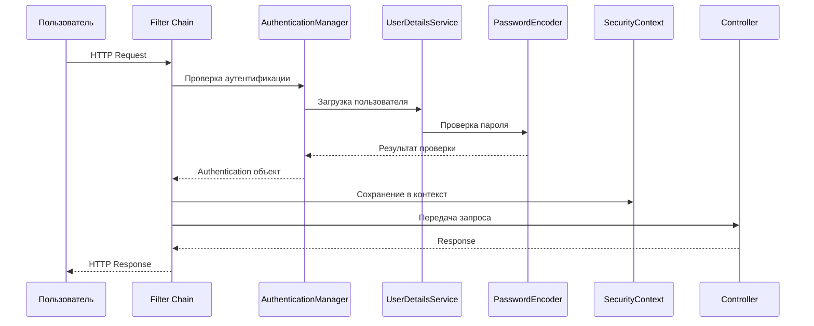

# 🔐 Конфигурация Spring Security

## 📋 Содержание
- [🎯 Что такое Spring Security?](#-что-такое-spring-security)
- [🏗️ Архитектура Spring Security](#️-архитектура-spring-security)
- [⚙️ Настройка проекта](#️-настройка-проекта)
- [🔧 Конфигурация безопасности](#-конфигурация-безопасности)
- [👥 Аутентификация и авторизация](#-аутентификация-и-авторизация)
- [🛡️ Защита URL](#️-защита-url)
- [🔑 Шифрование паролей](#-шифрование-паролей)
- [📝 Практический пример](#-практический-пример)
- [❓ Часто задаваемые вопросы](#-часто-задаваемые-вопросы)

---

## 🎯 Что такое Spring Security?

Spring Security — это мощный фреймворк для обеспечения безопасности в Spring-приложениях. Он предоставляет комплексную систему аутентификации, авторизации и защиты от различных атак.

### Основные возможности:
- ✅ Аутентификация пользователей
- ✅ Авторизация доступа к ресурсам
- ✅ Защита от CSRF, XSS атак
- ✅ Интеграция с различными провайдерами аутентификации
- ✅ Поддержка JWT токенов



---

## 🏗️ Архитектура Spring Security

Spring Security работает через цепочку фильтров (Filter Chain), которая перехватывает все HTTP-запросы.



### Компоненты архитектуры:

| Компонент | Назначение |
|-----------|------------|
| **Filter Chain** | Цепочка фильтров для обработки запросов |
| **AuthenticationManager** | Управляет процессом аутентификации |
| **UserDetailsService** | Загружает информацию о пользователях |
| **PasswordEncoder** | Шифрует и проверяет пароли |
| **SecurityContext** | Хранит информацию о текущем пользователе |

---

## ⚙️ Настройка проекта

### 1. Добавление зависимостей в `pom.xml`

```xml
<project xmlns="http://maven.apache.org/POM/4.0.0" 
         xmlns:xsi="http://www.w3.org/2001/XMLSchema-instance"
         xsi:schemaLocation="http://maven.apache.org/POM/4.0.0 
         http://maven.apache.org/maven-v4_0_0.xsd">
    <modelVersion>4.0.0</modelVersion>
    <groupId>com.safronov.spring.security</groupId>
    <artifactId>spring_security</artifactId>
    <packaging>war</packaging>
    <version>1.0-SNAPSHOT</version>
    <name>spring_security Maven Webapp</name>
    <url>http://maven.apache.org</url>
    
    <properties>
        <maven.compiler.source>8</maven.compiler.source>
        <maven.compiler.target>8</maven.compiler.target>
        <spring.version>5.2.9.RELEASE</spring.version>
        <spring.security.version>5.4.1</spring.security.version>
    </properties>
    
    <dependencies>
        <!-- Spring MVC -->
        <dependency>
            <groupId>org.springframework</groupId>
            <artifactId>spring-webmvc</artifactId>
            <version>${spring.version}</version>
        </dependency>
        
        <!-- Spring Security Web -->
        <dependency>
            <groupId>org.springframework.security</groupId>
            <artifactId>spring-security-web</artifactId>
            <version>${spring.security.version}</version>
        </dependency>
        
        <!-- Spring Security Config -->
        <dependency>
            <groupId>org.springframework.security</groupId>
            <artifactId>spring-security-config</artifactId>
            <version>${spring.security.version}</version>
        </dependency>
        
        <!-- Servlet API -->
        <dependency>
            <groupId>javax.servlet</groupId>
            <artifactId>javax.servlet-api</artifactId>
            <version>4.0.1</version>
            <scope>provided</scope>
        </dependency>
        
        <!-- JUnit для тестирования -->
        <dependency>
            <groupId>junit</groupId>
            <artifactId>junit</artifactId>
            <version>4.11</version>
            <scope>test</scope>
        </dependency>
    </dependencies>
    
    <build>
        <finalName>spring_security</finalName>
        <plugins>
            <plugin>
                <groupId>org.apache.maven.plugins</groupId>
                <artifactId>maven-compiler-plugin</artifactId>
                <version>3.8.1</version>
                <configuration>
                    <source>8</source>
                    <target>8</target>
                </configuration>
            </plugin>
            <plugin>
                <groupId>org.apache.maven.plugins</groupId>
                <artifactId>maven-war-plugin</artifactId>
                <version>3.2.2</version>
            </plugin>
        </plugins>
    </build>
</project>
```

### 2. Структура проекта

```
src/
├── main/
│   ├── java/
│   │   └── com/
│   │       └── safronov/
│   │           └── spring/
│   │               ├── configuration/
│   │               │   ├── MyConfig.java
│   │               │   ├── MySecurityConfig.java
│   │               │   ├── MyWebInitializer.java
│   │               │   └── MySecurityInitializer.java
│   │               ├── controller/
│   │               │   └── MyController.java
│   │               └── model/
│   │                   └── Employee.java
│   ├── resources/
│   └── webapp/
│       └── WEB-INF/
│           └── view/
│               └── jsp/
│                   ├── home.jsp
│                   └── login.jsp
└── test/
    └── java/
        └── com/
            └── safronov/
                └── spring/
                    └── AppTest.java
```

---

## 🔧 Конфигурация безопасности

### 1. Основной конфигурационный класс

```java
package com.safronov.spring.configuration;

import org.springframework.context.annotation.Bean;
import org.springframework.context.annotation.ComponentScan;
import org.springframework.context.annotation.Configuration;
import org.springframework.web.servlet.ViewResolver;
import org.springframework.web.servlet.config.annotation.EnableWebMvc;
import org.springframework.web.servlet.view.InternalResourceViewResolver;

@Configuration
@ComponentScan("com.safronov.spring")
@EnableWebMvc
public class MyConfig {

    @Bean
    public ViewResolver viewResolver() {
        InternalResourceViewResolver viewResolver = new InternalResourceViewResolver();
        viewResolver.setPrefix("/WEB-INF/view/jsp/");
        viewResolver.setSuffix(".jsp");
        return viewResolver;
    }
}
```

### 2. Инициализатор Dispatcher Servlet

```java
package com.safronov.spring.configuration;

import org.springframework.web.servlet.support.AbstractAnnotationConfigDispatcherServletInitializer;

public class MyWebInitializer extends AbstractAnnotationConfigDispatcherServletInitializer {
    
    @Override
    protected Class<?>[] getRootConfigClasses() {
        return null;
    }

    @Override
    protected Class<?>[] getServletConfigClasses() {
        return new Class[] {MyConfig.class};
    }

    @Override
    protected String[] getServletMappings() {
        return new String[]{"/"};
    }
}
```

### 3. Инициализатор Spring Security

```java
package com.safronov.spring.configuration;

import org.springframework.security.web.context.AbstractSecurityWebApplicationInitializer;

public class MySecurityInitializer extends AbstractSecurityWebApplicationInitializer {
    // Этот класс автоматически регистрирует фильтры Spring Security
}
```

---

## 👥 Аутентификация и авторизация

### Роли пользователей



### Конфигурация безопасности с ролями

```java
package com.safronov.spring.configuration;

import org.springframework.context.annotation.Bean;
import org.springframework.security.config.annotation.web.builders.HttpSecurity;
import org.springframework.security.config.annotation.web.configuration.EnableWebSecurity;
import org.springframework.security.config.annotation.web.configuration.WebSecurityConfigurerAdapter;
import org.springframework.security.core.userdetails.User;
import org.springframework.security.crypto.bcrypt.BCryptPasswordEncoder;
import org.springframework.security.crypto.password.PasswordEncoder;
import org.springframework.beans.factory.annotation.Autowired;
import org.springframework.security.config.annotation.authentication.builders.AuthenticationManagerBuilder;

@EnableWebSecurity
public class MySecurityConfig extends WebSecurityConfigurerAdapter {

    @Bean
    public PasswordEncoder passwordEncoder() {
        return new BCryptPasswordEncoder();
    }

    @Override
    protected void configure(AuthenticationManagerBuilder auth) throws Exception {
        User.UserBuilder userBuilder = User.builder();

        auth.inMemoryAuthentication()
                .withUser(userBuilder
                    .username("zaur")
                    .password(passwordEncoder().encode("zaur"))
                    .roles("EMPLOYEE"))
                .withUser(userBuilder
                    .username("elena")
                    .password(passwordEncoder().encode("elena"))
                    .roles("HR"))
                .withUser(userBuilder
                    .username("ivan")
                    .password(passwordEncoder().encode("ivan"))
                    .roles("MANAGER", "HR"));
    }

    @Override
    protected void configure(HttpSecurity http) throws Exception {
        http.authorizeRequests()
                .antMatchers("/").hasAnyRole("EMPLOYEE", "HR", "MANAGER")
                .antMatchers("/hr_info").hasRole("HR")
                .antMatchers("/manager_info").hasRole("MANAGER")
                .and()
                .formLogin()
                    .loginPage("/showMyLoginPage")
                    .loginProcessingUrl("/authenticateTheUser")
                    .permitAll()
                .and()
                .logout()
                    .permitAll()
                .and()
                .exceptionHandling()
                    .accessDeniedPage("/access-denied");
    }
}
```

---

## 🛡️ Защита URL

### Иерархия ролей и доступов

```mermaid
graph TD
    A[Все пользователи] --> B[EMPLOYEE]
    B --> C[HR]
    C --> D[MANAGER]
    
    B --> E[/ - Главная страница]
    C --> F[/hr_info - HR информация]
    D --> G[/manager_info - Менеджер информация]
    D --> H[/admin - Админ панель]
```

### Аннотации для защиты методов

```java
package com.safronov.spring.controller;

import org.springframework.stereotype.Controller;
import org.springframework.web.bind.annotation.GetMapping;
import org.springframework.security.access.prepost.PreAuthorize;

@Controller
public class MyController {

    @GetMapping("/")
    public String getHomePage() {
        return "home";
    }

    @GetMapping("/hr_info")
    @PreAuthorize("hasRole('HR')")
    public String getHRInfo() {
        return "hr_info";
    }

    @GetMapping("/manager_info")
    @PreAuthorize("hasRole('MANAGER')")
    public String getManagerInfo() {
        return "manager_info";
    }
}
```

---

## 🔑 Шифрование паролей

### Типы шифрования

| Тип | Описание | Безопасность |
|-----|----------|--------------|
| **BCrypt** | Рекомендуемый алгоритм | ⭐⭐⭐⭐⭐ |
| **SCrypt** | Современный алгоритм | ⭐⭐⭐⭐⭐ |
| **Argon2** | Новейший алгоритм | ⭐⭐⭐⭐⭐ |
| **MD5** | Устаревший | ❌ |
| **SHA-1** | Устаревший | ❌ |

### Примеры использования

```java
// BCrypt (рекомендуется)
@Bean
public PasswordEncoder passwordEncoder() {
    return new BCryptPasswordEncoder();
}

// SCrypt
@Bean
public PasswordEncoder scryptPasswordEncoder() {
    return new SCryptPasswordEncoder();
}

// Создание зашифрованного пароля
String rawPassword = "password123";
String encodedPassword = passwordEncoder().encode(rawPassword);
// Результат: $2a$10$N.zmdr9k7uOCQb376NoUnuTJ8iAt6Z5EHsM8lE9lBOsl7iKTVEFDa

// Проверка пароля
boolean matches = passwordEncoder().matches(rawPassword, encodedPassword);
// Результат: true
```

---

## 📝 Практический пример

### 1. Создание контроллера

```java
package com.safronov.spring.controller;

import org.springframework.stereotype.Controller;
import org.springframework.ui.Model;
import org.springframework.web.bind.annotation.GetMapping;
import org.springframework.security.core.Authentication;
import org.springframework.security.core.context.SecurityContextHolder;

@Controller
public class MyController {

    @GetMapping("/")
    public String getHomePage(Model model) {
        Authentication auth = SecurityContextHolder.getContext().getAuthentication();
        String username = auth.getName();
        model.addAttribute("username", username);
        return "home";
    }

    @GetMapping("/hr_info")
    public String getHRInfo() {
        return "hr_info";
    }

    @GetMapping("/manager_info")
    public String getManagerInfo() {
        return "manager_info";
    }

    @GetMapping("/access-denied")
    public String getAccessDenied() {
        return "access-denied";
    }
}
```

### 2. JSP страницы

**home.jsp:**
```jsp
<%@ page contentType="text/html;charset=UTF-8" language="java" %>
<%@ taglib prefix="c" uri="http://java.sun.com/jsp/jstl/core" %>
<html>
<head>
    <title>Главная страница</title>
</head>
<body>
    <h2>Добро пожаловать, ${username}!</h2>
    
    <p>Вы вошли в систему как: ${username}</p>
    
    <hr>
    
    <p>
        <a href="${pageContext.request.contextPath}/hr_info">HR информация</a>
        (только для HR)
    </p>
    
    <p>
        <a href="${pageContext.request.contextPath}/manager_info">Информация менеджера</a>
        (только для менеджеров)
    </p>
    
    <form:form action="${pageContext.request.contextPath}/logout" 
               method="POST">
        <input type="submit" value="Выйти"/>
    </form:form>
</body>
</html>
```

**hr_info.jsp:**
```jsp
<%@ page contentType="text/html;charset=UTF-8" language="java" %>
<html>
<head>
    <title>HR информация</title>
</head>
<body>
    <h2>HR информация</h2>
    <p>Эта страница доступна только для HR сотрудников.</p>
    
    <a href="${pageContext.request.contextPath}/">Вернуться на главную</a>
</body>
</html>
```

### 3. Настройка логина

```java
@Override
protected void configure(HttpSecurity http) throws Exception {
    http.authorizeRequests()
            .antMatchers("/").hasAnyRole("EMPLOYEE", "HR", "MANAGER")
            .antMatchers("/hr_info").hasRole("HR")
            .antMatchers("/manager_info").hasRole("MANAGER")
            .and()
            .formLogin()
                .loginPage("/showMyLoginPage")
                .loginProcessingUrl("/authenticateTheUser")
                .permitAll()
            .and()
            .logout()
                .permitAll()
            .and()
            .exceptionHandling()
                .accessDeniedPage("/access-denied");
}
```

---

## ❓ Часто задаваемые вопросы

### Q: Как добавить кастомную страницу логина?
**A:** Создайте контроллер и JSP страницу:

```java
@GetMapping("/showMyLoginPage")
public String showMyLoginPage() {
    return "custom-login";
}
```

### Q: Как получить информацию о текущем пользователе?
**A:** Используйте SecurityContextHolder:

```java
Authentication auth = SecurityContextHolder.getContext().getAuthentication();
String username = auth.getName();
Collection<? extends GrantedAuthority> authorities = auth.getAuthorities();
```

### Q: Как настроить CSRF защиту?
**A:** По умолчанию включена. Для отключения:

```java
http.csrf().disable()
```

### Q: Как добавить Remember Me функциональность?
**A:** Добавьте в конфигурацию:

```java
.and().rememberMe()
    .tokenValiditySeconds(86400) // 24 часа
```

---

## 🔍 Отладка и логирование

### Включение debug режима

```java
@EnableWebSecurity(debug = true)
public class MySecurityConfig extends WebSecurityConfigurerAdapter {
    // конфигурация
}
```

### Логирование в application.properties

```properties
# Логирование Spring Security
logging.level.org.springframework.security=DEBUG
logging.level.org.springframework.web=DEBUG

# Логирование аутентификации
logging.level.org.springframework.security.authentication=DEBUG
```

---

## 📊 Схема работы Spring Security



---

## 🎯 Заключение

Spring Security предоставляет мощные инструменты для обеспечения безопасности вашего приложения. Основные моменты:

1. **Всегда используйте BCrypt** для шифрования паролей
2. **Применяйте принцип наименьших привилегий** при настройке ролей
3. **Включайте CSRF защиту** для веб-приложений
4. **Логируйте события безопасности** для мониторинга
5. **Регулярно обновляйте зависимости** для получения исправлений безопасности

### Следующие шаги:
- Изучите интеграцию с базой данных
- Настройте JWT токены для REST API
- Добавьте двухфакторную аутентификацию
- Изучите OAuth2 и OpenID Connect
