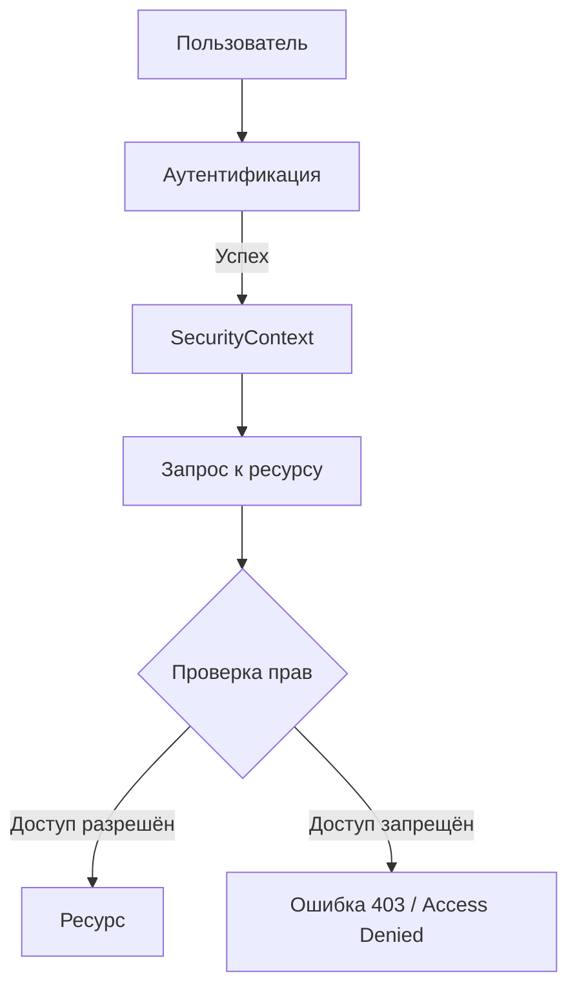
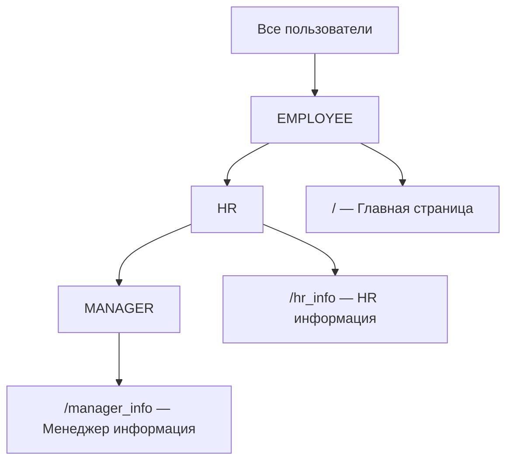

# 🛡️ Процедура авторизации в Spring Security

## 📋 Содержание
- [🔑 Что такое авторизация?](#-что-такое-авторизация)
- [🔄 Отличие авторизации от аутентификации](#-отличие-авторизации-от-аутентификации)
- [🖼️ Схема процесса авторизации](#️-схема-процесса-авторизации)
- [⚙️ Ключевые механизмы авторизации](#️-ключевые-механизмы-авторизации)
- [📝 Примеры кода: Java и JSP](#-примеры-кода-java-и-jsp)
- [🔍 Практика: ограничения доступа](#-практика-ограничения-доступа)
- [❓ FAQ и типичные ошибки](#-faq-и-типичные-ошибки)
- [🏁 Заключение](#-заключение)

---

## 🔑 Что такое авторизация?

**Авторизация** — это процесс проверки, имеет ли аутентифицированный пользователь право выполнять определённые действия или получать доступ к определённым ресурсам. В Spring Security авторизация реализуется через правила, фильтры, аннотации и теги.

---

## 🔄 Отличие авторизации от аутентификации

- **Аутентификация**: "Кто ты?" (логин/пароль)
- **Авторизация**: "Что тебе разрешено?" (роли, права)

---

## 🖼️ Схема процесса авторизации



---

## ⚙️ Ключевые механизмы авторизации

| Механизм | Где применяется | Пример |
|----------|----------------|--------|
| Java-конфиг | В классе конфигурации | `.antMatchers("/admin").hasRole("ADMIN")` |
| Аннотации | На методах/классах | `@PreAuthorize("hasRole('HR')")` |
| JSP-теги | В представлениях | `<security:authorize access="hasRole('MANAGER')">...</security:authorize>` |

---

## 📝 Примеры кода: Java и JSP

### Java-конфиг (WebSecurityConfigurerAdapter)
```java
@Override
protected void configure(HttpSecurity http) throws Exception {
    http.authorizeRequests()
        .antMatchers("/").hasAnyRole("EMPLOYEE", "MANAGER", "HR")
        .antMatchers("/hr_info").hasRole("HR")
        .antMatchers("/manager_info").hasRole("MANAGER")
        .and().formLogin().permitAll();
}
```

### Аннотации на методах
```java
@PreAuthorize("hasRole('HR')")
public String getHRInfo() {
    // ...
}
```

### JSP-теги безопасности
```jsp
<security:authorize access="hasRole('HR')">
    <input type="button" value="Зарплата" onclick="window.location.href='${pageContext.request.contextPath}/hr_info'"> Только для работников HR
</security:authorize>
<security:authorize access="hasRole('MANAGER')">
    <input type="button" value="Нагрузка" onclick="window.location.href='${pageContext.request.contextPath}/manager_info'"> Только для менеджеров
</security:authorize>
```

---

## 🔍 Практика: ограничения доступа



- `/` — доступен всем с ролями EMPLOYEE, HR, MANAGER
- `/hr_info` — только HR
- `/manager_info` — только MANAGER

---

## ❓ FAQ и типичные ошибки

**Q: Почему пользователь с ролью не видит кнопку/страницу?**
- Проверь, что роль указана правильно (без ROLE_ префикса в hasRole)
- Проверь, что пользователь аутентифицирован

**Q: Как сделать разные меню для разных ролей?**
- Используй `<security:authorize access="hasRole('...')">` в JSP

**Q: Как ограничить доступ к REST-методам?**
- Используй аннотации `@PreAuthorize`, `@Secured` на методах контроллера

**Q: Как отладить авторизацию?**
- Включи debug: `@EnableWebSecurity(debug = true)`
- Логируй: `logging.level.org.springframework.security=DEBUG`

---

## 🏁 Заключение

- Авторизация — это контроль доступа на основе ролей и прав
- В Spring Security есть гибкие механизмы: конфиг, аннотации, теги
- Визуализируй и тестируй права для разных ролей
- Для новичков: начни с antMatchers и тегов, потом переходи к аннотациям и кастомным решениям

