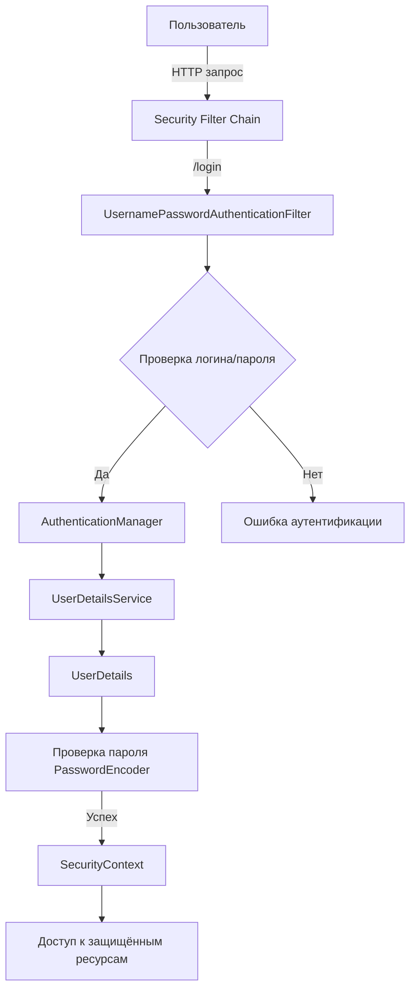
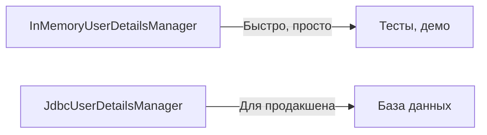

# 🔑 Процедура аутентификации в Spring Security

## 📋 Содержание
- [🚀 Введение](#-введение)
- [🔎 Как работает аутентификация в Spring Security](#-как-работает-аутентификация-в-spring-security)
- [🖼️ Схема процесса аутентификации](#️-схема-процесса-аутентификации)
- [⚙️ Ключевые классы и их роль](#️-ключевые-классы-и-их-роль)
- [📝 Пример кода: инициализация и конфиг](#-пример-кода-инициализация-и-конфиг)
- [💡 Пример: форма логина и результат](#-пример-форма-логина-и-результат)
- [📦 In-memory vs. база данных](#-in-memory-vs-база-данных)
- [❓ FAQ и типичные ошибки](#-faq-и-типичные-ошибки)
- [🏁 Заключение](#-заключение)

---

## 🚀 Введение

Аутентификация — это процесс проверки личности пользователя. В Spring Security она реализуется через цепочку фильтров, которые перехватывают HTTP-запросы и определяют, кто и что может делать в приложении.

---

## 🔎 Как работает аутентификация в Spring Security

1. Пользователь отправляет запрос (например, логин через форму).
2. Запрос проходит через цепочку фильтров Spring Security.
3. Если пользователь не аутентифицирован — его перенаправляют на страницу логина.
4. После успешного ввода логина/пароля создаётся объект Authentication и сохраняется в SecurityContext.
5. Дальнейшие запросы проходят с учётом аутентификации и ролей.

---

## 🖼️ Схема процесса аутентификации



---

## ⚙️ Ключевые классы и их роль

| Класс | Назначение |
|-------|------------|
| `AbstractSecurityWebApplicationInitializer` | Автоматически подключает фильтры Spring Security |
| `WebSecurityConfigurerAdapter` | Позволяет настраивать правила аутентификации и авторизации |
| `UserDetailsService` | Загружает пользователей (из памяти, БД и т.д.) |
| `PasswordEncoder` | Шифрует и проверяет пароли |
| `AuthenticationManager` | Управляет процессом аутентификации |
| `SecurityContext` | Хранит информацию о текущем пользователе |

---

## 📝 Пример кода: инициализация и конфиг

**1. Инициализатор:**
```java
package com.safronov.spring.security.configuration;

import org.springframework.security.web.context.AbstractSecurityWebApplicationInitializer;

public class MySecurityInitializer extends AbstractSecurityWebApplicationInitializer {
    // Просто наследуем — фильтры подключатся автоматически
}
```

**2. Конфиг аутентификации:**
```java
import org.springframework.context.annotation.Configuration;
import org.springframework.security.config.annotation.authentication.builders.AuthenticationManagerBuilder;
import org.springframework.security.config.annotation.web.configuration.EnableWebSecurity;
import org.springframework.security.config.annotation.web.configuration.WebSecurityConfigurerAdapter;
import org.springframework.security.core.userdetails.User;
import org.springframework.security.crypto.bcrypt.BCryptPasswordEncoder;
import org.springframework.security.crypto.password.PasswordEncoder;

@Configuration
@EnableWebSecurity
public class MySecurityConfig extends WebSecurityConfigurerAdapter {
    @Override
    protected void configure(AuthenticationManagerBuilder auth) throws Exception {
        User.UserBuilder userBuilder = User.builder();
        auth.inMemoryAuthentication()
            .withUser(userBuilder.username("zaur").password(passwordEncoder().encode("zaur")).roles("EMPLOYEE"))
            .withUser(userBuilder.username("elena").password(passwordEncoder().encode("elena")).roles("HR"))
            .withUser(userBuilder.username("ivan").password(passwordEncoder().encode("ivan")).roles("MANAGER", "HR"));
    }
    public PasswordEncoder passwordEncoder() {
        return new BCryptPasswordEncoder();
    }
}
```

---

## 💡 Пример: форма логина и результат

**login.jsp:**
```jsp
<form action="${pageContext.request.contextPath}/login" method="post">
    <label>Логин: <input type="text" name="username"/></label><br/>
    <label>Пароль: <input type="password" name="password"/></label><br/>
    <button type="submit">Войти</button>
</form>
<c:if test="${not empty param.error}">
    <div style="color:red">Ошибка: неверный логин или пароль</div>
</c:if>
```

**Контроллер (пример):**
```java
@GetMapping("/")
public String home(Model model) {
    Authentication auth = SecurityContextHolder.getContext().getAuthentication();
    model.addAttribute("username", auth.getName());
    return "home";
}
```

---

## 📦 In-memory vs. база данных

- **In-memory** — просто для тестов и демо, пользователи хранятся в памяти JVM.
- **База данных** — для реальных проектов. Используйте JDBC или кастомный UserDetailsService.



---

## ❓ FAQ и типичные ошибки

**Q: Почему не работает аутентификация?**
- Проверь, что инициализатор и конфиг подключены
- Проверь, что пароли совпадают (и не забывай про PasswordEncoder)

**Q: Как сделать кастомную страницу логина?**
- В конфиге добавь `.formLogin().loginPage("/login")`
- Создай контроллер и JSP для `/login`

**Q: Как добавить роли?**
- В inMemory — через `.roles("ROLE")`
- В БД — через таблицу ролей

**Q: Как отладить процесс?**
- Включи debug: `@EnableWebSecurity(debug = true)`
- Логируй: `logging.level.org.springframework.security=DEBUG`

---

## 🏁 Заключение

- Spring Security делает аутентификацию максимально гибкой и мощной
- Для новичков: начни с in-memory, потом переходи на БД
- Используй PasswordEncoder всегда, даже для тестов
- Визуализируй процесс — это реально помогает понять, что происходит

