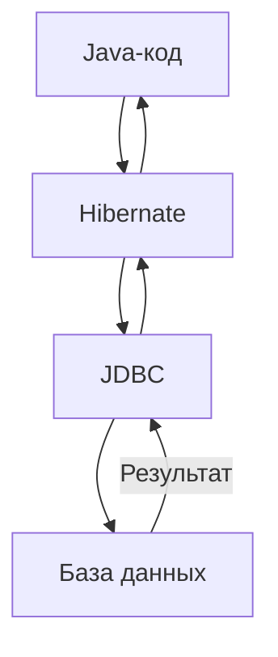

# 🐘 Знакомство с Hibernate

## 📋 Содержание
- [🎯 Что такое Hibernate?](#-что-такое-hibernate)
- [🔗 Что такое ORM?](#-что-такое-orm)
- [🖼️ Как работает Hibernate (схема)](#️-как-работает-hibernate-схема)
- [📝 Пример кода: сохранение объекта](#-пример-кода-сохранение-объекта)
- [✅ Плюсы Hibernate](#-плюсы-hibernate)
- [⚠️ Минусы Hibernate](#️-минусы-hibernate)
- [❓ FAQ](#-faq)
- [🏁 Заключение](#-заключение)

---

## 🎯 Что такое Hibernate?

Hibernate — это популярный Java-фреймворк для работы с базами данных. Он позволяет сохранять, получать, изменять и удалять Java-объекты в БД без ручного написания SQL.

- Hibernate работает поверх JDBC (Java Database Connectivity)
- Основная задача — автоматизировать преобразование между объектами Java и строками в таблицах БД

---

## 🔗 Что такое ORM?

**ORM (Object-Relational Mapping)** — это технология, которая позволяет связывать объекты языка программирования с таблицами реляционной базы данных.

- 1 объект Java = 1 строка в таблице БД
- 1 поле объекта = 1 столбец в таблице

**Пример:**
```java
public class User {
    private String name;
    private int age;
}
```
В таблице будет строка с колонками name и age.

---

## 🖼️ Как работает Hibernate (схема)



---

## 📝 Пример кода: сохранение объекта

```java
User user = new User();
user.setName("Ivan");
user.setAge(30);

Session session = sessionFactory.openSession();
session.beginTransaction();
session.save(user);
session.getTransaction().commit();
session.close();
```

- Не нужно писать SQL — Hibernate сам сгенерирует нужный запрос

---

## ✅ Плюсы Hibernate

- **ORM**: автоматическое преобразование объектов в строки таблицы и обратно
- **Меньше кода**: не нужно писать SQL для CRUD-операций
- **Портируемость**: легко сменить СУБД (PostgreSQL, MySQL, Oracle и др.)
- **Кэширование**: встроенная поддержка кэша
- **Транзакции**: управление транзакциями «из коробки»

---

## ⚠️ Минусы Hibernate

- **Сложность настройки** для новичков
- **Магия**: не всегда понятно, какой SQL генерируется
- **Не для всех задач**: для сложных запросов всё равно нужен SQL
- **Оверхед**: иногда медленнее чистого JDBC

---

## ❓ FAQ

**Q: Нужно ли знать SQL?**
- Да, для сложных запросов и понимания, что происходит «под капотом»

**Q: Можно ли использовать Hibernate с любой БД?**
- Да, если есть JDBC-драйвер

**Q: Как отладить SQL, который генерирует Hibernate?**
- Включи логирование SQL в настройках

**Q: Чем отличается Hibernate от JPA?**
- Hibernate — реализация спецификации JPA (Java Persistence API)

---

## 🏁 Заключение

- Hibernate — мощный инструмент для работы с БД в Java
- Начни с простых примеров, постепенно переходи к более сложным
- Не забывай про документацию и логи
- Визуализируй процесс — это реально помогает понять, что происходит

