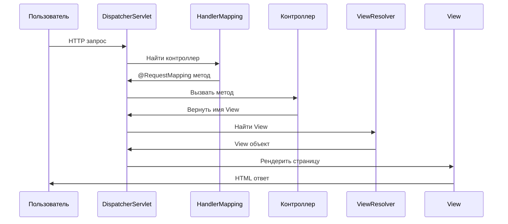
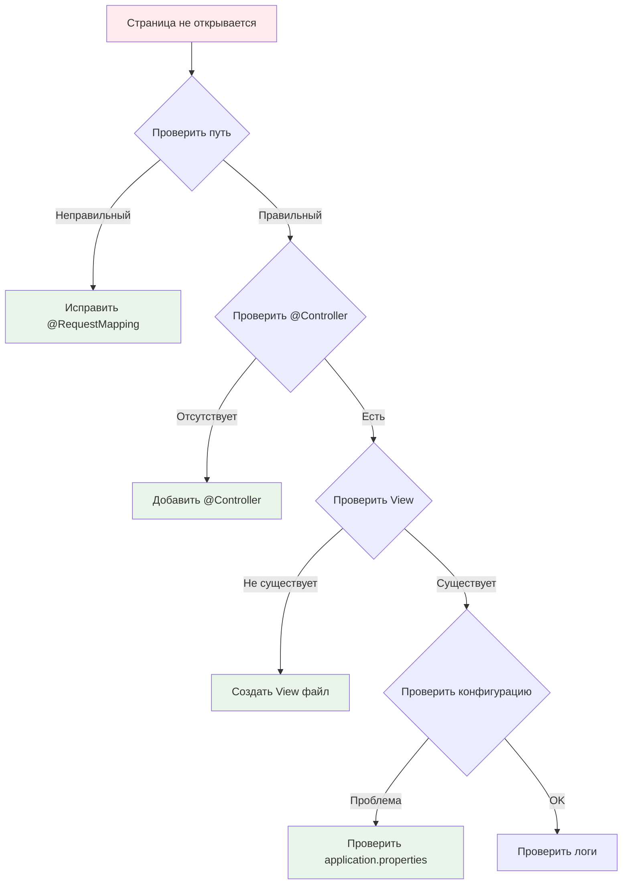

# Аннотация @RequestMapping для Controller класса (Spring MVC)

## 📋 Содержание
- [🎯 Что такое @RequestMapping?](#-что-такое-requestmapping)
- [🚀 Зачем это нужно?](#-зачем-это-нужно)
- [🔧 Как работает Spring MVC?](#-как-работает-spring-mvc)
- [📝 Основные аннотации для маппинга](#-основные-аннотации-для-маппинга)
- [💻 Пошаговый пример создания контроллера](#-пошаговый-пример-создания-контроллера)
- [🔍 Детальный разбор @RequestMapping](#-детальный-разбор-requestmapping)
- [⚡ Современные аннотации (@GetMapping, @PostMapping)](#-современные-аннотации-getmapping-postmapping)
- [🎨 Практические примеры](#-практические-примеры)
- [❌ Типичные ошибки и их решения](#-типичные-ошибки-и-их-решения)
- [📚 Мини-глоссарий](#-мини-глоссарий)
- [💡 Советы новичку](#-советы-новичку)
- [🔗 Полезные ссылки](#-полезные-ссылки)

---

## 🎯 Что такое @RequestMapping?

`@RequestMapping` — это специальная аннотация в Spring Framework, которая связывает HTTP-запросы с методами вашего Java-класса (контроллера). 

**Простыми словами:** Она говорит Spring'у: "Когда пользователь заходит по такому-то адресу, вызови этот метод".

```mermaid
graph LR
    A[Пользователь] -->|HTTP запрос| B[Spring MVC]
    B -->|@RequestMapping| C[Контроллер]
    C -->|Возвращает View| D[Страница]
    
    style A fill:#e1f5fe
    style B fill:#f3e5f5
    style C fill:#e8f5e8
    style D fill:#fff3e0
```

---

## 🚀 Зачем это нужно?

- **Маршрутизация запросов** — направлять разные URL к разным методам
- **Организация кода** — структурировать логику обработки запросов
- **REST API** — создавать веб-сервисы и API
- **Веб-приложения** — строить сайты с динамическим контентом

---

## 🔧 Как работает Spring MVC?



---

## 📝 Основные аннотации для маппинга

| Аннотация | HTTP метод | Описание |
|-----------|------------|----------|
| `@RequestMapping` | Любой | Универсальная аннотация |
| `@GetMapping` | GET | Получение данных |
| `@PostMapping` | POST | Отправка данных |
| `@PutMapping` | PUT | Обновление данных |
| `@DeleteMapping` | DELETE | Удаление данных |
| `@PatchMapping` | PATCH | Частичное обновление |

```mermaid
graph TD
    A[@RequestMapping] --> B[GET]
    A --> C[POST]
    A --> D[PUT]
    A --> E[DELETE]
    A --> F[PATCH]
    
    G[@GetMapping] --> B
    H[@PostMapping] --> C
    I[@PutMapping] --> D
    J[@DeleteMapping] --> E
    K[@PatchMapping] --> F
    
    style A fill:#ffebee
    style G fill:#e8f5e8
    style H fill:#e8f5e8
    style I fill:#e8f5e8
    style J fill:#e8f5e8
    style K fill:#e8f5e8
```

---

## 💻 Пошаговый пример создания контроллера

### Шаг 1: Создаем класс контроллера

```java
package com.safronov.spring.mvc;

import org.springframework.stereotype.Controller;
import org.springframework.web.bind.annotation.RequestMapping;

@Controller // 1. Помечаем класс как контроллер
@RequestMapping("/employees") // 2. Базовый путь для всех методов
public class EmployeeController {
    
    // Методы будут здесь
}
```

### Шаг 2: Добавляем методы

```java
@Controller
@RequestMapping("/employees")
public class EmployeeController {

    @RequestMapping("/") // Обрабатывает GET /employees/
    public String showAllEmployees() {
        return "employees/list"; // Возвращает имя view
    }

    @RequestMapping("/add") // Обрабатывает GET /employees/add
    public String showAddForm() {
        return "employees/add-form";
    }

    @RequestMapping("/details") // Обрабатывает GET /employees/details
    public String showEmployeeDetails() {
        return "employees/details";
    }
}
```

### Шаг 3: Создаем View файлы

```
src/main/resources/templates/
├── employees/
│   ├── list.html
│   ├── add-form.html
│   └── details.html
```

---

## 🔍 Детальный разбор @RequestMapping

### Базовый синтаксис

```java
@RequestMapping(value = "/path", method = RequestMethod.GET)
public String methodName() {
    return "view-name";
}
```

### Параметры аннотации

| Параметр | Описание | Пример |
|----------|----------|--------|
| `value` | URL путь | `"/users"` |
| `method` | HTTP метод | `RequestMethod.GET` |
| `params` | Параметры запроса | `"id=123"` |
| `headers` | HTTP заголовки | `"Content-Type=application/json"` |
| `consumes` | Тип входящих данных | `"application/json"` |
| `produces` | Тип исходящих данных | `"text/html"` |

### Примеры использования параметров

```java
@Controller
public class AdvancedController {

    // Только GET запросы
    @RequestMapping(value = "/users", method = RequestMethod.GET)
    public String getUsers() {
        return "users/list";
    }

    // С параметром id
    @RequestMapping(value = "/user", params = "id")
    public String getUserById() {
        return "users/details";
    }

    // С заголовком
    @RequestMapping(value = "/api/data", 
                   headers = "Content-Type=application/json")
    public String getJsonData() {
        return "api/response";
    }
}
```

---

## ⚡ Современные аннотации (@GetMapping, @PostMapping)

### @GetMapping - для получения данных

```java
@Controller
@RequestMapping("/api")
public class UserController {

    @GetMapping("/users") // GET /api/users
    public String getAllUsers() {
        return "users/list";
    }

    @GetMapping("/users/{id}") // GET /api/users/123
    public String getUserById(@PathVariable Long id) {
        return "users/details";
    }

    @GetMapping("/users/search") // GET /api/users/search?name=John
    public String searchUsers(@RequestParam String name) {
        return "users/search-results";
    }
}
```

### @PostMapping - для отправки данных

```java
@Controller
public class FormController {

    @GetMapping("/register") // Показать форму
    public String showRegistrationForm() {
        return "auth/register";
    }

    @PostMapping("/register") // Обработать форму
    public String processRegistration(@ModelAttribute User user) {
        // Логика регистрации
        return "redirect:/login";
    }
}
```

### Сравнение подходов

```mermaid
graph LR
    A[Старый подход] --> B[@RequestMapping<br/>method=GET]
    C[Новый подход] --> D[@GetMapping]
    
    E[Старый подход] --> F[@RequestMapping<br/>method=POST]
    G[Новый подход] --> H[@PostMapping]
    
    style A fill:#ffebee
    style C fill:#e8f5e8
    style E fill:#ffebee
    style G fill:#e8f5e8
```

---

## 🎨 Практические примеры

### Пример 1: Простой блог

```java
@Controller
@RequestMapping("/blog")
public class BlogController {

    @GetMapping("/") // Главная страница блога
    public String showHomePage() {
        return "blog/home";
    }

    @GetMapping("/posts") // Список всех постов
    public String showAllPosts() {
        return "blog/posts";
    }

    @GetMapping("/posts/{id}") // Конкретный пост
    public String showPost(@PathVariable Long id) {
        return "blog/post";
    }

    @GetMapping("/posts/new") // Форма создания поста
    public String showNewPostForm() {
        return "blog/new-post";
    }

    @PostMapping("/posts") // Создание нового поста
    public String createPost(@ModelAttribute Post post) {
        // Логика сохранения
        return "redirect:/blog/posts";
    }
}
```

### Пример 2: REST API

```java
@RestController // Автоматически конвертирует в JSON
@RequestMapping("/api/users")
public class UserApiController {

    @GetMapping // GET /api/users
    public List<User> getAllUsers() {
        return userService.findAll();
    }

    @GetMapping("/{id}") // GET /api/users/123
    public User getUserById(@PathVariable Long id) {
        return userService.findById(id);
    }

    @PostMapping // POST /api/users
    public User createUser(@RequestBody User user) {
        return userService.save(user);
    }

    @PutMapping("/{id}") // PUT /api/users/123
    public User updateUser(@PathVariable Long id, @RequestBody User user) {
        return userService.update(id, user);
    }

    @DeleteMapping("/{id}") // DELETE /api/users/123
    public void deleteUser(@PathVariable Long id) {
        userService.delete(id);
    }
}
```

### Пример 3: Обработка форм

```java
@Controller
public class ContactController {

    @GetMapping("/contact") // Показать форму контактов
    public String showContactForm() {
        return "contact/form";
    }

    @PostMapping("/contact") // Обработать форму
    public String processContactForm(@ModelAttribute ContactMessage message,
                                   @RequestParam("attachment") MultipartFile file) {
        // Логика обработки
        return "contact/success";
    }

    @GetMapping("/contact/success") // Страница успеха
    public String showSuccessPage() {
        return "contact/success";
    }
}
```

---

## ❌ Типичные ошибки и их решения

### Ошибка 1: Неправильный путь

```java
// ❌ НЕПРАВИЛЬНО
@RequestMapping("users") // Без слеша

// ✅ ПРАВИЛЬНО
@RequestMapping("/users") // Со слешем
```

### Ошибка 2: Конфликт путей

```java
// ❌ НЕПРАВИЛЬНО - конфликт
@RequestMapping("/users")
public String getUsers() { return "users/list"; }

@RequestMapping("/users") // Тот же путь!
public String addUser() { return "users/add"; }

// ✅ ПРАВИЛЬНО - разные пути
@GetMapping("/users")
public String getUsers() { return "users/list"; }

@PostMapping("/users")
public String addUser() { return "users/add"; }
```

### Ошибка 3: Отсутствие @Controller

```java
// ❌ НЕПРАВИЛЬНО - Spring не найдет контроллер
public class MyController {
    @RequestMapping("/test")
    public String test() { return "test"; }
}

// ✅ ПРАВИЛЬНО
@Controller
public class MyController {
    @RequestMapping("/test")
    public String test() { return "test"; }
}
```

### Ошибка 4: Неправильное имя View

```java
// ❌ НЕПРАВИЛЬНО - файл не существует
@RequestMapping("/test")
public String test() {
    return "non-existent-view"; // Файл не найден!
}

// ✅ ПРАВИЛЬНО - проверьте существование файла
@RequestMapping("/test")
public String test() {
    return "test"; // Убедитесь, что test.html существует
}
```

### Чек-лист для отладки



---

## 📚 Мини-глоссарий

- **Контроллер (Controller)** — класс, который принимает и обрабатывает HTTP-запросы
- **Аннотация** — специальная метка в коде, которая даёт подсказку Spring
- **View** — страница, которую видит пользователь (HTML/JSP/Thymeleaf)
- **URL** — адрес страницы в браузере
- **HTTP метод** — тип операции (GET, POST, PUT, DELETE)
- **Маршрутизация** — процесс направления запросов к нужным методам
- **REST API** — архитектурный стиль для веб-сервисов
- **@PathVariable** — получение параметра из URL
- **@RequestParam** — получение параметра из запроса
- **@ModelAttribute** — привязка данных формы к объекту

---

## 💡 Советы новичку

### ✅ Что делать:

- **Всегда указывай слеш `/`** в начале пути в @RequestMapping
- **Используй современные аннотации** (@GetMapping вместо @RequestMapping с method=GET)
- **Проверяй существование View файлов** перед запуском
- **Изучай логи приложения** при возникновении ошибок
- **Тестируй каждый endpoint** отдельно

### ❌ Чего избегать:

- **Не дублируй пути** в одном контроллере
- **Не забывай @Controller** аннотацию
- **Не используй кириллицу** в путях
- **Не делай слишком длинные пути** (максимум 3-4 уровня)
- **Не смешивай старые и новые аннотации** без необходимости

### 🔧 Инструменты для отладки:

```java
// Добавь в контроллер для отладки
@GetMapping("/debug")
public String debug() {
    System.out.println("Метод вызван!");
    return "debug";
}
```

---

## 🔗 Полезные ссылки

- [Официальная документация Spring MVC](https://docs.spring.io/spring-framework/reference/web/webmvc.html)
- [Spring Boot Reference](https://docs.spring.io/spring-boot/docs/current/reference/html/)
- [Spring Guides](https://spring.io/guides)
- [Thymeleaf (шаблонизатор)](https://www.thymeleaf.org/)
- [REST API Design](https://restfulapi.net/)

---

## 📝 Домашнее задание

1. **Создай простой контроллер** с 3-4 методами
2. **Добавь обработку форм** (GET и POST)
3. **Создай REST API** для работы с данными
4. **Протестируй все endpoints** в браузере
5. **Добавь обработку ошибок** (404, 500)

### Пример задания:

```java
@Controller
@RequestMapping("/library")
public class LibraryController {
    // Реализуй методы для:
    // - Показа списка книг
    // - Добавления новой книги
    // - Просмотра деталей книги
    // - Поиска книг по автору
}
```

---

*🎉 Поздравляем! Теперь вы знаете основы работы с @RequestMapping в Spring MVC!*

