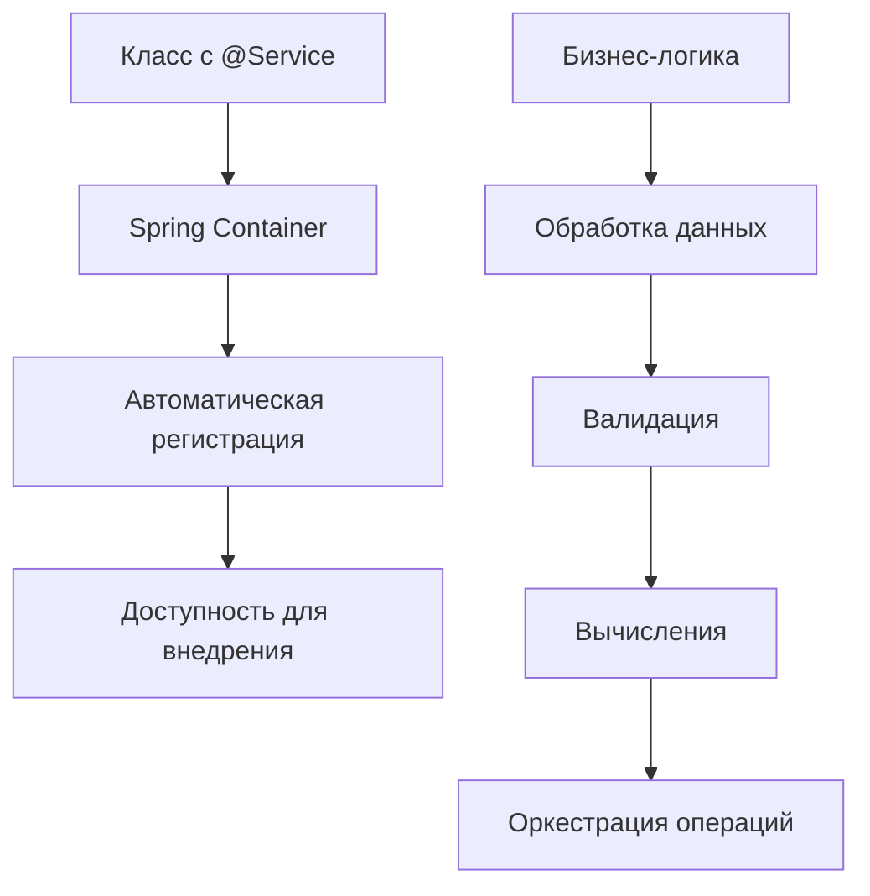
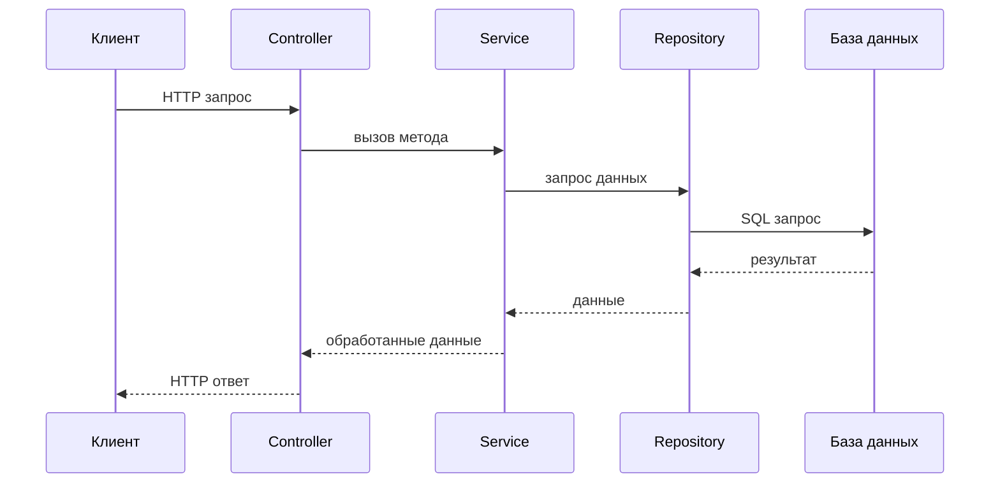
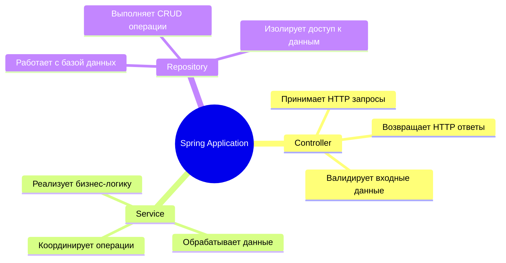
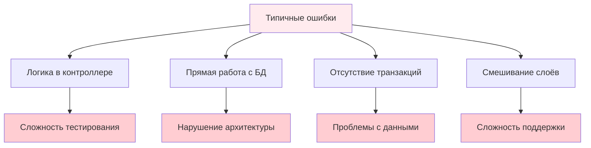

# Аннотация @Service (Spring)

## 📋 Содержание
- [🎯 Что такое @Service?](#-что-такое-service)
- [🏗️ Архитектура Spring приложения](#-архитектура-spring-приложения)
- [🔍 Как работает @Service?](#-как-работает-service)
- [💡 Практические примеры](#-практические-примеры)
- [⚡ Полный пример: Controller → Service → DAO](#-полный-пример-controller--service--dao)
- [🔄 Связь с другими аннотациями](#-связь-с-другими-аннотациями)
- [📚 Глоссарий](#-глоссарий)
- [💡 Советы и лучшие практики](#-советы-и-лучшие-практики)
- [❓ Часто задаваемые вопросы](#-часто-задаваемые-вопросы)

---

## 🎯 Что такое @Service?

`@Service` — это специальная аннотация в Spring Framework, которая помечает классы, реализующие **бизнес-логику** приложения.

### 🎨 Визуальное представление



### 📝 Простой пример

```java
import org.springframework.stereotype.Service;

@Service
public class CalculatorService {
    
    public int add(int a, int b) {
        return a + b; // Бизнес-логика: сложение
    }
    
    public double calculateDiscount(double price, double discountPercent) {
        return price * (1 - discountPercent / 100); // Бизнес-логика: расчёт скидки
    }
}
```

---

## 🏗️ Архитектура Spring приложения

### 🎯 Слоистая архитектура

```mermaid
graph TB
    subgraph "Презентационный слой"
        A[Controller<br/>@Controller/@RestController]
    end
    
    subgraph "Бизнес-слой"
        B[Service<br/>@Service]
    end
    
    subgraph "Слой данных"
        C[Repository<br/>@Repository]
        D[Entity/Model]
    end
    
    subgraph "Внешние системы"
        E[База данных]
        F[API]
    end
    
    A -->|"вызывает"| B
    B -->|"использует"| C
    C -->|"работает с"| D
    D -->|"сохраняется в"| E
    B -->|"интегрируется с"| F
    
    style A fill:#e1f5fe
    style B fill:#f3e5f5
    style C fill:#e8f5e8
    style D fill:#fff3e0
```

### 🔄 Поток данных



---

## 🔍 Как работает @Service?

### 🎯 Основные принципы

1. **Автоматическое сканирование**: Spring находит все классы с `@Service`
2. **Регистрация в контейнере**: Создаёт bean-объекты
3. **Внедрение зависимостей**: Доступен для `@Autowired`

### 🔧 Механизм работы

```mermaid
graph LR
    A[Компонент-сканирование] --> B[Найдены @Service классы]
    B --> C[Создание bean-ов]
    C --> D[Регистрация в контейнере]
    D --> E[Доступность для DI]
    
    F[@Autowired] --> E
    E --> G[Внедрение в другие компоненты]
```

---

## 💡 Практические примеры

### 📊 Пример 1: Сервис для работы с сотрудниками

```java
import org.springframework.stereotype.Service;
import org.springframework.beans.factory.annotation.Autowired;
import java.util.List;

@Service
public class EmployeeService {
    
    @Autowired
    private EmployeeRepository employeeRepository;
    
    // Бизнес-логика: получение всех сотрудников
    public List<Employee> getAllEmployees() {
        return employeeRepository.findAll();
    }
    
    // Бизнес-логика: расчёт зарплаты с бонусами
    public double calculateSalaryWithBonus(Employee employee) {
        double baseSalary = employee.getBaseSalary();
        double bonus = calculateBonus(employee);
        return baseSalary + bonus;
    }
    
    // Бизнес-логика: расчёт бонуса
    private double calculateBonus(Employee employee) {
        if (employee.getYearsOfService() > 5) {
            return employee.getBaseSalary() * 0.15; // 15% бонус
        }
        return employee.getBaseSalary() * 0.05; // 5% бонус
    }
}
```

### 🛒 Пример 2: Сервис для интернет-магазина

```java
@Service
public class OrderService {
    
    @Autowired
    private OrderRepository orderRepository;
    
    @Autowired
    private ProductRepository productRepository;
    
    // Бизнес-логика: создание заказа
    public Order createOrder(List<OrderItem> items, Customer customer) {
        // Валидация товаров
        validateItems(items);
        
        // Расчёт общей стоимости
        double totalAmount = calculateTotal(items);
        
        // Применение скидки
        double discount = calculateDiscount(customer, totalAmount);
        double finalAmount = totalAmount - discount;
        
        // Создание заказа
        Order order = new Order();
        order.setItems(items);
        order.setCustomer(customer);
        order.setTotalAmount(finalAmount);
        order.setStatus("PENDING");
        
        return orderRepository.save(order);
    }
    
    private void validateItems(List<OrderItem> items) {
        for (OrderItem item : items) {
            Product product = productRepository.findById(item.getProductId());
            if (product == null || product.getStock() < item.getQuantity()) {
                throw new IllegalArgumentException("Товар недоступен");
            }
        }
    }
    
    private double calculateTotal(List<OrderItem> items) {
        return items.stream()
                   .mapToDouble(item -> item.getPrice() * item.getQuantity())
                   .sum();
    }
    
    private double calculateDiscount(Customer customer, double amount) {
        if (customer.getLoyaltyLevel() == "GOLD") {
            return amount * 0.10; // 10% скидка
        }
        return 0;
    }
}
```

---

## ⚡ Полный пример: Controller → Service → DAO

### 🎯 Полная архитектура приложения

```mermaid
graph TB
    subgraph "Controller Layer"
        A[EmployeeController<br/>@RestController]
    end
    
    subgraph "Service Layer"
        B[EmployeeService<br/>@Service]
    end
    
    subgraph "Repository Layer"
        C[EmployeeRepository<br/>@Repository]
    end
    
    subgraph "Database"
        D[(Employee Table)]
    end
    
    A -->|"1. HTTP GET /employees"| B
    B -->|"2. getAllEmployees()"| C
    C -->|"3. SELECT * FROM employees"| D
    D -->|"4. ResultSet"| C
    C -->|"5. List<Employee>"| B
    B -->|"6. Processed data"| A
    A -->|"7. JSON response"| E[Client]
    
    style A fill:#e1f5fe
    style B fill:#f3e5f5
    style C fill:#e8f5e8
    style D fill:#fff3e0
```

### 📝 Код всех слоёв

#### 1. Entity (Модель данных)
```java
@Entity
@Table(name = "employees")
public class Employee {
    @Id
    @GeneratedValue(strategy = GenerationType.IDENTITY)
    private Long id;
    
    private String name;
    private String position;
    private double salary;
    private int yearsOfService;
    
    // Конструкторы, геттеры, сеттеры...
}
```

#### 2. Repository (Слой данных)
```java
@Repository
public interface EmployeeRepository extends JpaRepository<Employee, Long> {
    List<Employee> findByPosition(String position);
    List<Employee> findBySalaryGreaterThan(double salary);
}
```

#### 3. Service (Бизнес-логика)
```java
@Service
@Transactional
public class EmployeeService {
    
    @Autowired
    private EmployeeRepository employeeRepository;
    
    // Получить всех сотрудников
    public List<Employee> getAllEmployees() {
        return employeeRepository.findAll();
    }
    
    // Получить сотрудников по должности
    public List<Employee> getEmployeesByPosition(String position) {
        return employeeRepository.findByPosition(position);
    }
    
    // Расчёт зарплаты с бонусами
    public double calculateTotalSalary(Long employeeId) {
        Employee employee = employeeRepository.findById(employeeId)
            .orElseThrow(() -> new RuntimeException("Сотрудник не найден"));
        
        double baseSalary = employee.getSalary();
        double bonus = calculateBonus(employee);
        
        return baseSalary + bonus;
    }
    
    private double calculateBonus(Employee employee) {
        if (employee.getYearsOfService() >= 5) {
            return employee.getSalary() * 0.15; // 15% бонус
        } else if (employee.getYearsOfService() >= 2) {
            return employee.getSalary() * 0.10; // 10% бонус
        }
        return employee.getSalary() * 0.05; // 5% бонус
    }
}
```

#### 4. Controller (Презентационный слой)
```java
@RestController
@RequestMapping("/api/employees")
public class EmployeeController {
    
    @Autowired
    private EmployeeService employeeService;
    
    @GetMapping
    public ResponseEntity<List<Employee>> getAllEmployees() {
        List<Employee> employees = employeeService.getAllEmployees();
        return ResponseEntity.ok(employees);
    }
    
    @GetMapping("/{id}/salary")
    public ResponseEntity<Map<String, Object>> getEmployeeSalary(@PathVariable Long id) {
        double totalSalary = employeeService.calculateTotalSalary(id);
        
        Map<String, Object> response = new HashMap<>();
        response.put("employeeId", id);
        response.put("totalSalary", totalSalary);
        
        return ResponseEntity.ok(response);
    }
    
    @GetMapping("/position/{position}")
    public ResponseEntity<List<Employee>> getEmployeesByPosition(@PathVariable String position) {
        List<Employee> employees = employeeService.getEmployeesByPosition(position);
        return ResponseEntity.ok(employees);
    }
}
```

---

## 🔄 Связь с другими аннотациями

### 🎯 Иерархия аннотаций Spring

```mermaid
graph TD
    A[@Component] --> B[@Service]
    A --> C[@Repository]
    A --> D[@Controller]
    
    E[Базовый стереотип] --> A
    F[Специализированные стереотипы] --> B
    F --> C
    F --> D
    
    style A fill:#ffebee
    style B fill:#e8f5e8
    style C fill:#e3f2fd
    style D fill:#fff3e0
```

### 📊 Сравнение аннотаций

| Аннотация | Назначение | Слой | Пример использования |
|-----------|------------|------|---------------------|
| `@Component` | Универсальный компонент | Любой | Утилитарные классы |
| `@Service` | Бизнес-логика | Сервисный | Обработка данных, расчёты |
| `@Repository` | Работа с данными | Доступа к данным | CRUD операции |
| `@Controller` | Обработка HTTP | Презентационный | REST API, MVC |

---

## 📚 Глоссарий

### 🔤 Ключевые термины

- **@Service** — аннотация Spring для маркировки классов с бизнес-логикой
- **Бизнес-логика** — правила и операции, отражающие суть работы приложения
- **Spring Container** — контейнер, управляющий жизненным циклом bean-ов
- **Dependency Injection (DI)** — внедрение зависимостей между компонентами
- **Bean** — объект, управляемый Spring контейнером
- **@Autowired** — аннотация для автоматического внедрения зависимостей
- **@Transactional** — аннотация для управления транзакциями
- **Слоистая архитектура** — разделение приложения на логические слои

### 🎯 Роли в приложении



---

## 💡 Советы и лучшие практики

### ✅ Что делать

- ✅ Выносите бизнес-логику в сервисы
- ✅ Используйте транзакции на уровне сервисов
- ✅ Разделяйте ответственность между слоями
- ✅ Пишите тесты для сервисов
- ✅ Используйте интерфейсы для сервисов

### ❌ Что не делать

- ❌ Не помещайте всю логику в контроллеры
- ❌ Не работайте напрямую с базой данных из сервисов
- ❌ Не создавайте сервисы для простых CRUD операций
- ❌ Не забывайте про обработку исключений

### 🎯 Пример правильной структуры

```java
// ✅ Хорошо: Интерфейс + реализация
public interface UserService {
    User createUser(UserDto userDto);
    List<User> getActiveUsers();
}

@Service
public class UserServiceImpl implements UserService {
    // Реализация методов
}

// ❌ Плохо: Всё в контроллере
@RestController
public class UserController {
    @Autowired
    private UserRepository userRepository; // Прямая работа с БД
    
    @PostMapping("/users")
    public User createUser(@RequestBody User user) {
        // Бизнес-логика в контроллере - ПЛОХО!
        return userRepository.save(user);
    }
}
```

---

## ❓ Часто задаваемые вопросы

### 🤔 FAQ

**Q: В чём разница между @Service и @Component?**
A: `@Service` — это специализированный `@Component` для бизнес-логики. Функционально они идентичны, но `@Service` лучше описывает назначение класса.

**Q: Можно ли использовать @Service без @Autowired?**
A: Да, можно использовать конструктор или setter-инъекцию, но `@Autowired` — самый распространённый способ.

**Q: Нужно ли создавать интерфейсы для сервисов?**
A: Рекомендуется для сложной бизнес-логики и тестирования, но не обязательно для простых случаев.

**Q: Где размещать @Transactional — в сервисе или репозитории?**
A: Обычно в сервисе, так как транзакции должны охватывать всю бизнес-операцию.

### 🎯 Типичные ошибки новичков



---

## 🎯 Заключение

`@Service` — ключевая аннотация Spring для организации бизнес-логики. Правильное использование обеспечивает:

- 🏗️ Чистую архитектуру
- 🧪 Лёгкость тестирования  
- 🔧 Простоту поддержки
- 📈 Масштабируемость

Помните: **Service — это мост между Controller и Repository, где живёт вся бизнес-логика вашего приложения!**
