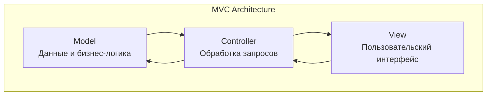
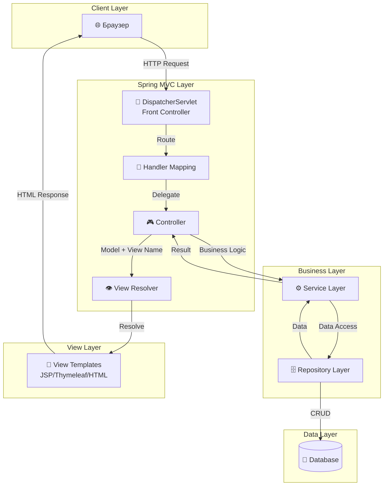
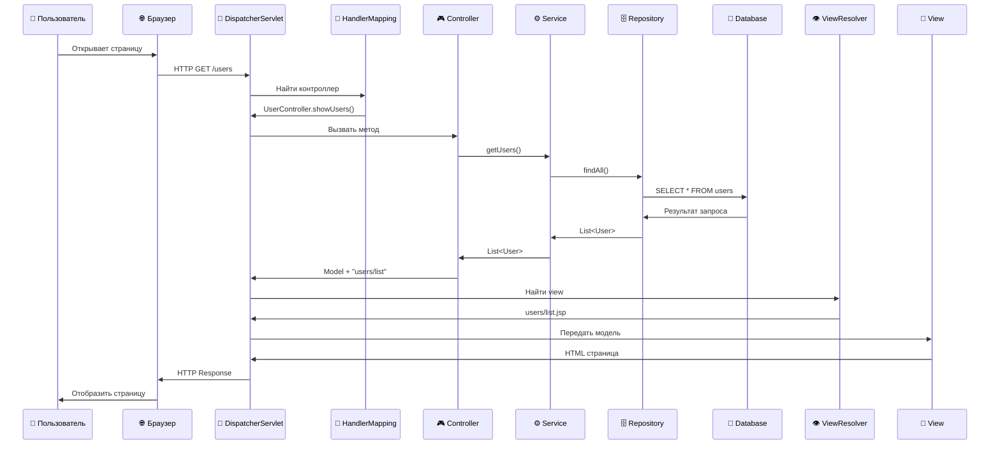
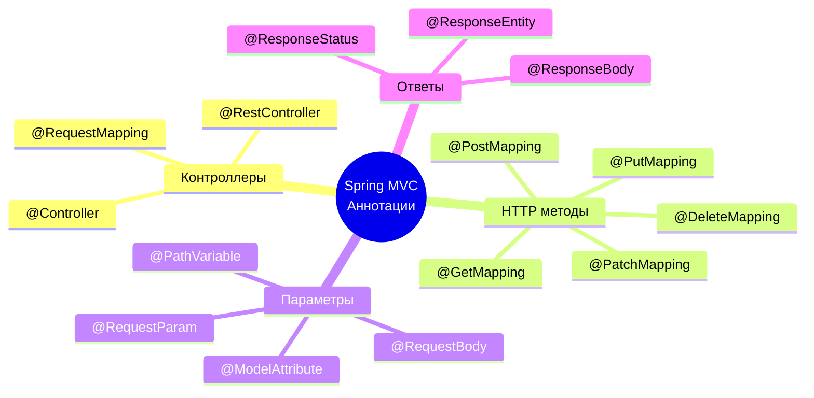

# 🚀 Знакомство со Spring MVC

## 📋 Содержание
- [🎯 Что такое Spring MVC?](#-что-такое-spring-mvc)
- [🏗️ Архитектура MVC](#️-архитектура-mvc)
- [⚙️ Как работает Spring MVC](#️-как-работает-spring-mvc)
- [🔧 Основные компоненты](#-основные-компоненты)
- [💻 Практический пример](#-практический-пример)
- [📚 Аннотации Spring MVC](#-аннотации-spring-mvc)
- [🎨 Создание View](#-создание-view)
- [🔗 Полезные ссылки](#-полезные-ссылки)
- [❓ Часто задаваемые вопросы](#-часто-задаваемые-вопросы)

---

## 🎯 Что такое Spring MVC?

**Spring MVC** — это мощный фреймворк для создания веб-приложений на Java, основанный на архитектурном паттерне **MVC** (Model-View-Controller).

### 🎪 Что такое MVC?

MVC — это архитектурный паттерн, который разделяет приложение на три логических компонента:



**Преимущества MVC:**
- ✅ Разделение ответственности
- ✅ Легкость тестирования
- ✅ Переиспользование кода
- ✅ Простота поддержки

---

## 🏗️ Архитектура MVC

### 📊 Детальная схема компонентов



### 🎭 Роли каждого компонента

| Компонент | Роль | Пример |
|-----------|------|--------|
| **Model** | Хранит данные и бизнес-логику | `User`, `Product`, `Order` |
| **View** | Отображает данные пользователю | JSP, Thymeleaf, HTML |
| **Controller** | Обрабатывает запросы и управляет потоком | `UserController`, `ProductController` |

---

## ⚙️ Как работает Spring MVC

### 🔄 Жизненный цикл запроса



### 📝 Пошаговый процесс

1. **🌐 Запрос** - Пользователь отправляет HTTP запрос
2. **🚦 Диспетчеризация** - DispatcherServlet получает запрос
3. **🎯 Маршрутизация** - HandlerMapping определяет контроллер
4. **🎮 Обработка** - Контроллер выполняет бизнес-логику
5. **⚙️ Сервисы** - Обращение к сервисному слою
6. **🗄️ Данные** - Работа с базой данных
7. **📄 Представление** - Выбор и рендеринг view
8. **🌐 Ответ** - Возврат HTML страницы

---

## 🔧 Основные компоненты

### 🚦 DispatcherServlet (Front Controller)

**DispatcherServlet** — это центральный компонент Spring MVC, который:
- Принимает все HTTP запросы
- Делегирует их соответствующим контроллерам
- Управляет жизненным циклом запроса

```java
// Конфигурация в web.xml
<servlet>
    <servlet-name>dispatcher</servlet-name>
    <servlet-class>org.springframework.web.servlet.DispatcherServlet</servlet-class>
    <load-on-startup>1</load-on-startup>
</servlet>

<servlet-mapping>
    <servlet-name>dispatcher</servlet-name>
    <url-pattern>/</url-pattern>
</servlet-mapping>
```

### 🎮 Controller

Контроллер — это класс, который обрабатывает HTTP запросы и возвращает ответы.

```java
@Controller
public class UserController {
    
    @Autowired
    private UserService userService;
    
    @GetMapping("/users")
    public String showUsers(Model model) {
        List<User> users = userService.getAllUsers();
        model.addAttribute("users", users);
        return "users/list";
    }
}
```

### 📦 Model

Модель — это контейнер для данных, которые передаются между контроллером и view.

```java
// Entity класс
@Entity
public class User {
    @Id
    @GeneratedValue(strategy = GenerationType.IDENTITY)
    private Long id;
    
    private String name;
    private String email;
    
    // Геттеры и сеттеры
}

// DTO класс
public class UserDTO {
    private String name;
    private String email;
    // Геттеры и сеттеры
}
```

---

## 💻 Практический пример

### 🏗️ Создание простого Spring MVC приложения

#### 1. 📁 Структура проекта

```
src/
├── main/
│   ├── java/
│   │   └── com/example/
│   │       ├── controller/
│   │       │   └── UserController.java
│   │       ├── model/
│   │       │   └── User.java
│   │       ├── service/
│   │       │   └── UserService.java
│   │       └── config/
│   │           └── WebConfig.java
│   ├── resources/
│   │   └── application.properties
│   └── webapp/
│       └── WEB-INF/
│           └── views/
│               └── users/
│                   ├── list.jsp
│                   └── form.jsp
```

#### 2. 🎮 Контроллер

```java
@Controller
@RequestMapping("/users")
public class UserController {
    
    @Autowired
    private UserService userService;
    
    // Показать список пользователей
    @GetMapping
    public String listUsers(Model model) {
        List<User> users = userService.getAllUsers();
        model.addAttribute("users", users);
        return "users/list";
    }
    
    // Показать форму создания
    @GetMapping("/new")
    public String showForm(Model model) {
        model.addAttribute("user", new User());
        return "users/form";
    }
    
    // Создать пользователя
    @PostMapping
    public String createUser(@ModelAttribute User user, 
                           BindingResult result) {
        if (result.hasErrors()) {
            return "users/form";
        }
        userService.saveUser(user);
        return "redirect:/users";
    }
    
    // Показать пользователя по ID
    @GetMapping("/{id}")
    public String showUser(@PathVariable Long id, Model model) {
        User user = userService.getUserById(id);
        model.addAttribute("user", user);
        return "users/show";
    }
}
```

#### 3. 📦 Модель

```java
@Entity
@Table(name = "users")
public class User {
    
    @Id
    @GeneratedValue(strategy = GenerationType.IDENTITY)
    private Long id;
    
    @NotBlank(message = "Имя обязательно")
    @Size(min = 2, max = 50, message = "Имя должно быть от 2 до 50 символов")
    private String name;
    
    @Email(message = "Некорректный email")
    @NotBlank(message = "Email обязателен")
    private String email;
    
    // Конструкторы
    public User() {}
    
    public User(String name, String email) {
        this.name = name;
        this.email = email;
    }
    
    // Геттеры и сеттеры
    public Long getId() { return id; }
    public void setId(Long id) { this.id = id; }
    
    public String getName() { return name; }
    public void setName(String name) { this.name = name; }
    
    public String getEmail() { return email; }
    public void setEmail(String email) { this.email = email; }
}
```

#### 4. ⚙️ Сервис

```java
@Service
public class UserService {
    
    @Autowired
    private UserRepository userRepository;
    
    public List<User> getAllUsers() {
        return userRepository.findAll();
    }
    
    public User getUserById(Long id) {
        return userRepository.findById(id)
            .orElseThrow(() -> new UserNotFoundException("Пользователь не найден"));
    }
    
    public User saveUser(User user) {
        return userRepository.save(user);
    }
    
    public void deleteUser(Long id) {
        userRepository.deleteById(id);
    }
}
```

---

## 📚 Аннотации Spring MVC

### 🎯 Основные аннотации



### 📋 Таблица аннотаций

| Аннотация | Описание | Пример |
|-----------|----------|--------|
| `@Controller` | Помечает класс как контроллер | `@Controller` |
| `@RequestMapping` | Определяет базовый URL | `@RequestMapping("/api")` |
| `@GetMapping` | Обрабатывает GET запросы | `@GetMapping("/users")` |
| `@PostMapping` | Обрабатывает POST запросы | `@PostMapping("/users")` |
| `@PathVariable` | Извлекает параметр из URL | `@PathVariable Long id` |
| `@RequestParam` | Извлекает параметр запроса | `@RequestParam String name` |
| `@ModelAttribute` | Связывает данные формы | `@ModelAttribute User user` |
| `@ResponseBody` | Возвращает данные напрямую | `@ResponseBody String` |

### 💡 Примеры использования

```java
@Controller
@RequestMapping("/api/users")
public class UserApiController {
    
    // GET /api/users
    @GetMapping
    @ResponseBody
    public List<User> getAllUsers() {
        return userService.getAllUsers();
    }
    
    // GET /api/users/123
    @GetMapping("/{id}")
    @ResponseBody
    public User getUserById(@PathVariable Long id) {
        return userService.getUserById(id);
    }
    
    // POST /api/users?name=John&email=john@example.com
    @PostMapping
    @ResponseBody
    public User createUser(@RequestParam String name, 
                          @RequestParam String email) {
        User user = new User(name, email);
        return userService.saveUser(user);
    }
    
    // PUT /api/users/123
    @PutMapping("/{id}")
    @ResponseBody
    public User updateUser(@PathVariable Long id, 
                          @RequestBody User user) {
        user.setId(id);
        return userService.saveUser(user);
    }
    
    // DELETE /api/users/123
    @DeleteMapping("/{id}")
    @ResponseStatus(HttpStatus.NO_CONTENT)
    public void deleteUser(@PathVariable Long id) {
        userService.deleteUser(id);
    }
}
```

---

## 🎨 Создание View

### 📄 JSP (Java Server Pages)

JSP — это технология для создания динамических веб-страниц с использованием HTML и Java кода.

#### Пример JSP страницы

```jsp
<%@ page language="java" contentType="text/html; charset=UTF-8" pageEncoding="UTF-8"%>
<%@ taglib prefix="c" uri="http://java.sun.com/jsp/jstl/core"%>
<!DOCTYPE html>
<html>
<head>
    <meta charset="UTF-8">
    <title>Список пользователей</title>
    <link rel="stylesheet" href="/css/style.css">
</head>
<body>
    <div class="container">
        <h1>👥 Список пользователей</h1>
        
        <a href="/users/new" class="btn btn-primary">➕ Добавить пользователя</a>
        
        <table class="table">
            <thead>
                <tr>
                    <th>ID</th>
                    <th>Имя</th>
                    <th>Email</th>
                    <th>Действия</th>
                </tr>
            </thead>
            <tbody>
                <c:forEach var="user" items="${users}">
                    <tr>
                        <td>${user.id}</td>
                        <td>${user.name}</td>
                        <td>${user.email}</td>
                        <td>
                            <a href="/users/${user.id}" class="btn btn-info">👁️ Просмотр</a>
                            <a href="/users/${user.id}/edit" class="btn btn-warning">✏️ Редактировать</a>
                            <a href="/users/${user.id}/delete" class="btn btn-danger" 
                               onclick="return confirm('Удалить пользователя?')">🗑️ Удалить</a>
                        </td>
                    </tr>
                </c:forEach>
            </tbody>
        </table>
    </div>
</body>
</html>
```

### 🍃 Thymeleaf

Thymeleaf — современный шаблонизатор для Spring MVC.

#### Пример Thymeleaf шаблона

```html
<!DOCTYPE html>
<html xmlns:th="http://www.thymeleaf.org">
<head>
    <meta charset="UTF-8">
    <title>Список пользователей</title>
    <link rel="stylesheet" th:href="@{/css/style.css}">
</head>
<body>
    <div class="container">
        <h1>👥 Список пользователей</h1>
        
        <a th:href="@{/users/new}" class="btn btn-primary">➕ Добавить пользователя</a>
        
        <table class="table">
            <thead>
                <tr>
                    <th>ID</th>
                    <th>Имя</th>
                    <th>Email</th>
                    <th>Действия</th>
                </tr>
            </thead>
            <tbody>
                <tr th:each="user : ${users}">
                    <td th:text="${user.id}"></td>
                    <td th:text="${user.name}"></td>
                    <td th:text="${user.email}"></td>
                    <td>
                        <a th:href="@{/users/{id}(id=${user.id})}" class="btn btn-info">👁️ Просмотр</a>
                        <a th:href="@{/users/{id}/edit(id=${user.id})}" class="btn btn-warning">✏️ Редактировать</a>
                        <a th:href="@{/users/{id}/delete(id=${user.id})}" class="btn btn-danger" 
                           onclick="return confirm('Удалить пользователя?')">🗑️ Удалить</a>
                    </td>
                </tr>
            </tbody>
        </table>
    </div>
</body>
</html>
```

### 📊 Сравнение технологий

| Технология | Преимущества | Недостатки | Когда использовать |
|------------|--------------|------------|-------------------|
| **JSP** | Простота, интеграция с Java | Устаревшая технология | Легационные проекты |
| **Thymeleaf** | Современность, безопасность | Крутая кривая обучения | Новые проекты |
| **HTML + JavaScript** | Гибкость, SPA | Сложность | REST API + Frontend |

---

## 🔗 Полезные ссылки

### 📚 Документация
- [Spring MVC Documentation](https://docs.spring.io/spring-framework/docs/current/reference/html/web.html)
- [Spring Boot Reference](https://docs.spring.io/spring-boot/docs/current/reference/html/)
- [Thymeleaf Documentation](https://www.thymeleaf.org/documentation.html)

### 🎓 Обучающие ресурсы
- [Spring MVC Tutorial](https://spring.io/guides/gs/serving-web-content/)
- [Spring Boot Tutorial](https://spring.io/guides/gs/spring-boot/)
- [Baeldung Spring MVC](https://www.baeldung.com/spring-mvc-tutorial)

### 🛠️ Инструменты
- [Spring Initializr](https://start.spring.io/) - Генератор проектов
- [Spring Tool Suite](https://spring.io/tools) - IDE для Spring
- [Spring Boot DevTools](https://docs.spring.io/spring-boot/docs/current/reference/html/using.html#using.devtools)

---

## ❓ Часто задаваемые вопросы

### 🤔 Что такое DispatcherServlet?
**DispatcherServlet** — это центральный сервлет Spring MVC, который:
- Принимает все HTTP запросы
- Делегирует их соответствующим контроллерам
- Управляет жизненным циклом запроса

### 🤔 В чем разница между @Controller и @RestController?
- `@Controller` — для MVC приложений с view
- `@RestController` — для REST API (комбинация `@Controller` + `@ResponseBody`)

### 🤔 Как работает @RequestMapping?
`@RequestMapping` определяет базовый URL для всех методов контроллера:
```java
@RequestMapping("/api/users")  // Базовый URL
public class UserController {
    @GetMapping                 // /api/users
    @GetMapping("/{id}")        // /api/users/{id}
    @PostMapping                // /api/users
}
```

### 🤔 Что такое Model в Spring MVC?
**Model** — это интерфейс для передачи данных между контроллером и view:
```java
@GetMapping("/users")
public String showUsers(Model model) {
    model.addAttribute("users", userService.getAllUsers());
    return "users/list";
}
```

### 🤔 Как настроить ViewResolver?
```java
@Configuration
public class WebConfig implements WebMvcConfigurer {
    
    @Bean
    public ViewResolver viewResolver() {
        InternalResourceViewResolver resolver = new InternalResourceViewResolver();
        resolver.setPrefix("/WEB-INF/views/");
        resolver.setSuffix(".jsp");
        return resolver;
    }
}
```

---

## 🎯 Заключение

Spring MVC — это мощный и гибкий фреймворк для создания веб-приложений. Основные преимущества:

✅ **Простота использования** — минимум конфигурации  
✅ **Гибкость** — поддержка различных view технологий  
✅ **Интеграция** — полная совместимость с Spring экосистемой  
✅ **Производительность** — оптимизированная архитектура  
✅ **Безопасность** — встроенные механизмы защиты  

Начните с простых контроллеров и постепенно изучайте более сложные возможности фреймворка!

---

*📝 Последнее обновление: 2024 год*  
*🔗 Автор: Spring Framework Team*

