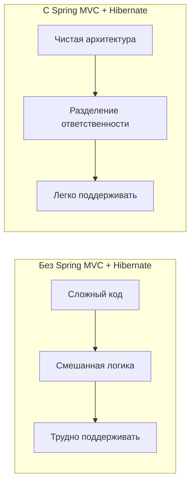
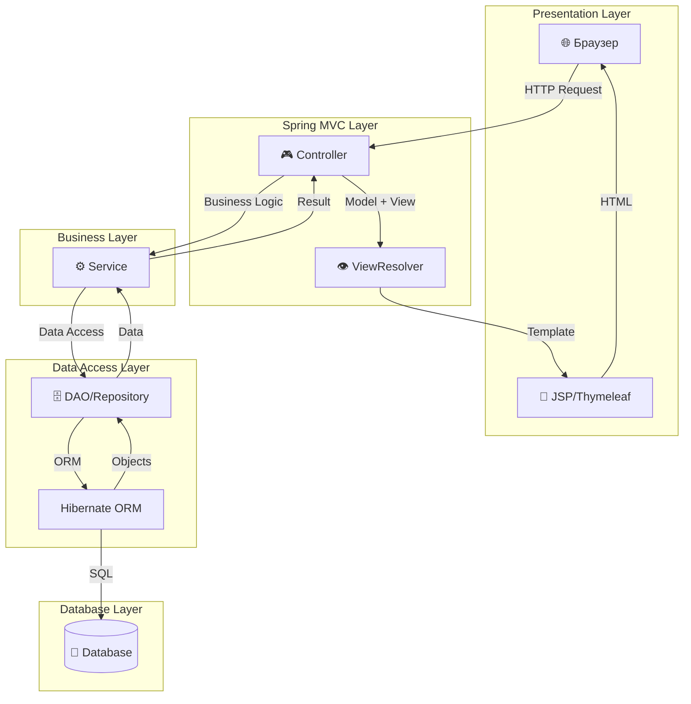
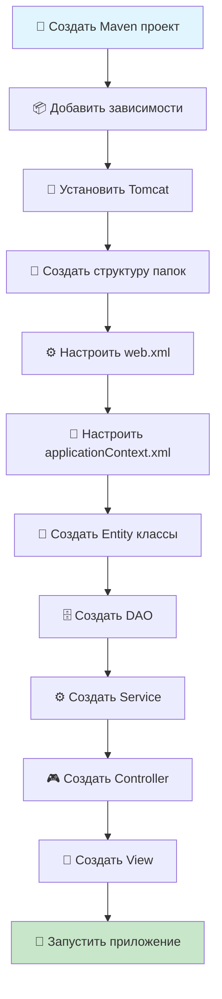
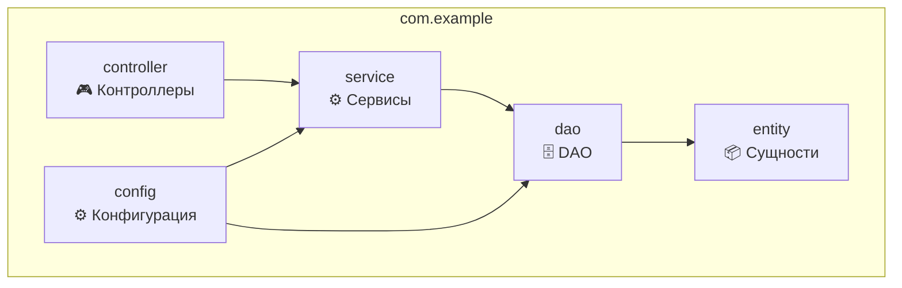
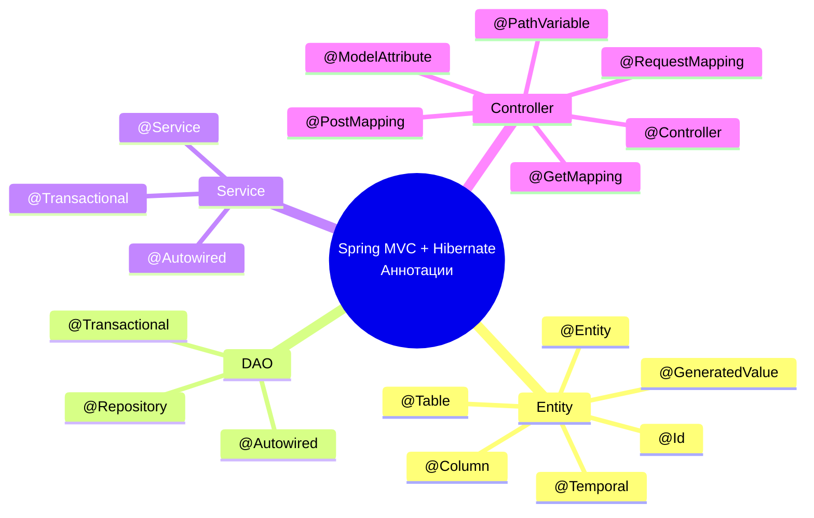

# 🚀 Конфигурация приложения Spring MVC + Hibernate

## 📋 Содержание
- [🎯 Что такое Spring MVC + Hibernate?](#-что-такое-spring-mvc--hibernate)
- [🏗️ Архитектура приложения](#️-архитектура-приложения)
- [⚙️ Пошаговая настройка](#️-пошаговая-настройка)
- [📁 Структура проекта](#-структура-проекта)
- [🔧 Конфигурационные файлы](#-конфигурационные-файлы)
- [💻 Практический пример](#-практический-пример)
- [📚 Аннотации и слои](#-аннотации-и-слои)
- [🐛 Troubleshooting](#-troubleshooting)
- [🔗 Полезные ссылки](#-полезные-ссылки)
- [❓ Часто задаваемые вопросы](#-часто-задаваемые-вопросы)

---

## 🎯 Что такое Spring MVC + Hibernate?

**Spring MVC + Hibernate** — это мощная комбинация технологий для создания веб-приложений на Java:

- **🌐 Spring MVC** — фреймворк для создания веб-приложений
- **🗄️ Hibernate** — ORM (Object-Relational Mapping) для работы с базой данных
- **🔗 Вместе** — полноценное веб-приложение с разделением ответственности

### 🎪 Зачем их связывать?



**Преимущества комбинации:**
- ✅ **Разделение ответственности** — каждый слой отвечает за свою задачу
- ✅ **Простота разработки** — минимум boilerplate кода
- ✅ **Производительность** — оптимизированная работа с БД
- ✅ **Безопасность** — встроенные механизмы защиты
- ✅ **Масштабируемость** — легко добавлять новые функции

---

## 🏗️ Архитектура приложения

### 📊 Общая схема архитектуры



### 🎭 Роли каждого слоя

| Слой | Компонент | Роль | Пример |
|------|-----------|------|--------|
| **Presentation** | Controller | Обработка HTTP запросов | `UserController` |
| **Business** | Service | Бизнес-логика | `UserService` |
| **Data Access** | DAO/Repository | Работа с БД | `UserDAO` |
| **Database** | Entity | Модель данных | `User` |

---

## ⚙️ Пошаговая настройка

### 📋 Чек-лист настройки



### 🛠️ Шаг 1: Создание Maven проекта

1. **Открой IDE** (IntelliJ IDEA, Eclipse, VS Code)
2. **Создай новый Maven проект**:
   - GroupId: `com.example`
   - ArtifactId: `spring-mvc-hibernate-app`
   - Version: `1.0-SNAPSHOT`
   - Packaging: `war`

### 📦 Шаг 2: Добавление зависимостей

Добавь в `pom.xml`:

```xml
<?xml version="1.0" encoding="UTF-8"?>
<project xmlns="http://maven.apache.org/POM/4.0.0"
         xmlns:xsi="http://www.w3.org/2001/XMLSchema-instance"
         xsi:schemaLocation="http://maven.apache.org/POM/4.0.0 
         http://maven.apache.org/xsd/maven-4.0.0.xsd">
    <modelVersion>4.0.0</modelVersion>

    <groupId>com.example</groupId>
    <artifactId>spring-mvc-hibernate-app</artifactId>
    <version>1.0-SNAPSHOT</version>
    <packaging>war</packaging>

    <properties>
        <maven.compiler.source>17</maven.compiler.source>
        <maven.compiler.target>17</maven.compiler.target>
        <spring.version>6.1.10</spring.version>
        <hibernate.version>6.5.2.Final</hibernate.version>
    </properties>

    <dependencies>
        <!-- Spring MVC -->
        <dependency>
            <groupId>org.springframework</groupId>
            <artifactId>spring-webmvc</artifactId>
            <version>${spring.version}</version>
        </dependency>

        <!-- Spring ORM -->
        <dependency>
            <groupId>org.springframework</groupId>
            <artifactId>spring-orm</artifactId>
            <version>${spring.version}</version>
        </dependency>

        <!-- Hibernate -->
        <dependency>
            <groupId>org.hibernate.orm</groupId>
            <artifactId>hibernate-core</artifactId>
            <version>${hibernate.version}</version>
        </dependency>

        <!-- PostgreSQL Driver -->
        <dependency>
            <groupId>org.postgresql</groupId>
            <artifactId>postgresql</artifactId>
            <version>42.7.1</version>
        </dependency>

        <!-- C3P0 Connection Pool -->
        <dependency>
            <groupId>com.mchange</groupId>
            <artifactId>c3p0</artifactId>
            <version>0.9.5.5</version>
        </dependency>

        <!-- JSTL -->
        <dependency>
            <groupId>jakarta.servlet.jsp.jstl</groupId>
            <artifactId>jakarta.servlet.jsp.jstl-api</artifactId>
            <version>3.0.0</version>
        </dependency>

        <!-- Lombok -->
        <dependency>
            <groupId>org.projectlombok</groupId>
            <artifactId>lombok</artifactId>
            <version>1.18.30</version>
            <scope>provided</scope>
        </dependency>

        <!-- Servlet API -->
        <dependency>
            <groupId>jakarta.servlet</groupId>
            <artifactId>jakarta.servlet-api</artifactId>
            <version>6.0.0</version>
            <scope>provided</scope>
        </dependency>
    </dependencies>

    <build>
        <plugins>
            <plugin>
                <groupId>org.apache.maven.plugins</groupId>
                <artifactId>maven-war-plugin</artifactId>
                <version>3.4.0</version>
            </plugin>
        </plugins>
    </build>
</project>
```

### 🐘 Шаг 3: Установка Tomcat

1. **Скачай Apache Tomcat** (версия 10.x)
2. **Распакуй в папку** (например, `C:\tomcat`)
3. **Настрой в IDE**:
   - IntelliJ IDEA: `File → Settings → Build, Execution, Deployment → Application Servers`
   - Eclipse: `Window → Preferences → Server → Runtime Environments`

---

## 📁 Структура проекта

### 🗂️ Рекомендуемая структура

```
src/
├── main/
│   ├── java/
│   │   └── com/example/
│   │       ├── controller/          # 🎮 Контроллеры
│   │       │   └── UserController.java
│   │       ├── service/             # ⚙️ Сервисы
│   │       │   ├── UserService.java
│   │       │   └── UserServiceImpl.java
│   │       ├── dao/                 # 🗄️ Data Access Objects
│   │       │   ├── UserDAO.java
│   │       │   └── UserDAOImpl.java
│   │       ├── entity/              # 📦 Сущности
│   │       │   └── User.java
│   │       └── config/              # ⚙️ Конфигурация
│   │           └── DatabaseConfig.java
│   ├── resources/
│   │   ├── application.properties   # 🔧 Настройки приложения
│   │   └── hibernate.cfg.xml        # 🗄️ Настройки Hibernate
│   └── webapp/
│       ├── WEB-INF/
│       │   ├── web.xml              # 🌐 Конфигурация веб-приложения
│       │   ├── applicationContext.xml # ⚙️ Конфигурация Spring
│       │   └── views/               # 📄 JSP страницы
│       │       ├── users/
│       │       │   ├── list.jsp
│       │       │   ├── form.jsp
│       │       │   └── show.jsp
│       │       └── index.jsp
│       ├── css/                     # 🎨 Стили
│       │   └── style.css
│       └── js/                      # 📜 JavaScript
│           └── script.js
└── test/
    └── java/
        └── com/example/
            └── UserControllerTest.java
```

### 📊 Диаграмма пакетов



---

## 🔧 Конфигурационные файлы

### 🌐 web.xml

```xml
<?xml version="1.0" encoding="UTF-8"?>
<web-app xmlns="https://jakarta.ee/xml/ns/jakartaee"
         xmlns:xsi="http://www.w3.org/2001/XMLSchema-instance"
         xsi:schemaLocation="https://jakarta.ee/xml/ns/jakartaee 
         https://jakarta.ee/xml/ns/jakartaee/web-app_6_0.xsd"
         version="6.0">

    <!-- Spring MVC DispatcherServlet -->
    <servlet>
        <servlet-name>dispatcher</servlet-name>
        <servlet-class>org.springframework.web.servlet.DispatcherServlet</servlet-class>
        <init-param>
            <param-name>contextConfigLocation</param-name>
            <param-value>/WEB-INF/applicationContext.xml</param-value>
        </init-param>
        <load-on-startup>1</load-on-startup>
    </servlet>

    <servlet-mapping>
        <servlet-name>dispatcher</servlet-name>
        <url-pattern>/</url-pattern>
    </servlet-mapping>

    <!-- Character Encoding Filter -->
    <filter>
        <filter-name>characterEncodingFilter</filter-name>
        <filter-class>org.springframework.web.filter.CharacterEncodingFilter</filter-class>
        <init-param>
            <param-name>encoding</param-name>
            <param-value>UTF-8</param-value>
        </init-param>
        <init-param>
            <param-name>forceEncoding</param-name>
            <param-value>true</param-value>
        </init-param>
    </filter>

    <filter-mapping>
        <filter-name>characterEncodingFilter</filter-name>
        <url-pattern>/*</url-pattern>
    </filter-mapping>

    <!-- Welcome File -->
    <welcome-file-list>
        <welcome-file>index.jsp</welcome-file>
    </welcome-file-list>
</web-app>
```

### ⚙️ applicationContext.xml

```xml
<?xml version="1.0" encoding="UTF-8"?>
<beans xmlns="http://www.springframework.org/schema/beans"
       xmlns:xsi="http://www.w3.org/2001/XMLSchema-instance"
       xmlns:context="http://www.springframework.org/schema/context"
       xmlns:tx="http://www.springframework.org/schema/tx"
       xsi:schemaLocation="http://www.springframework.org/schema/beans
       http://www.springframework.org/schema/beans/spring-beans.xsd
       http://www.springframework.org/schema/context
       http://www.springframework.org/schema/context/spring-context.xsd
       http://www.springframework.org/schema/tx
       http://www.springframework.org/schema/tx/spring-tx.xsd">

    <!-- Component Scanning -->
    <context:component-scan base-package="com.example"/>

    <!-- Database Configuration -->
    <bean id="dataSource" class="com.mchange.v2.c3p0.ComboPooledDataSource">
        <property name="driverClass" value="org.postgresql.Driver"/>
        <property name="jdbcUrl" value="jdbc:postgresql://localhost:5432/spring_mvc_db"/>
        <property name="user" value="postgres"/>
        <property name="password" value="password"/>
        
        <!-- Connection Pool Settings -->
        <property name="initialPoolSize" value="5"/>
        <property name="minPoolSize" value="5"/>
        <property name="maxPoolSize" value="20"/>
        <property name="acquireIncrement" value="1"/>
        <property name="maxIdleTime" value="3000"/>
    </bean>

    <!-- Hibernate SessionFactory -->
    <bean id="sessionFactory" class="org.springframework.orm.hibernate5.LocalSessionFactoryBean">
        <property name="dataSource" ref="dataSource"/>
        <property name="packagesToScan" value="com.example.entity"/>
        <property name="hibernateProperties">
            <props>
                <prop key="hibernate.dialect">org.hibernate.dialect.PostgreSQLDialect</prop>
                <prop key="hibernate.show_sql">true</prop>
                <prop key="hibernate.format_sql">true</prop>
                <prop key="hibernate.hbm2ddl.auto">update</prop>
                <prop key="hibernate.connection.characterEncoding">UTF-8</prop>
            </props>
        </property>
    </bean>

    <!-- Transaction Manager -->
    <bean id="transactionManager" class="org.springframework.orm.hibernate5.HibernateTransactionManager">
        <property name="sessionFactory" ref="sessionFactory"/>
    </bean>

    <!-- Enable Transaction Management -->
    <tx:annotation-driven/>

    <!-- View Resolver -->
    <bean class="org.springframework.web.servlet.view.InternalResourceViewResolver">
        <property name="prefix" value="/WEB-INF/views/"/>
        <property name="suffix" value=".jsp"/>
    </bean>

    <!-- Static Resources -->
    <mvc:resources mapping="/css/**" location="/css/"/>
    <mvc:resources mapping="/js/**" location="/js/"/>
    <mvc:resources mapping="/images/**" location="/images/"/>

</beans>
```

### 🗄️ hibernate.cfg.xml (альтернатива)

```xml
<?xml version="1.0" encoding="UTF-8"?>
<!DOCTYPE hibernate-configuration PUBLIC
        "-//Hibernate/Hibernate Configuration DTD 3.0//EN"
        "http://hibernate.sourceforge.net/hibernate-configuration-3.0.dtd">
<hibernate-configuration>
    <session-factory>
        <!-- Database Connection -->
        <property name="hibernate.connection.driver_class">org.postgresql.Driver</property>
        <property name="hibernate.connection.url">jdbc:postgresql://localhost:5432/spring_mvc_db</property>
        <property name="hibernate.connection.username">postgres</property>
        <property name="hibernate.connection.password">password</property>

        <!-- Hibernate Properties -->
        <property name="hibernate.dialect">org.hibernate.dialect.PostgreSQLDialect</property>
        <property name="hibernate.show_sql">true</property>
        <property name="hibernate.format_sql">true</property>
        <property name="hibernate.hbm2ddl.auto">update</property>
        <property name="hibernate.connection.characterEncoding">UTF-8</property>

        <!-- Connection Pool -->
        <property name="hibernate.c3p0.min_size">5</property>
        <property name="hibernate.c3p0.max_size">20</property>
        <property name="hibernate.c3p0.timeout">300</property>
        <property name="hibernate.c3p0.max_statements">50</property>
        <property name="hibernate.c3p0.idle_test_period">3000</property>

        <!-- Entity Mappings -->
        <mapping class="com.example.entity.User"/>
    </session-factory>
</hibernate-configuration>
```

---

## 💻 Практический пример

### 📦 Entity (User.java)

```java
package com.example.entity;

import jakarta.persistence.*;
import lombok.Data;
import lombok.NoArgsConstructor;
import lombok.AllArgsConstructor;

@Entity
@Table(name = "users")
@Data
@NoArgsConstructor
@AllArgsConstructor
public class User {
    
    @Id
    @GeneratedValue(strategy = GenerationType.IDENTITY)
    private Long id;
    
    @Column(name = "name", nullable = false, length = 100)
    private String name;
    
    @Column(name = "email", nullable = false, unique = true, length = 100)
    private String email;
    
    @Column(name = "age")
    private Integer age;
    
    @Column(name = "created_at")
    @Temporal(TemporalType.TIMESTAMP)
    private java.util.Date createdAt;
    
    @PrePersist
    protected void onCreate() {
        createdAt = new java.util.Date();
    }
}
```

### 🗄️ DAO (UserDAO.java)

```java
package com.example.dao;

import com.example.entity.User;
import java.util.List;

public interface UserDAO {
    List<User> getAllUsers();
    User getUserById(Long id);
    User getUserByEmail(String email);
    void saveUser(User user);
    void updateUser(User user);
    void deleteUser(Long id);
    boolean userExists(String email);
}
```

### 🗄️ DAO Implementation (UserDAOImpl.java)

```java
package com.example.dao;

import com.example.entity.User;
import org.hibernate.Session;
import org.hibernate.SessionFactory;
import org.hibernate.query.Query;
import org.springframework.beans.factory.annotation.Autowired;
import org.springframework.stereotype.Repository;
import org.springframework.transaction.annotation.Transactional;

import java.util.List;

@Repository
@Transactional
public class UserDAOImpl implements UserDAO {
    
    @Autowired
    private SessionFactory sessionFactory;
    
    private Session getCurrentSession() {
        return sessionFactory.getCurrentSession();
    }
    
    @Override
    @Transactional(readOnly = true)
    public List<User> getAllUsers() {
        Query<User> query = getCurrentSession().createQuery("from User", User.class);
        return query.getResultList();
    }
    
    @Override
    @Transactional(readOnly = true)
    public User getUserById(Long id) {
        return getCurrentSession().get(User.class, id);
    }
    
    @Override
    @Transactional(readOnly = true)
    public User getUserByEmail(String email) {
        Query<User> query = getCurrentSession()
            .createQuery("from User where email = :email", User.class);
        query.setParameter("email", email);
        return query.uniqueResult();
    }
    
    @Override
    public void saveUser(User user) {
        getCurrentSession().save(user);
    }
    
    @Override
    public void updateUser(User user) {
        getCurrentSession().update(user);
    }
    
    @Override
    public void deleteUser(Long id) {
        User user = getUserById(id);
        if (user != null) {
            getCurrentSession().delete(user);
        }
    }
    
    @Override
    @Transactional(readOnly = true)
    public boolean userExists(String email) {
        Query<Long> query = getCurrentSession()
            .createQuery("select count(*) from User where email = :email", Long.class);
        query.setParameter("email", email);
        return query.uniqueResult() > 0;
    }
}
```

### ⚙️ Service (UserService.java)

```java
package com.example.service;

import com.example.entity.User;
import java.util.List;

public interface UserService {
    List<User> getAllUsers();
    User getUserById(Long id);
    User getUserByEmail(String email);
    void saveUser(User user);
    void updateUser(User user);
    void deleteUser(Long id);
    boolean userExists(String email);
}
```

### ⚙️ Service Implementation (UserServiceImpl.java)

```java
package com.example.service;

import com.example.dao.UserDAO;
import com.example.entity.User;
import org.springframework.beans.factory.annotation.Autowired;
import org.springframework.stereotype.Service;
import org.springframework.transaction.annotation.Transactional;

import java.util.List;

@Service
@Transactional
public class UserServiceImpl implements UserService {
    
    @Autowired
    private UserDAO userDAO;
    
    @Override
    @Transactional(readOnly = true)
    public List<User> getAllUsers() {
        return userDAO.getAllUsers();
    }
    
    @Override
    @Transactional(readOnly = true)
    public User getUserById(Long id) {
        return userDAO.getUserById(id);
    }
    
    @Override
    @Transactional(readOnly = true)
    public User getUserByEmail(String email) {
        return userDAO.getUserByEmail(email);
    }
    
    @Override
    public void saveUser(User user) {
        if (userExists(user.getEmail())) {
            throw new RuntimeException("Пользователь с таким email уже существует");
        }
        userDAO.saveUser(user);
    }
    
    @Override
    public void updateUser(User user) {
        userDAO.updateUser(user);
    }
    
    @Override
    public void deleteUser(Long id) {
        userDAO.deleteUser(id);
    }
    
    @Override
    @Transactional(readOnly = true)
    public boolean userExists(String email) {
        return userDAO.userExists(email);
    }
}
```

### 🎮 Controller (UserController.java)

```java
package com.example.controller;

import com.example.entity.User;
import com.example.service.UserService;
import org.springframework.beans.factory.annotation.Autowired;
import org.springframework.stereotype.Controller;
import org.springframework.ui.Model;
import org.springframework.validation.BindingResult;
import org.springframework.web.bind.annotation.*;

import jakarta.validation.Valid;
import java.util.List;

@Controller
@RequestMapping("/users")
public class UserController {
    
    @Autowired
    private UserService userService;
    
    // Показать список всех пользователей
    @GetMapping
    public String listUsers(Model model) {
        List<User> users = userService.getAllUsers();
        model.addAttribute("users", users);
        return "users/list";
    }
    
    // Показать форму создания пользователя
    @GetMapping("/new")
    public String showCreateForm(Model model) {
        model.addAttribute("user", new User());
        return "users/form";
    }
    
    // Создать пользователя
    @PostMapping
    public String createUser(@Valid @ModelAttribute User user, 
                           BindingResult result, 
                           Model model) {
        if (result.hasErrors()) {
            return "users/form";
        }
        
        try {
            userService.saveUser(user);
            return "redirect:/users";
        } catch (RuntimeException e) {
            model.addAttribute("error", e.getMessage());
            return "users/form";
        }
    }
    
    // Показать пользователя по ID
    @GetMapping("/{id}")
    public String showUser(@PathVariable Long id, Model model) {
        User user = userService.getUserById(id);
        if (user == null) {
            return "redirect:/users";
        }
        model.addAttribute("user", user);
        return "users/show";
    }
    
    // Показать форму редактирования
    @GetMapping("/{id}/edit")
    public String showEditForm(@PathVariable Long id, Model model) {
        User user = userService.getUserById(id);
        if (user == null) {
            return "redirect:/users";
        }
        model.addAttribute("user", user);
        return "users/form";
    }
    
    // Обновить пользователя
    @PostMapping("/{id}")
    public String updateUser(@PathVariable Long id, 
                           @Valid @ModelAttribute User user, 
                           BindingResult result) {
        if (result.hasErrors()) {
            return "users/form";
        }
        
        user.setId(id);
        userService.updateUser(user);
        return "redirect:/users";
    }
    
    // Удалить пользователя
    @PostMapping("/{id}/delete")
    public String deleteUser(@PathVariable Long id) {
        userService.deleteUser(id);
        return "redirect:/users";
    }
}
```

---

## 📚 Аннотации и слои

### 🏷️ Основные аннотации



### 📋 Таблица аннотаций

| Слой | Аннотация | Описание | Пример |
|------|-----------|----------|--------|
| **Entity** | `@Entity` | Помечает класс как сущность БД | `@Entity` |
| **Entity** | `@Table` | Указывает имя таблицы | `@Table(name = "users")` |
| **Entity** | `@Id` | Помечает поле как первичный ключ | `@Id` |
| **Entity** | `@Column` | Настройки колонки | `@Column(nullable = false)` |
| **DAO** | `@Repository` | Помечает класс как DAO | `@Repository` |
| **Service** | `@Service` | Помечает класс как сервис | `@Service` |
| **Controller** | `@Controller` | Помечает класс как контроллер | `@Controller` |
| **Все** | `@Autowired` | Внедрение зависимостей | `@Autowired` |

### 🎯 Слои приложения

```mermaid
graph TD
    subgraph "Presentation Layer"
        C[Controller<br/>@Controller]
    end
    
    subgraph "Business Layer"
        S[Service<br/>@Service]
    end
    
    subgraph "Data Access Layer"
        D[DAO<br/>@Repository]
    end
    
    subgraph "Database Layer"
        E[Entity<br/>@Entity]
    end
    
    C -->|@Autowired| S
    S -->|@Autowired| D
    D -->|Hibernate| E
```

---

## 🐛 Troubleshooting

### ❌ Частые ошибки и решения

| Ошибка | Причина | Решение |
|--------|---------|---------|
| **NoClassDefFoundError** | Отсутствует зависимость | Добавь в `pom.xml` |
| **Connection refused** | БД не запущена | Запусти PostgreSQL |
| **Table doesn't exist** | Не создана таблица | Проверь `hibernate.hbm2ddl.auto` |
| **Bean creation failed** | Неправильная конфигурация | Проверь `applicationContext.xml` |
| **404 Not Found** | Неправильный URL | Проверь `@RequestMapping` |

### 🔍 Отладка конфигурации

#### 1. Проверка подключения к БД

```java
@Controller
public class TestController {
    
    @Autowired
    private SessionFactory sessionFactory;
    
    @GetMapping("/test-db")
    @ResponseBody
    public String testDatabase() {
        try {
            Session session = sessionFactory.openSession();
            session.close();
            return "✅ Подключение к БД успешно!";
        } catch (Exception e) {
            return "❌ Ошибка подключения: " + e.getMessage();
        }
    }
}
```

#### 2. Проверка Spring контекста

```java
@Component
public class SpringContextChecker implements ApplicationContextAware {
    
    private ApplicationContext context;
    
    @Override
    public void setApplicationContext(ApplicationContext context) throws BeansException {
        this.context = context;
        System.out.println("✅ Spring контекст загружен успешно!");
        System.out.println("📦 Количество бинов: " + context.getBeanDefinitionCount());
    }
}
```

### 📝 Логи для отладки

Добавь в `applicationContext.xml`:

```xml
<!-- Логирование SQL -->
<property name="hibernate.show_sql">true</property>
<property name="hibernate.format_sql">true</property>
<property name="hibernate.use_sql_comments">true</property>
```

---

## 🔗 Полезные ссылки

### 📚 Документация
- [Spring Framework Documentation](https://docs.spring.io/spring-framework/docs/current/reference/html/)
- [Hibernate Documentation](https://hibernate.org/orm/documentation/)
- [Apache Tomcat Documentation](https://tomcat.apache.org/tomcat-10.0-doc/)

### 🎓 Обучающие ресурсы
- [Spring MVC Tutorial](https://spring.io/guides/gs/serving-web-content/)
- [Hibernate Tutorial](https://hibernate.org/orm/documentation/6.5/)
- [Maven Tutorial](https://maven.apache.org/guides/getting-started/)

### 🛠️ Инструменты
- [Spring Initializr](https://start.spring.io/) - Генератор проектов
- [Hibernate Tools](https://hibernate.org/tools/) - Инструменты для Hibernate
- [DBeaver](https://dbeaver.io/) - Универсальный клиент БД

---

## ❓ Часто задаваемые вопросы

### 🤔 Как выбрать между XML и Java конфигурацией?
- **XML** — традиционный подход, больше контроля
- **Java** — современный подход, типобезопасность
- **Рекомендация** — используй Java конфигурацию для новых проектов

### 🤔 Какой пул соединений выбрать?
- **C3P0** — проверенный временем, много настроек
- **HikariCP** — быстрый, современный
- **DBCP2** — простой, встроенный в Spring
- **Рекомендация** — HikariCP для новых проектов

### 🤔 Как настроить транзакции?
```java
@Transactional(readOnly = true)  // Только чтение
@Transactional                    // Чтение и запись
@Transactional(rollbackFor = Exception.class)  // Откат при ошибке
```

### 🤔 Как создать миграции БД?
- **Hibernate** — `hibernate.hbm2ddl.auto = update`
- **Flyway** — профессиональные миграции
- **Liquibase** — XML/YAML миграции

### 🤔 Как оптимизировать производительность?
- Используй пул соединений
- Настрой кэширование Hibernate
- Используй `@Transactional(readOnly = true)`
- Оптимизируй запросы с `@Query`

---

## 🎯 Заключение

Spring MVC + Hibernate — это мощная комбинация для создания веб-приложений. Основные преимущества:

✅ **Простота настройки** — минимум конфигурации  
✅ **Производительность** — оптимизированная работа с БД  
✅ **Гибкость** — поддержка различных БД  
✅ **Безопасность** — встроенные механизмы защиты  
✅ **Масштабируемость** — легко добавлять новые функции  

Начните с простых Entity и постепенно изучайте более сложные возможности!

---

*📝 Последнее обновление: 2024 год*  
*🔗 Автор: Spring Framework Team*