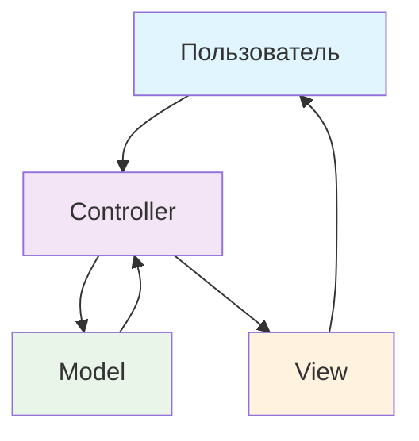
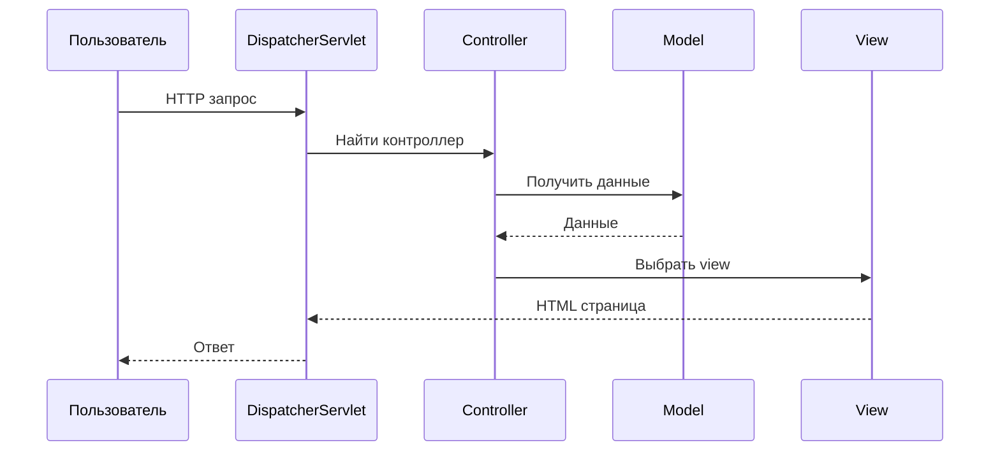
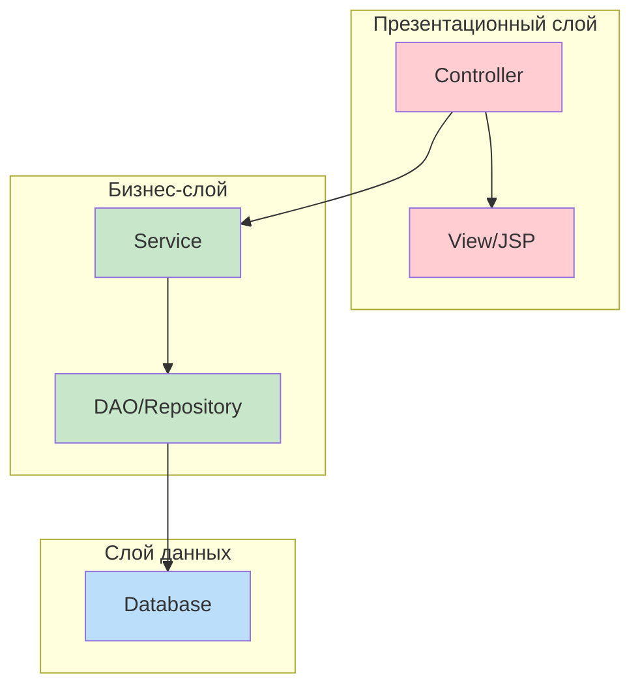
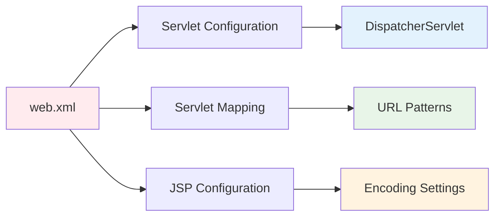
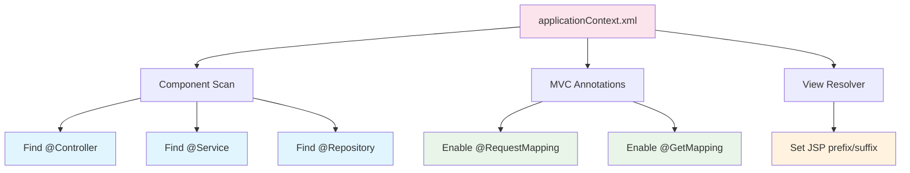
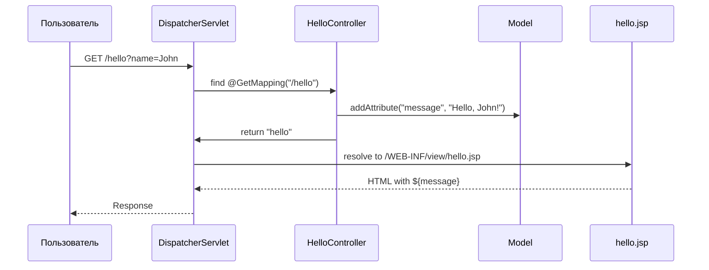

# 🚀 Конфигурация приложения Spring MVC

## 📋 Содержание
- [🎯 Что такое Spring MVC?](#-что-такое-spring-mvc)
- [🏗️ Архитектура Spring MVC](#️-архитектура-spring-mvc)
- [📁 Структура проекта](#-структура-проекта)
- [⚙️ Пошаговая настройка](#️-пошаговая-настройка)
- [🔧 Конфигурационные файлы](#-конфигурационные-файлы)
- [💡 Практический пример](#-практический-пример)
- [❓ Часто задаваемые вопросы](#-часто-задаваемые-вопросы)
- [📚 Глоссарий](#-глоссарий)
- [💡 Советы для новичков](#-советы-для-новичков)

---

## 🎯 Что такое Spring MVC?

Spring MVC — это мощный фреймворк для создания веб-приложений на Java. Он следует паттерну **Model-View-Controller (MVC)**, что делает код организованным и легким для понимания.

### 🎨 Паттерн MVC


**Model** — данные и бизнес-логика  
**View** — интерфейс пользователя  
**Controller** — обработчик запросов

---

## 🏗️ Архитектура Spring MVC

### 🔄 Жизненный цикл запроса


### 🏛️ Слои приложения


---

## 📁 Структура проекта

```
src/
├── main/
│   ├── java/
│   │   └── com/safronov/spring/mvc/
│   │       ├── controller/     # Контроллеры
│   │       ├── service/        # Бизнес-логика
│   │       ├── dao/           # Доступ к данным
│   │       └── entity/        # Модели данных
│   ├── resources/
│   │   └── applicationContext.xml
│   └── webapp/
│       ├── WEB-INF/
│       │   ├── web.xml
│       │   └── view/          # JSP страницы
│       └── index.jsp
└── test/
    └── java/
        └── com/safronov/spring/mvc/
```

---

## ⚙️ Пошаговая настройка

### 1️⃣ Добавление зависимостей (pom.xml)

```xml
<?xml version="1.0" encoding="UTF-8"?>
<project xmlns="http://maven.apache.org/POM/4.0.0" 
         xmlns:xsi="http://www.w3.org/2001/XMLSchema-instance"
         xsi:schemaLocation="http://maven.apache.org/POM/4.0.0 
         http://maven.apache.org/maven-v4_0_0.xsd">
    <modelVersion>4.0.0</modelVersion>
    <groupId>com.safronov.spring.mvc</groupId>
    <artifactId>spring-mvc-app</artifactId>
    <packaging>war</packaging>
    <version>1.0-SNAPSHOT</version>
    
    <properties>
        <maven.compiler.source>17</maven.compiler.source>
        <maven.compiler.target>17</maven.compiler.target>
        <spring.version>6.1.10</spring.version>
    </properties>

    <dependencies>
        <!-- Spring Web MVC -->
        <dependency>
            <groupId>org.springframework</groupId>
            <artifactId>spring-webmvc</artifactId>
            <version>${spring.version}</version>
        </dependency>

        <!-- JSTL для JSP -->
        <dependency>
            <groupId>jakarta.servlet.jsp.jstl</groupId>
            <artifactId>jakarta.servlet.jsp.jstl-api</artifactId>
            <version>3.0.0</version>
        </dependency>
        <dependency>
            <groupId>org.glassfish.web</groupId>
            <artifactId>jakarta.servlet.jsp.jstl</artifactId>
            <version>3.0.1</version>
        </dependency>

        <!-- Lombok для упрощения кода -->
        <dependency>
            <groupId>org.projectlombok</groupId>
            <artifactId>lombok</artifactId>
            <version>1.18.38</version>
            <scope>provided</scope>
        </dependency>

        <!-- Тестирование -->
        <dependency>
            <groupId>org.springframework</groupId>
            <artifactId>spring-test</artifactId>
            <version>${spring.version}</version>
            <scope>test</scope>
        </dependency>
        <dependency>
            <groupId>junit</groupId>
            <artifactId>junit</artifactId>
            <version>4.13.2</version>
            <scope>test</scope>
        </dependency>
    </dependencies>

    <build>
        <finalName>spring-mvc-app</finalName>
        <plugins>
            <plugin>
                <groupId>org.apache.maven.plugins</groupId>
                <artifactId>maven-war-plugin</artifactId>
                <version>3.4.0</version>
            </plugin>
        </plugins>
    </build>
</project>
```

### 2️⃣ Настройка web.xml

```xml
<?xml version="1.0" encoding="UTF-8"?>
<web-app xmlns="http://xmlns.jcp.org/xml/ns/javaee"
         xmlns:xsi="http://www.w3.org/2001/XMLSchema-instance"
         xsi:schemaLocation="http://xmlns.jcp.org/xml/ns/javaee 
         http://xmlns.jcp.org/xml/ns/javaee/web-app_3_1.xsd"
         version="3.1">

    <display-name>Spring MVC Application</display-name>

    <!-- Главный сервлет Spring MVC -->
    <servlet>
        <servlet-name>dispatcher</servlet-name>
        <servlet-class>org.springframework.web.servlet.DispatcherServlet</servlet-class>
        <init-param>
            <param-name>contextConfigLocation</param-name>
            <param-value>/WEB-INF/applicationContext.xml</param-value>
        </init-param>
        <load-on-startup>1</load-on-startup>
    </servlet>

    <!-- Маппинг URL на сервлет -->
    <servlet-mapping>
        <servlet-name>dispatcher</servlet-name>
        <url-pattern>/</url-pattern>
    </servlet-mapping>

    <!-- Настройка кодировки для JSP -->
    <jsp-config>
        <jsp-property-group>
            <url-pattern>*.jsp</url-pattern>
            <page-encoding>UTF-8</page-encoding>
        </jsp-property-group>
    </jsp-config>

</web-app>
```

### 3️⃣ Настройка applicationContext.xml

```xml
<?xml version="1.0" encoding="UTF-8"?>
<beans xmlns="http://www.springframework.org/schema/beans"
       xmlns:xsi="http://www.w3.org/2001/XMLSchema-instance"
       xmlns:context="http://www.springframework.org/schema/context"
       xmlns:mvc="http://www.springframework.org/schema/mvc"
       xsi:schemaLocation="
        http://www.springframework.org/schema/beans
        http://www.springframework.org/schema/beans/spring-beans.xsd
        http://www.springframework.org/schema/context
        http://www.springframework.org/schema/context/spring-context.xsd
        http://www.springframework.org/schema/mvc
        http://www.springframework.org/schema/mvc/spring-mvc.xsd">

    <!-- Автоматическое сканирование компонентов -->
    <context:component-scan base-package="com.safronov.spring.mvc"/>

    <!-- Активация аннотаций MVC -->
    <mvc:annotation-driven/>

    <!-- Настройка резолвера представлений -->
    <bean class="org.springframework.web.servlet.view.InternalResourceViewResolver">
        <property name="prefix" value="/WEB-INF/view/"/>
        <property name="suffix" value=".jsp"/>
    </bean>

</beans>
```

---

## 🔧 Конфигурационные файлы

### 📋 Сравнение конфигураций

| Файл | Назначение | Ключевые элементы |
|------|------------|-------------------|
| `pom.xml` | Управление зависимостями | Dependencies, plugins |
| `web.xml` | Конфигурация веб-приложения | Servlets, mappings |
| `applicationContext.xml` | Конфигурация Spring | Beans, component-scan |

### 🔍 Детальный разбор web.xml



**Ключевые элементы:**
- `<servlet>` — определение сервлета
- `<servlet-mapping>` — привязка URL к сервлету
- `<jsp-config>` — настройки JSP страниц

### 🔍 Детальный разбор applicationContext.xml



---

## 💡 Практический пример

### 🎮 Простой контроллер

```java
package com.safronov.spring.mvc.controller;

import org.springframework.stereotype.Controller;
import org.springframework.ui.Model;
import org.springframework.web.bind.annotation.GetMapping;
import org.springframework.web.bind.annotation.RequestParam;

@Controller
public class HelloController {

    @GetMapping("/hello")
    public String sayHello(@RequestParam(value = "name", defaultValue = "World") String name, 
                          Model model) {
        model.addAttribute("message", "Hello, " + name + "!");
        return "hello"; // вернет /WEB-INF/view/hello.jsp
    }
}
```

### 🎨 JSP страница (hello.jsp)

```jsp
<%@ page contentType="text/html;charset=UTF-8" language="java" %>
<%@ taglib prefix="c" uri="http://java.sun.com/jsp/jstl/core" %>
<!DOCTYPE html>
<html>
<head>
    <title>Hello Spring MVC</title>
</head>
<body>
    <h1>${message}</h1>
    <p>Добро пожаловать в Spring MVC!</p>
</body>
</html>
```

### 🔄 Поток выполнения



---

## ❓ Часто задаваемые вопросы

### 🤔 Что такое DispatcherServlet?
**DispatcherServlet** — это центральный сервлет Spring MVC, который:
- Принимает все HTTP запросы
- Находит подходящий контроллер
- Передает управление контроллеру
- Возвращает результат пользователю

### 🤔 Зачем нужен component-scan?
**Component-scan** автоматически находит и регистрирует:
- `@Controller` — контроллеры
- `@Service` — сервисы
- `@Repository` — репозитории
- `@Component` — другие компоненты

### 🤔 Как работает ViewResolver?
**ViewResolver** преобразует логическое имя view в физический путь:
- `return "hello"` → `/WEB-INF/view/hello.jsp`
- `return "user/profile"` → `/WEB-INF/view/user/profile.jsp`

---

## 📚 Глоссарий

| Термин | Описание |
|--------|----------|
| **Spring MVC** | Фреймворк для создания веб-приложений |
| **DispatcherServlet** | Главный обработчик HTTP запросов |
| **Controller** | Класс, обрабатывающий запросы |
| **View** | Страница, отображаемая пользователю |
| **Model** | Контейнер для данных |
| **Bean** | Объект, управляемый Spring |
| **JSTL** | Библиотека тегов для JSP |
| **Component Scan** | Автоматический поиск компонентов |
| **ViewResolver** | Преобразование имен view в пути |

---

## 💡 Советы для новичков

### ✅ Что делать
- ✅ Начинай с простых контроллеров
- ✅ Используй аннотации вместо XML
- ✅ Разделяй логику на слои
- ✅ Тестируй каждый компонент
- ✅ Используй логирование для отладки

### ❌ Что не делать
- ❌ Не смешивай бизнес-логику с контроллерами
- ❌ Не забывай про кодировку UTF-8
- ❌ Не создавай сложные контроллеры
- ❌ Не игнорируй обработку ошибок
- ❌ Не забывай про безопасность

### 🛠️ Полезные команды Maven
```bash
# Сборка проекта
mvn clean package

# Запуск на встроенном сервере
mvn tomcat7:run

# Очистка и пересборка
mvn clean compile
```

### 🔧 Отладка
```java
// Добавь в контроллер для отладки
@GetMapping("/debug")
public String debug(Model model) {
    System.out.println("Debug endpoint called");
    model.addAttribute("debug", "Application is running!");
    return "debug";
}
```

---

## 🎯 Следующие шаги

После освоения базовой конфигурации Spring MVC:

1. **Добавь базу данных** — Hibernate + JPA
2. **Изучи REST API** — @RestController, @ResponseBody
3. **Настрой безопасность** — Spring Security
4. **Добавь валидацию** — @Valid, BindingResult
5. **Изучи тестирование** — @WebMvcTest, MockMvc

---

*📝 **Примечание**: Этот гайд покрывает базовую настройку Spring MVC без Hibernate. Для работы с базой данных потребуется дополнительная конфигурация.*


