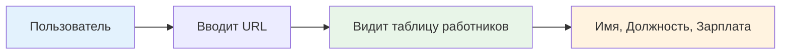
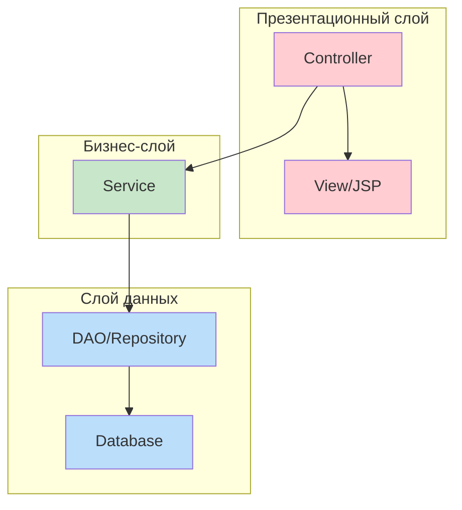
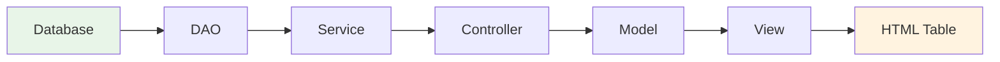
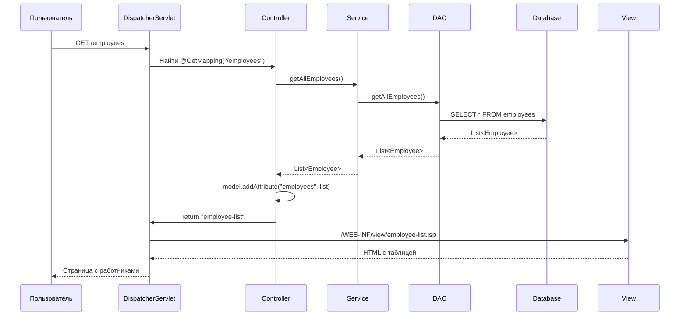

# 👥 Отображение списка всех работников в Spring MVC

## 📋 Содержание
- [🎯 Что мы создаем?](#-что-мы-создаем)
- [🏗️ Архитектура приложения](#️-архитектура-приложения)
- [🔄 Жизненный цикл запроса](#-жизненный-цикл-запроса)
- [💻 Полный пример кода](#-полный-пример-кода)
- [🎨 Отображение в браузере](#-отображение-в-браузере)
- [🔧 Отладка и тестирование](#-отладка-и-тестирование)
- [❓ Часто задаваемые вопросы](#-часто-задаваемые-вопросы)
- [📚 Глоссарий](#-глоссарий)
- [💡 Советы для новичков](#-советы-для-новичков)

---

## 🎯 Что мы создаем?

Мы создаем веб-страницу, которая отображает список всех работников из базы данных. Это классический пример CRUD операции — **Read** (чтение данных).

### 🎨 Что увидит пользователь


---

## 🏗️ Архитектура приложения

### 🏛️ Слои приложения


### 📊 Поток данных


---

## 🔄 Жизненный цикл запроса

### 📋 Пошаговый процесс


### 🔍 Детальное объяснение каждого шага

1. **Пользователь вводит URL** → `http://localhost:8080/employees`
2. **DispatcherServlet** получает запрос и ищет подходящий контроллер
3. **Контроллер** находит метод с аннотацией `@GetMapping("/employees")`
4. **Сервис** вызывается для получения бизнес-логики
5. **DAO** выполняет SQL запрос к базе данных
6. **Данные** возвращаются обратно по цепочке
7. **Контроллер** добавляет данные в модель
8. **View** отображает данные в виде HTML таблицы

---

## 💻 Полный пример кода

### 🎮 Контроллер (EmployeeController.java)

```java
package com.safronov.spring.mvc.controller;

import com.safronov.spring.mvc.entity.Employee;
import com.safronov.spring.mvc.service.EmployeeService;
import org.springframework.beans.factory.annotation.Autowired;
import org.springframework.stereotype.Controller;
import org.springframework.ui.Model;
import org.springframework.web.bind.annotation.GetMapping;

import java.util.List;

@Controller
public class EmployeeController {
    
    @Autowired
    private EmployeeService employeeService;
    
    @GetMapping("/employees")
    public String showAllEmployees(Model model) {
        // Получаем список всех работников
        List<Employee> employees = employeeService.getAllEmployees();
        
        // Добавляем в модель для передачи в view
        model.addAttribute("employees", employees);
        
        // Возвращаем имя view (JSP страницы)
        return "employee-list";
    }
}
```

### 🏢 Сервис (EmployeeService.java)

```java
package com.safronov.spring.mvc.service;

import com.safronov.spring.mvc.dao.EmployeeDAO;
import com.safronov.spring.mvc.entity.Employee;
import org.springframework.beans.factory.annotation.Autowired;
import org.springframework.stereotype.Service;
import org.springframework.transaction.annotation.Transactional;

import java.util.List;

@Service
public class EmployeeServiceImpl implements EmployeeService {
    
    @Autowired
    private EmployeeDAO employeeDAO;
    
    @Override
    @Transactional
    public List<Employee> getAllEmployees() {
        return employeeDAO.getAllEmployees();
    }
}
```

### 🗄️ DAO (EmployeeDAO.java)

```java
package com.safronov.spring.mvc.dao;

import com.safronov.spring.mvc.entity.Employee;
import org.hibernate.Session;
import org.hibernate.SessionFactory;
import org.springframework.beans.factory.annotation.Autowired;
import org.springframework.stereotype.Repository;

import java.util.List;

@Repository
public class EmployeeDAOImpl implements EmployeeDAO {
    
    @Autowired
    private SessionFactory sessionFactory;
    
    @Override
    public List<Employee> getAllEmployees() {
        Session session = sessionFactory.getCurrentSession();
        return session.createQuery("from Employee", Employee.class)
                     .getResultList();
    }
}
```

### 👤 Модель (Employee.java)

```java
package com.safronov.spring.mvc.entity;

import lombok.Data;
import javax.persistence.*;

@Data
@Entity
@Table(name = "employees")
public class Employee {
    
    @Id
    @GeneratedValue(strategy = GenerationType.IDENTITY)
    private int id;
    
    @Column(name = "name")
    private String name;
    
    @Column(name = "surname")
    private String surname;
    
    @Column(name = "department")
    private String department;
    
    @Column(name = "salary")
    private int salary;
}
```

### 🎨 JSP страница (employee-list.jsp)

```jsp
<%@ page contentType="text/html;charset=UTF-8" language="java" %>
<%@ taglib prefix="c" uri="http://java.sun.com/jsp/jstl/core" %>
<!DOCTYPE html>
<html>
<head>
    <title>Список работников</title>
    <style>
        table {
            border-collapse: collapse;
            width: 100%;
            margin: 20px 0;
        }
        th, td {
            border: 1px solid #ddd;
            padding: 8px;
            text-align: left;
        }
        th {
            background-color: #f2f2f2;
            font-weight: bold;
        }
        tr:nth-child(even) {
            background-color: #f9f9f9;
        }
        tr:hover {
            background-color: #f5f5f5;
        }
    </style>
</head>
<body>
    <h1>Список всех работников</h1>
    
    <table>
        <thead>
            <tr>
                <th>ID</th>
                <th>Имя</th>
                <th>Фамилия</th>
                <th>Отдел</th>
                <th>Зарплата</th>
            </tr>
        </thead>
        <tbody>
            <c:forEach var="employee" items="${employees}">
                <tr>
                    <td>${employee.id}</td>
                    <td>${employee.name}</td>
                    <td>${employee.surname}</td>
                    <td>${employee.department}</td>
                    <td>${employee.salary} ₽</td>
                </tr>
            </c:forEach>
        </tbody>
    </table>
    
    <p>Всего работников: ${employees.size()}</p>
</body>
</html>
```

---

## 🎨 Отображение в браузере

### 📱 Что увидит пользователь

| ID | Имя | Фамилия | Отдел | Зарплата |
|----|-----|---------|-------|----------|
| 1 | Иван | Иванов | IT | 80000 ₽ |
| 2 | Петр | Петров | HR | 60000 ₽ |
| 3 | Анна | Сидорова | Финансы | 70000 ₽ |

### 🔗 URL для доступа
```
http://localhost:8080/your-app-name/employees
```

---

## 🔧 Отладка и тестирование

### 🐛 Добавление логирования

```java
@Controller
public class EmployeeController {
    
    private static final Logger logger = LoggerFactory.getLogger(EmployeeController.class);
    
    @Autowired
    private EmployeeService employeeService;
    
    @GetMapping("/employees")
    public String showAllEmployees(Model model) {
        logger.info("Запрос на получение списка работников");
        
        List<Employee> employees = employeeService.getAllEmployees();
        logger.info("Получено {} работников", employees.size());
        
        // Выводим в консоль для отладки
        employees.forEach(emp -> 
            System.out.println("Работник: " + emp.getName() + " " + emp.getSurname())
        );
        
        model.addAttribute("employees", employees);
        return "employee-list";
    }
}
```

### 🧪 Простой тест

```java
@SpringBootTest
@AutoConfigureTestDatabase
class EmployeeControllerTest {
    
    @Autowired
    private TestEntityManager entityManager;
    
    @Autowired
    private EmployeeService employeeService;
    
    @Test
    void shouldReturnAllEmployees() {
        // Создаем тестового работника
        Employee employee = new Employee();
        employee.setName("Тест");
        employee.setSurname("Тестов");
        employee.setDepartment("IT");
        employee.setSalary(50000);
        
        entityManager.persist(employee);
        entityManager.flush();
        
        // Получаем список
        List<Employee> employees = employeeService.getAllEmployees();
        
        // Проверяем
        assertThat(employees).isNotEmpty();
        assertThat(employees).anyMatch(emp -> 
            emp.getName().equals("Тест")
        );
    }
}
```

---

## ❓ Часто задаваемые вопросы

### 🤔 Почему список пустой?
**Возможные причины:**
- База данных пустая
- Неправильный SQL запрос
- Проблемы с подключением к БД
- Ошибки в маппинге сущности

**Решение:**
```java
// Добавь в DAO для отладки
@Override
public List<Employee> getAllEmployees() {
    Session session = sessionFactory.getCurrentSession();
    List<Employee> employees = session.createQuery("from Employee", Employee.class)
                                     .getResultList();
    System.out.println("Найдено работников: " + employees.size());
    return employees;
}
```

### 🤔 Как добавить сортировку?
```java
// В DAO
public List<Employee> getAllEmployees() {
    Session session = sessionFactory.getCurrentSession();
    return session.createQuery("from Employee order by name", Employee.class)
                 .getResultList();
}
```

### 🤔 Как добавить пагинацию?
```java
// В контроллере
@GetMapping("/employees")
public String showAllEmployees(@RequestParam(defaultValue = "0") int page,
                              @RequestParam(defaultValue = "10") int size,
                              Model model) {
    List<Employee> employees = employeeService.getEmployeesWithPagination(page, size);
    model.addAttribute("employees", employees);
    return "employee-list";
}
```

---

## 📚 Глоссарий

| Термин | Описание |
|--------|----------|
| **Controller** | Класс, обрабатывающий HTTP запросы |
| **Service** | Слой с бизнес-логикой |
| **DAO** | Data Access Object — слой для работы с БД |
| **Model** | Объект для передачи данных в view |
| **View** | JSP страница для отображения |
| **@GetMapping** | Аннотация для обработки GET запросов |
| **@Autowired** | Внедрение зависимостей |
| **@Transactional** | Управление транзакциями |
| **JSTL** | Библиотека тегов для JSP |

---

## 💡 Советы для новичков

### ✅ Что делать
- ✅ Разделяй логику на слои (Controller → Service → DAO)
- ✅ Используй аннотации Spring
- ✅ Добавляй логирование для отладки
- ✅ Тестируй каждый слой отдельно
- ✅ Используй транзакции для операций с БД

### ❌ Что не делать
- ❌ Не пиши всю логику в контроллере
- ❌ Не забывай про обработку ошибок
- ❌ Не смешивай презентационную и бизнес-логику
- ❌ Не игнорируй производительность при больших списках
- ❌ Не забывай про валидацию данных

### 🛠️ Полезные команды для отладки
```bash
# Проверка подключения к БД
mvn spring-boot:run

# Просмотр логов
tail -f logs/application.log

# Тестирование endpoint
curl http://localhost:8080/employees
```

### 🔍 Отладочные советы
```java
// Добавь в контроллер для проверки
@GetMapping("/debug/employees")
@ResponseBody
public String debugEmployees() {
    List<Employee> employees = employeeService.getAllEmployees();
    return "Найдено работников: " + employees.size() + 
           "\nСписок: " + employees.toString();
}
```

---

## 🎯 Следующие шаги

После освоения отображения списка:

1. **Добавь поиск** — фильтрация по имени/отделу
2. **Реализуй пагинацию** — для больших списков
3. **Добавь сортировку** — по различным полям
4. **Создай детальную страницу** — просмотр одного работника
5. **Добавь CRUD операции** — создание, редактирование, удаление

---

*📝 **Примечание**: Этот пример показывает базовое отображение списка. Для продакшена добавь пагинацию, сортировку и фильтрацию.* 


