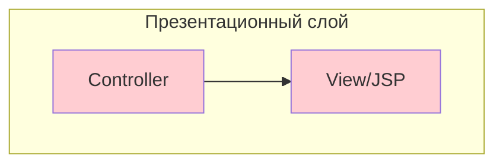
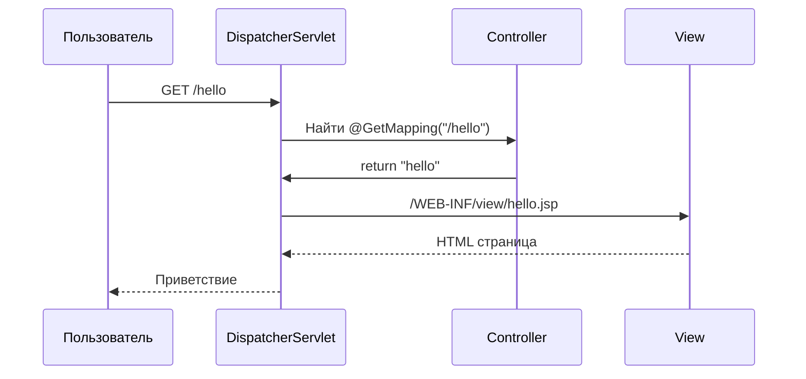
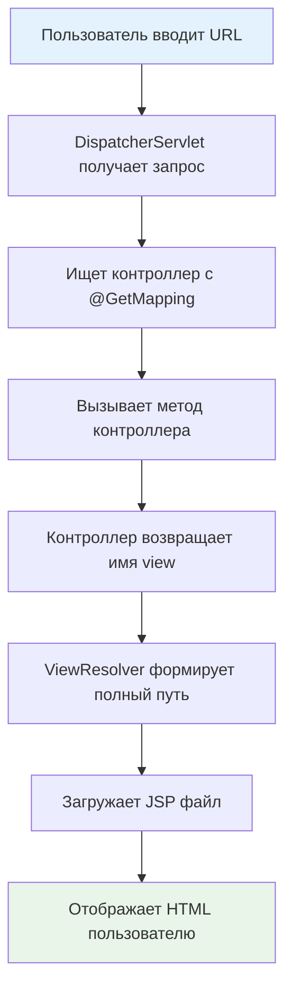

# 🚀 Первое Spring MVC приложение

## 📋 Содержание
- [🎯 Что мы создаем?](#-что-мы-создаем)
- [🏗️ Архитектура приложения](#️-архитектура-приложения)
- [📁 Структура проекта](#-структура-проекта)
- [⚙️ Пошаговая настройка](#️-пошаговая-настройка)
- [💻 Полный пример кода](#-полный-пример-кода)
- [🔄 Как это работает?](#-как-это-работает)
- [🎨 Результат в браузере](#-результат-в-браузере)
- [🔧 Отладка и тестирование](#-отладка-и-тестирование)
- [❓ Часто задаваемые вопросы](#-часто-задаваемые-вопросы)
- [📚 Глоссарий](#-глоссарий)
- [💡 Советы для новичков](#-советы-для-новичков)

---

## 🎯 Что мы создаем?

Мы создаем самое простое веб-приложение на Spring MVC, которое будет отображать приветственную страницу. Это первый шаг в изучении Spring MVC!

### 🎨 Что получится


---

## 🏗️ Архитектура приложения

### 🏛️ Простая архитектура MVC


### 🔄 Поток запроса


---

## 📁 Структура проекта

```
src/
├── main/
│   ├── java/
│   │   └── com/safronov/spring/mvc/
│   │       └── controller/
│   │           └── HelloController.java
│   ├── resources/
│   │   └── applicationContext.xml
│   └── webapp/
│       ├── WEB-INF/
│       │   ├── web.xml
│       │   └── view/
│       │       └── hello.jsp
│       └── index.jsp
└── test/
    └── java/
        └── com/safronov/spring/mvc/
```

---

## ⚙️ Пошаговая настройка

### 1️⃣ Создание Maven проекта

**В IntelliJ IDEA:**
1. File → New → Project
2. Выбери Maven
3. Выбери архетип: `maven-archetype-webapp`
4. GroupId: `com.safronov.spring.mvc`
5. ArtifactId: `first-spring-mvc-app`

### 2️⃣ Настройка pom.xml

```xml
<?xml version="1.0" encoding="UTF-8"?>
<project xmlns="http://maven.apache.org/POM/4.0.0" 
         xmlns:xsi="http://www.w3.org/2001/XMLSchema-instance"
         xsi:schemaLocation="http://maven.apache.org/POM/4.0.0 
         http://maven.apache.org/maven-v4_0_0.xsd">
    <modelVersion>4.0.0</modelVersion>
    <groupId>com.safronov.spring.mvc</groupId>
    <artifactId>first-spring-mvc-app</artifactId>
    <packaging>war</packaging>
    <version>1.0-SNAPSHOT</version>
    
    <properties>
        <maven.compiler.source>17</maven.compiler.source>
        <maven.compiler.target>17</maven.compiler.target>
        <spring.version>6.1.10</spring.version>
    </properties>

    <dependencies>
        <!-- Spring Web MVC -->
        <dependency>
            <groupId>org.springframework</groupId>
            <artifactId>spring-webmvc</artifactId>
            <version>${spring.version}</version>
        </dependency>

        <!-- JSTL для JSP -->
        <dependency>
            <groupId>jakarta.servlet.jsp.jstl</groupId>
            <artifactId>jakarta.servlet.jsp.jstl-api</artifactId>
            <version>3.0.0</version>
        </dependency>
        <dependency>
            <groupId>org.glassfish.web</groupId>
            <artifactId>jakarta.servlet.jsp.jstl</artifactId>
            <version>3.0.1</version>
        </dependency>

        <!-- Lombok -->
        <dependency>
            <groupId>org.projectlombok</groupId>
            <artifactId>lombok</artifactId>
            <version>1.18.38</version>
            <scope>provided</scope>
        </dependency>
    </dependencies>

    <build>
        <finalName>first-spring-mvc-app</finalName>
        <plugins>
            <plugin>
                <groupId>org.apache.maven.plugins</groupId>
                <artifactId>maven-war-plugin</artifactId>
                <version>3.4.0</version>
            </plugin>
        </plugins>
    </build>
</project>
```

### 3️⃣ Настройка web.xml

```xml
<?xml version="1.0" encoding="UTF-8"?>
<web-app xmlns="http://xmlns.jcp.org/xml/ns/javaee"
         xmlns:xsi="http://www.w3.org/2001/XMLSchema-instance"
         xsi:schemaLocation="http://xmlns.jcp.org/xml/ns/javaee 
         http://xmlns.jcp.org/xml/ns/javaee/web-app_3_1.xsd"
         version="3.1">

    <display-name>First Spring MVC App</display-name>

    <!-- Главный сервлет Spring MVC -->
    <servlet>
        <servlet-name>dispatcher</servlet-name>
        <servlet-class>org.springframework.web.servlet.DispatcherServlet</servlet-class>
        <init-param>
            <param-name>contextConfigLocation</param-name>
            <param-value>/WEB-INF/applicationContext.xml</param-value>
        </init-param>
        <load-on-startup>1</load-on-startup>
    </servlet>

    <!-- Маппинг URL на сервлет -->
    <servlet-mapping>
        <servlet-name>dispatcher</servlet-name>
        <url-pattern>/</url-pattern>
    </servlet-mapping>

    <!-- Настройка кодировки -->
    <jsp-config>
        <jsp-property-group>
            <url-pattern>*.jsp</url-pattern>
            <page-encoding>UTF-8</page-encoding>
        </jsp-property-group>
    </jsp-config>

</web-app>
```

### 4️⃣ Настройка applicationContext.xml

```xml
<?xml version="1.0" encoding="UTF-8"?>
<beans xmlns="http://www.springframework.org/schema/beans"
       xmlns:xsi="http://www.w3.org/2001/XMLSchema-instance"
       xmlns:context="http://www.springframework.org/schema/context"
       xmlns:mvc="http://www.springframework.org/schema/mvc"
       xsi:schemaLocation="
        http://www.springframework.org/schema/beans
        http://www.springframework.org/schema/beans/spring-beans.xsd
        http://www.springframework.org/schema/context
        http://www.springframework.org/schema/context/spring-context.xsd
        http://www.springframework.org/schema/mvc
        http://www.springframework.org/schema/mvc/spring-mvc.xsd">

    <!-- Автоматическое сканирование компонентов -->
    <context:component-scan base-package="com.safronov.spring.mvc"/>

    <!-- Активация аннотаций MVC -->
    <mvc:annotation-driven/>

    <!-- Настройка резолвера представлений -->
    <bean class="org.springframework.web.servlet.view.InternalResourceViewResolver">
        <property name="prefix" value="/WEB-INF/view/"/>
        <property name="suffix" value=".jsp"/>
    </bean>

</beans>
```

---

## 💻 Полный пример кода

### 🎮 Контроллер (HelloController.java)

```java
package com.safronov.spring.mvc.controller;

import org.springframework.stereotype.Controller;
import org.springframework.web.bind.annotation.GetMapping;

@Controller
public class HelloController {
    
    @GetMapping("/hello")
    public String sayHello() {
        // Возвращаем имя view (JSP страницы)
        return "hello";
    }
    
    @GetMapping("/")
    public String showHomePage() {
        // Главная страница
        return "home";
    }
}
```

### 🎨 JSP страница (hello.jsp)

```jsp
<%@ page contentType="text/html;charset=UTF-8" language="java" %>
<!DOCTYPE html>
<html>
<head>
    <title>Первое Spring MVC приложение</title>
    <style>
        body {
            font-family: Arial, sans-serif;
            margin: 50px;
            background-color: #f5f5f5;
        }
        .container {
            background-color: white;
            padding: 30px;
            border-radius: 10px;
            box-shadow: 0 2px 10px rgba(0,0,0,0.1);
            text-align: center;
        }
        h1 {
            color: #2196F3;
            margin-bottom: 20px;
        }
        .success {
            color: #4CAF50;
            font-size: 18px;
        }
    </style>
</head>
<body>
    <div class="container">
        <h1>🚀 Добро пожаловать в Spring MVC!</h1>
        <p class="success">✅ Ваше первое приложение работает!</p>
        <p>Это простая страница, созданная с помощью Spring MVC</p>
        <hr>
        <p><small>Время создания: <%= new java.util.Date() %></small></p>
    </div>
</body>
</html>
```

### 🏠 Главная страница (home.jsp)

```jsp
<%@ page contentType="text/html;charset=UTF-8" language="java" %>
<!DOCTYPE html>
<html>
<head>
    <title>Главная страница</title>
    <style>
        body {
            font-family: Arial, sans-serif;
            margin: 50px;
            background-color: #f0f8ff;
        }
        .container {
            background-color: white;
            padding: 30px;
            border-radius: 10px;
            box-shadow: 0 2px 10px rgba(0,0,0,0.1);
        }
        .nav {
            margin: 20px 0;
        }
        .nav a {
            display: inline-block;
            padding: 10px 20px;
            background-color: #2196F3;
            color: white;
            text-decoration: none;
            border-radius: 5px;
            margin: 5px;
        }
        .nav a:hover {
            background-color: #1976D2;
        }
    </style>
</head>
<body>
    <div class="container">
        <h1>🏠 Главная страница</h1>
        <p>Добро пожаловать в ваше первое Spring MVC приложение!</p>
        
        <div class="nav">
            <a href="/hello">Перейти к приветствию</a>
        </div>
        
        <h3>Что вы можете сделать:</h3>
        <ul>
            <li>Создать новые контроллеры</li>
            <li>Добавить формы для ввода данных</li>
            <li>Подключить базу данных</li>
            <li>Создать REST API</li>
        </ul>
    </div>
</body>
</html>
```

---

## 🔄 Как это работает?

### 📋 Детальный процесс



### 🔍 Разбор ViewResolver

```mermaid
graph LR
    A[return "hello"] --> B[ViewResolver]
    B --> C[prefix: /WEB-INF/view/]
    B --> D[suffix: .jsp]
    C --> E[Полный путь]
    D --> E
    E --> F[/WEB-INF/view/hello.jsp]
    
    style A fill:#ffebee
    style F fill:#e8f5e8
```

**Формула формирования пути:**
```
prefix + имя_из_контроллера + suffix
/WEB-INF/view/ + hello + .jsp = /WEB-INF/view/hello.jsp
```

---

## 🎨 Результат в браузере

### 📱 Что увидит пользователь

**При переходе на `http://localhost:8080/hello`:**
```
🚀 Добро пожаловать в Spring MVC!
✅ Ваше первое приложение работает!
Это простая страница, созданная с помощью Spring MVC
```

**При переходе на `http://localhost:8080/`:**
```
🏠 Главная страница
Добро пожаловать в ваше первое Spring MVC приложение!
[Перейти к приветствию]
```

### 🔗 Доступные URL

| URL | Описание | Контроллер |
|-----|----------|------------|
| `/` | Главная страница | `showHomePage()` |
| `/hello` | Страница приветствия | `sayHello()` |

---

## 🔧 Отладка и тестирование

### 🐛 Добавление логирования

```java
@Controller
public class HelloController {
    
    private static final Logger logger = LoggerFactory.getLogger(HelloController.class);
    
    @GetMapping("/hello")
    public String sayHello() {
        logger.info("Вызван метод sayHello()");
        System.out.println("Привет! Метод контроллера работает!");
        return "hello";
    }
}
```

### 🧪 Простой тест

```java
@SpringBootTest
@AutoConfigureMockMvc
class HelloControllerTest {
    
    @Autowired
    private MockMvc mockMvc;
    
    @Test
    void shouldReturnHelloPage() throws Exception {
        mockMvc.perform(get("/hello"))
               .andExpect(status().isOk())
               .andExpect(view().name("hello"));
    }
}
```

### 🔍 Проверка конфигурации

```java
// Добавь в контроллер для отладки
@GetMapping("/debug")
@ResponseBody
public String debug() {
    return "Приложение работает! Время: " + new java.util.Date();
}
```

---

## ❓ Часто задаваемые вопросы

### 🤔 Почему страница не отображается?
**Возможные причины:**
- Неправильный путь к JSP файлу
- Ошибки в web.xml
- Проблемы с applicationContext.xml
- Неправильная структура папок

**Решение:**
```bash
# Проверь структуру папок
ls -la src/main/webapp/WEB-INF/view/

# Проверь логи Tomcat
tail -f logs/catalina.out
```

### 🤔 Как добавить параметры в URL?
```java
@GetMapping("/hello")
public String sayHello(@RequestParam(value = "name", defaultValue = "World") String name, 
                      Model model) {
    model.addAttribute("message", "Hello, " + name + "!");
    return "hello";
}
```

### 🤔 Как создать форму?
```java
@GetMapping("/form")
public String showForm() {
    return "form";
}

@PostMapping("/submit")
public String handleForm(@RequestParam String name) {
    // Обработка формы
    return "result";
}
```

---

## 📚 Глоссарий

| Термин | Описание |
|--------|----------|
| **Controller** | Класс, обрабатывающий HTTP запросы |
| **View** | JSP страница для отображения |
| **DispatcherServlet** | Главный сервлет Spring MVC |
| **JSP** | JavaServer Pages — технология создания веб-страниц |
| **@Controller** | Аннотация для обозначения контроллера |
| **@GetMapping** | Аннотация для обработки GET запросов |
| **ViewResolver** | Компонент для поиска view файлов |
| **Model** | Объект для передачи данных в view |

---

## 💡 Советы для новичков

### ✅ Что делать
- ✅ Начинай с простого — один контроллер, одна страница
- ✅ Проверяй структуру папок
- ✅ Используй логирование для отладки
- ✅ Читай stacktrace при ошибках
- ✅ Тестируй каждый шаг

### ❌ Что не делать
- ❌ Не усложняй первое приложение
- ❌ Не забывай про кодировку UTF-8
- ❌ Не игнорируй ошибки компиляции
- ❌ Не смешивай логику в контроллере
- ❌ Не забывай про правильные пути к файлам

### 🛠️ Полезные команды
```bash
# Сборка проекта
mvn clean package

# Запуск на встроенном сервере
mvn tomcat7:run

# Проверка структуры
find . -name "*.jsp" -o -name "*.java" -o -name "*.xml"
```

### 🔍 Отладочные советы
```java
// Добавь в контроллер для проверки
@GetMapping("/test")
@ResponseBody
public String test() {
    return "Контроллер работает! Время: " + new java.util.Date();
}
```

---

## 🎯 Следующие шаги

После создания первого приложения:

1. **Добавь формы** — создание и обработка данных
2. **Подключи базу данных** — Hibernate + JPA
3. **Создай CRUD операции** — создание, чтение, обновление, удаление
4. **Добавь валидацию** — проверка введенных данных
5. **Изучи REST API** — создание веб-сервисов

---

*📝 **Примечание**: Это базовое приложение демонстрирует основные принципы Spring MVC. Для продакшена добавь обработку ошибок, логирование и тестирование.*


