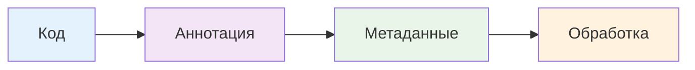
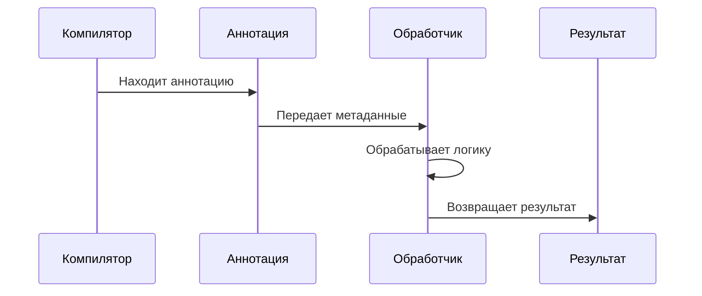
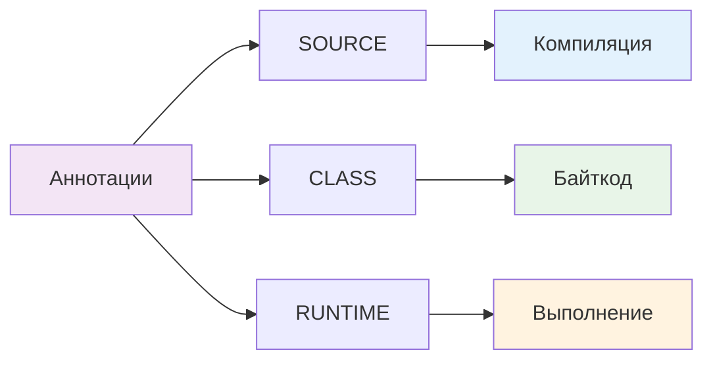
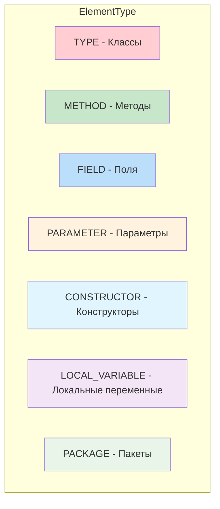
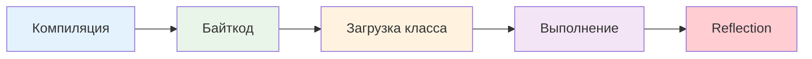
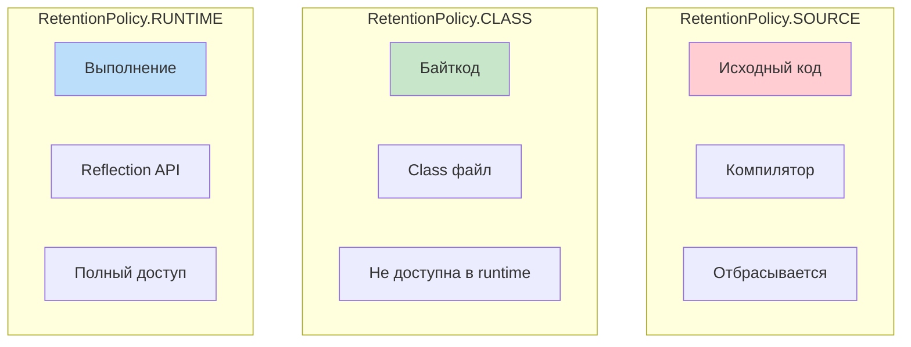

# 🏷️ Создание собственной аннотации в Java

## 📋 Содержание
- [🎯 Что такое аннотация?](#-что-такое-аннотация)
- [🏗️ Архитектура аннотаций](#️-архитектура-аннотаций)
- [📊 Типы аннотаций](#-типы-аннотаций)
- [⚙️ Пошаговое создание](#️-пошаговое-создание)
- [💻 Практические примеры](#-практические-примеры)
- [🔧 Использование в Spring MVC](#-использование-в-spring-mvc)
- [🔄 Жизненный цикл аннотации](#-жизненный-цикл-аннотации)
- [❓ Часто задаваемые вопросы](#-часто-задаваемые-вопросы)
- [📚 Глоссарий](#-глоссарий)
- [💡 Советы для новичков](#-советы-для-новичков)

---

## 🎯 Что такое аннотация?

Аннотация — это специальная метка (форма метаданных), которую можно добавить к коду для предоставления дополнительной информации компилятору, фреймворку или другим инструментам.

### 🎨 Визуальное представление


### 📝 Примеры встроенных аннотаций
```java
@Override          // Переопределение метода
@Deprecated        // Устаревший код
@SuppressWarnings  // Подавление предупреждений
@FunctionalInterface // Функциональный интерфейс
```

---

## 🏗️ Архитектура аннотаций

### 🏛️ Структура аннотации
```mermaid
graph TB
    subgraph "Аннотация"
        A[@interface]
        B[Элементы]
        C[Мета-аннотации]
    end
    
    subgraph "Использование"
        D[Код]
        E[Обработчик]
        F[Результат]
    end
    
    A --> B
    A --> C
    D --> E
    E --> F
    
    style A fill:#ffcdd2
    style B fill:#c8e6c9
    style C fill:#bbdefb
    style D fill:#e1f5fe
    style E fill:#fff3e0
    style F fill:#e8f5e8
```

### 🔄 Процесс обработки


---

## 📊 Типы аннотаций

### 🎯 По области применения


### 📍 По месту использования


---

## ⚙️ Пошаговое создание

### 1️⃣ Базовое объявление
```java
public @interface MyAnnotation {
    String value();
}
```

### 2️⃣ Добавление мета-аннотаций
```java
import java.lang.annotation.Retention;
import java.lang.annotation.RetentionPolicy;
import java.lang.annotation.Target;
import java.lang.annotation.ElementType;

@Retention(RetentionPolicy.RUNTIME)  // Доступна во время выполнения
@Target({ElementType.FIELD, ElementType.METHOD})  // Можно использовать на полях и методах
public @interface MyAnnotation {
    String value();
    String description() default "";  // Опциональный элемент с значением по умолчанию
}
```

### 3️⃣ Использование в коде
```java
public class User {
    @MyAnnotation(value = "Имя пользователя", description = "Обязательное поле")
    private String name;
    
    @MyAnnotation("Метод получения имени")
    public String getName() {
        return name;
    }
}
```

---

## 💻 Практические примеры

### 🎯 Пример 1: Аннотация для логирования

```java
import java.lang.annotation.ElementType;
import java.lang.annotation.Retention;
import java.lang.annotation.RetentionPolicy;
import java.lang.annotation.Target;

@Retention(RetentionPolicy.RUNTIME)
@Target(ElementType.METHOD)
public @interface LogExecution {
    String value() default "Выполняется метод";
    boolean logParameters() default true;
    boolean logResult() default false;
}
```

**Использование:**
```java
public class UserService {
    
    @LogExecution("Получение пользователя по ID")
    public User getUserById(Long id) {
        // Логика получения пользователя
        return userRepository.findById(id);
    }
    
    @LogExecution(value = "Создание пользователя", logParameters = true, logResult = true)
    public User createUser(User user) {
        // Логика создания пользователя
        return userRepository.save(user);
    }
}
```

### 🎯 Пример 2: Аннотация для валидации email-домена

```java
import javax.validation.Constraint;
import javax.validation.Payload;
import java.lang.annotation.*;

@Constraint(validatedBy = EmailDomainValidator.class)
@Target({ ElementType.FIELD, ElementType.PARAMETER })
@Retention(RetentionPolicy.RUNTIME)
public @interface ValidEmailDomain {
    String message() default "Email должен быть с доменом @test.ru";
    Class<?>[] groups() default {};
    Class<? extends Payload>[] payload() default {};
    String domain() default "@test.ru";  // Дополнительный параметр
}
```

**Валидатор:**
```java
import javax.validation.ConstraintValidator;
import javax.validation.ConstraintValidatorContext;

public class EmailDomainValidator implements ConstraintValidator<ValidEmailDomain, String> {
    
    private String domain;
    
    @Override
    public void initialize(ValidEmailDomain constraintAnnotation) {
        this.domain = constraintAnnotation.domain();
    }
    
    @Override
    public boolean isValid(String email, ConstraintValidatorContext context) {
        if (email == null) {
            return false;
        }
        return email.endsWith(domain);
    }
}
```

**Использование:**
```java
public class User {
    @ValidEmailDomain(domain = "@company.com")
    private String email;
}
```

### 🎯 Пример 3: Аннотация для кэширования

```java
import java.lang.annotation.ElementType;
import java.lang.annotation.Retention;
import java.lang.annotation.RetentionPolicy;
import java.lang.annotation.Target;

@Retention(RetentionPolicy.RUNTIME)
@Target(ElementType.METHOD)
public @interface Cacheable {
    String key() default "";
    int ttl() default 3600;  // Time to live в секундах
}
```

---

## 🔧 Использование в Spring MVC

### 🎮 Аннотация для контроллеров

```java
import java.lang.annotation.ElementType;
import java.lang.annotation.Retention;
import java.lang.annotation.RetentionPolicy;
import java.lang.annotation.Target;

@Retention(RetentionPolicy.RUNTIME)
@Target(ElementType.METHOD)
public @interface RequireAuth {
    String[] roles() default {};
    String message() default "Требуется авторизация";
}
```

**Использование в контроллере:**
```java
@Controller
public class UserController {
    
    @RequireAuth(roles = {"ADMIN"})
    @GetMapping("/admin/users")
    public String getUsers(Model model) {
        // Логика получения пользователей
        return "users";
    }
    
    @RequireAuth(roles = {"USER", "ADMIN"})
    @GetMapping("/profile")
    public String getProfile(Model model) {
        // Логика получения профиля
        return "profile";
    }
}
```

### 🔍 Обработчик аннотации

```java
import org.aspectj.lang.ProceedingJoinPoint;
import org.aspectj.lang.annotation.Around;
import org.aspectj.lang.annotation.Aspect;
import org.springframework.stereotype.Component;

@Aspect
@Component
public class AuthAspect {
    
    @Around("@annotation(requireAuth)")
    public Object checkAuth(ProceedingJoinPoint joinPoint, RequireAuth requireAuth) throws Throwable {
        // Проверка авторизации
        if (!isAuthenticated()) {
            throw new UnauthorizedException(requireAuth.message());
        }
        
        // Проверка ролей
        if (!hasRequiredRoles(requireAuth.roles())) {
            throw new ForbiddenException("Недостаточно прав");
        }
        
        return joinPoint.proceed();
    }
}
```

---

## 🔄 Жизненный цикл аннотации

### 📊 Этапы обработки


### 🔍 Retention Policy


---

## ❓ Часто задаваемые вопросы

### 🤔 Когда использовать RUNTIME vs CLASS?
**RUNTIME** — когда нужен доступ к аннотации во время выполнения через Reflection
**CLASS** — когда аннотация используется только для генерации кода или инструментами

### 🤔 Как получить значение аннотации?
```java
// Через Reflection
Method method = UserService.class.getMethod("getUserById", Long.class);
LogExecution annotation = method.getAnnotation(LogExecution.class);
String value = annotation.value();
```

### 🤔 Можно ли создавать аннотации без элементов?
```java
@Retention(RetentionPolicy.RUNTIME)
@Target(ElementType.METHOD)
public @interface Deprecated {
    // Пустая аннотация - маркер
}
```

### 🤔 Как создать аннотацию с массивом значений?
```java
@Retention(RetentionPolicy.RUNTIME)
@Target(ElementType.METHOD)
public @interface Roles {
    String[] value();  // Массив ролей
}
```

---

## 📚 Глоссарий

| Термин | Описание |
|--------|----------|
| **Аннотация** | Специальная метка для кода |
| **@interface** | Ключевое слово для объявления аннотации |
| **@Retention** | Когда аннотация доступна |
| **@Target** | Где можно использовать аннотацию |
| **ElementType** | Типы элементов для аннотации |
| **RetentionPolicy** | Политика хранения аннотации |
| **Валидатор** | Класс для проверки значений |
| **Reflection** | Механизм доступа к метаданным |

### 📊 Retention Policy значения

| Значение | Описание |
|----------|----------|
| **SOURCE** | Только в исходном коде |
| **CLASS** | В байткоде, но не в runtime |
| **RUNTIME** | Доступна во время выполнения |

### 📍 ElementType значения

| Значение | Описание |
|----------|----------|
| **TYPE** | Классы, интерфейсы, enum |
| **METHOD** | Методы |
| **FIELD** | Поля класса |
| **PARAMETER** | Параметры методов |
| **CONSTRUCTOR** | Конструкторы |
| **LOCAL_VARIABLE** | Локальные переменные |
| **PACKAGE** | Пакеты |

---

## 💡 Советы для новичков

### ✅ Что делать
- ✅ Всегда указывай @Retention и @Target
- ✅ Используй осмысленные имена для аннотаций
- ✅ Добавляй значения по умолчанию для опциональных элементов
- ✅ Документируй назначение аннотации
- ✅ Тестируй аннотации на практике

### ❌ Что не делать
- ❌ Не создавай аннотации без четкой цели
- ❌ Не забывай про обработчики для сложных аннотаций
- ❌ Не используй аннотации для бизнес-логики
- ❌ Не игнорируй производительность при обработке
- ❌ Не создавай слишком сложные аннотации

### 🛠️ Полезные паттерны
```java
// Маркерная аннотация
@Retention(RetentionPolicy.RUNTIME)
@Target(ElementType.METHOD)
public @interface Cacheable {}

// Аннотация с одним элементом
@Retention(RetentionPolicy.RUNTIME)
@Target(ElementType.FIELD)
public @interface MaxLength {
    int value();
}

// Аннотация с несколькими элементами
@Retention(RetentionPolicy.RUNTIME)
@Target(ElementType.METHOD)
public @interface Logged {
    String level() default "INFO";
    boolean logParameters() default true;
    boolean logResult() default false;
}
```

### 🔍 Отладочные советы
```java
// Проверка наличия аннотации
if (method.isAnnotationPresent(LogExecution.class)) {
    LogExecution annotation = method.getAnnotation(LogExecution.class);
    System.out.println("Аннотация найдена: " + annotation.value());
}

// Получение всех аннотаций
Annotation[] annotations = method.getAnnotations();
for (Annotation annotation : annotations) {
    System.out.println("Аннотация: " + annotation.annotationType().getSimpleName());
}
```

---

## 🎯 Следующие шаги

После освоения создания аннотаций:

1. **Изучи AOP** — аспектно-ориентированное программирование
2. **Создай обработчики** — для автоматической обработки аннотаций
3. **Изучи Bean Validation** — для валидации данных
4. **Создай кастомные валидаторы** — для специфических проверок
5. **Изучи Spring Boot** — для автоматической конфигурации

---

*📝 **Примечание**: Аннотации — мощный инструмент для метапрограммирования. Используй их для автоматизации и улучшения читаемости кода.*


```Java
@Override
public void go() {

}
```


> Данная аннотация нам говорит, что данный метод перезаписываем метод родителя


Аннотированы могут быть пакеты, классы, методы, поля класса и параметры, локальные переменные

## Создание собственной аннотации


Для создания своей аннотации испуользуется слово @interface


```Java
public @interface Version {
    String info();
}
```


Аннотация @Retention

RetentionPolicy.SOURCE - аннотация используется на этапе помпиляции и должна отбрасываться компилятором

RetentionPolicy.CLASS - аннотация будет записана в class-файл компилятором, но не должна быть доступна во время выполнения (runtime)

RetentionPolicy.RUNTIME - аннотация будет записана в class-файл и доступна во время выполения через reflection


Для того, чтобы ограничить использование аннотации ее нужно проаннотировать, для этого существует аннотация @Target

Данная аннотация может использоваться для пакетов (PACKAGE), классов (TYPE), конструкторов (CONSTRUCTOR), методов (METHOD), переменнных класса (FIELD), параметов метода (PARAMATER), локальных переменных (LOCAL_VARIABLE)


```Java
import javax.validation.Constraint;
import javax.validation.Payload;
import java.lang.annotation.ElementType;
import java.lang.annotation.Retention;
import java.lang.annotation.RetentionPolicy;
import java.lang.annotation.Target;

@Constraint(validatedBy = EmailDomainValidator.class) // Связь с валидатором
@Target({ ElementType.FIELD, ElementType.PARAMETER }) // Применяется к полям и параметрам
@Retention(RetentionPolicy.RUNTIME) // Доступна во время выполнения
public @interface ValidEmailDomain {
    String message() default "Строка должна заканчиваться на @test.ru"; // Сообщение об ошибке
    Class<?>[] groups() default {};
    Class<? extends Payload>[] payload() default {};
}
```


```Java
import javax.validation.ConstraintValidator;
import javax.validation.ConstraintValidatorContext;

public class EmailDomainValidator implements ConstraintValidator<ValidEmailDomain, String> {

    @Override
    public void initialize(ValidEmailDomain constraintAnnotation) {
        // Инициализация (не требуется)
    }

    @Override
    public boolean isValid(String email, ConstraintValidatorContext context) {
        if (email == null) return false; // Проверка на null
        return email.endsWith("@test.ru"); // Проверка окончания строки
    }
}
```