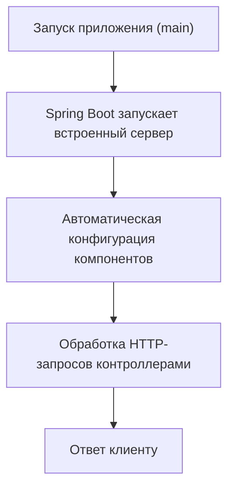

# Знакомство со Spring Boot

## 📋 Содержание
- [🚀 Что такое Spring Boot?](#-что-такое-spring-boot)
- [❓ Зачем нужен Spring Boot?](#-зачем-нужен-spring-boot)
- [🏆 Основные преимущества](#-основные-преимущества)
- [🗂️ Структура минимального проекта](#-структура-минимального-проекта)
- [⚡ Быстрый старт: создание и запуск проекта](#-быстрый-старт-создание-и-запуск-проекта)
- [📝 Пример простого контроллера](#-пример-простого-контроллера)
- [🔍 Как работает Spring Boot (схема)](#-как-работает-spring-boot-схема)
- [🐞 Типичные ошибки новичков и советы](#-типичные-ошибки-новичков-и-советы)
- [🔗 Полезные ссылки и ресурсы](#-полезные-ссылки-и-ресурсы)

---

## 🚀 Что такое Spring Boot?

Spring Boot — это фреймворк, который упрощает создание приложений на основе Spring. Он позволяет быстро запускать и разрабатывать приложения без необходимости ручной настройки большинства параметров.

---

## ❓ Зачем нужен Spring Boot?

- Экономит время на настройке проекта.
- Позволяет сосредоточиться на бизнес-логике, а не на инфраструктуре.
- Упрощает запуск и деплой приложений.

---

## 🏆 Основные преимущества

- Автоматическая конфигурация приложения
- Управление зависимостями в Maven/Gradle
- Встроенный сервер (Tomcat, Jetty и др.)
- Поддержка production-ready фич (мониторинг, логирование и др.)
- Простота запуска: `java -jar app.jar`

---

## 🗂️ Структура минимального проекта

```
knowledge_base_spring/
├── src/
│   └── main/
│       └── java/
│           └── com/
│               └── example/
│                   └── DemoApplication.java
├── pom.xml
```

**pom.xml (фрагмент):**
```xml
<dependency>
    <groupId>org.springframework.boot</groupId>
    <artifactId>spring-boot-starter-web</artifactId>
</dependency>
```

---

## ⚡ Быстрый старт: создание и запуск проекта

1. **Создать проект через Spring Initializr:**  
   https://start.spring.io/

2. **Скачать и распаковать архив.**

3. **Запустить приложение:**
   ```bash
   ./mvnw spring-boot:run
   ```
   или
   ```bash
   java -jar target/your-app.jar
   ```

---

## 📝 Пример простого контроллера

```java
import org.springframework.web.bind.annotation.GetMapping;
import org.springframework.web.bind.annotation.RestController;

@RestController
public class HelloController {
    @GetMapping("/hello")
    public String hello() {
        return "Hello, Spring Boot!";
    }
}
```

---

## 🔍 Как работает Spring Boot (схема)



---

## 🐞 Типичные ошибки новичков и советы

- Не указан `@SpringBootApplication` в главном классе.
- Не совпадает структура пакетов (контроллеры не видны).
- Не добавлены нужные зависимости в pom.xml.
- Проблемы с портом (занят другим процессом).

**Совет:**  
Если приложение не стартует — внимательно читайте stacktrace, чаще всего причина указана в первых строках ошибки.

---

## 🔗 Полезные ссылки и ресурсы

- [Официальная документация Spring Boot](https://docs.spring.io/spring-boot/docs/current/reference/html/)
- [Spring Initializr (генератор проектов)](https://start.spring.io/)
- [Примеры на GitHub](https://github.com/spring-projects/spring-boot)
