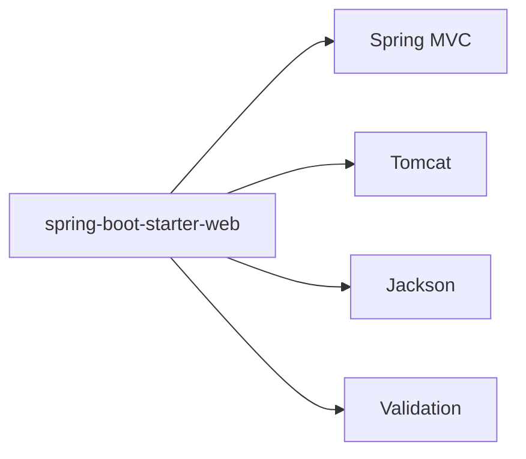
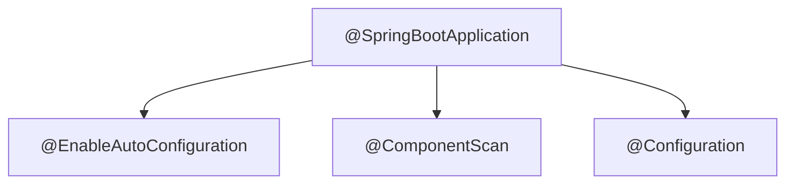
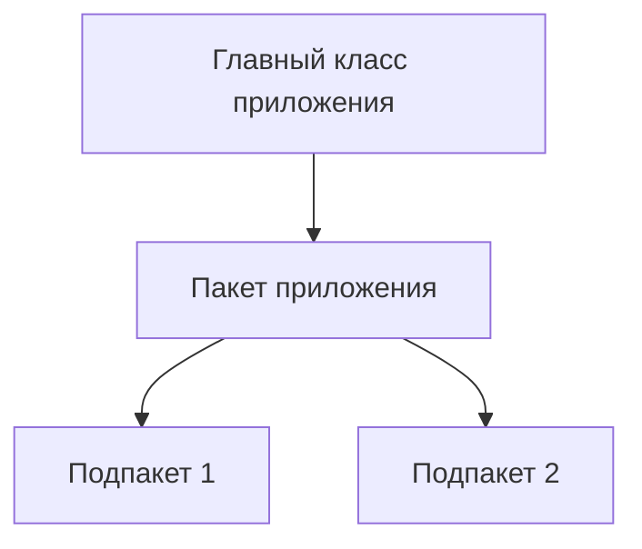
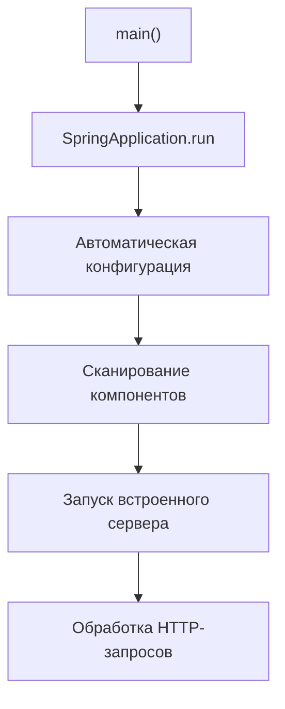

# Создание Spring Boot приложения

## 📋 Содержание
- [🛠️ Необходимые зависимости (starters)](#-необходимые-зависимости-starters)
- [📦 Что такое starter?](#-что-такое-starter)
- [🚀 Структура главного класса приложения](#-структура-главного-класса-приложения)
- [🔍 Аннотация @SpringBootApplication и её состав](#-аннотация-springbootapplication-и-её-состав)
- [🗺️ Сканирование пакетов (component scan)](#-сканирование-пакетов-component-scan)
- [📝 Пример полного минимального приложения](#-пример-полного-минимального-приложения)
- [🔎 Схема запуска Spring Boot приложения](#-схема-запуска-spring-boot-приложения)
- [🐞 Типичные ошибки и советы](#-типичные-ошибки-и-советы)

---

## 🛠️ Необходимые зависимости (starters)

При создании проекта указываются зависимости, которые нужны для работы приложения. Примеры для Gradle:

```groovy
implementation 'org.springframework.boot:spring-boot-starter-data-jpa'
implementation 'org.springframework.boot:spring-boot-starter-web'
```

Для Maven:
```xml
<dependency>
    <groupId>org.springframework.boot</groupId>
    <artifactId>spring-boot-starter-web</artifactId>
</dependency>
```

---

## 📦 Что такое starter?

**Starter** — это специальный пакет зависимостей, который включает всё необходимое для определённой задачи (например, web, JPA, security). Это избавляет от необходимости вручную указывать десятки зависимостей.



---

## 🚀 Структура главного класса приложения

Главный класс приложения должен находиться в корневом пакете и содержать аннотацию `@SpringBootApplication`:

```java
package com.safronov.spring.springboot.springboot;

import org.springframework.boot.SpringApplication;
import org.springframework.boot.autoconfigure.SpringBootApplication;

@SpringBootApplication
public class SpringbootApplication {
    public static void main(String[] args) {
        SpringApplication.run(SpringbootApplication.class, args);
    }
}
```

---

## 🔍 Аннотация @SpringBootApplication и её состав

`@SpringBootApplication` объединяет три аннотации:
- `@EnableAutoConfiguration` — включает автоматическую конфигурацию
- `@ComponentScan` — включает сканирование компонентов
- `@Configuration` — помечает класс как конфигурационный



---

## 🗺️ Сканирование пакетов (component scan)

Spring сканирует на наличие бинов тот пакет, где находится главный класс, и все его подпакеты. Поэтому **главный класс должен быть в корне** вашей структуры.

> Если нужно явно указать пакет для сканирования:

```java
@SpringBootApplication(scanBasePackages = "com.safronov.spring.springboot.springboot")
```

**Визуализация:**



---

## 📝 Пример полного минимального приложения

**pom.xml (фрагмент):**
```xml
<dependency>
    <groupId>org.springframework.boot</groupId>
    <artifactId>spring-boot-starter-web</artifactId>
</dependency>
```

**DemoApplication.java:**
```java
@SpringBootApplication
public class DemoApplication {
    public static void main(String[] args) {
        SpringApplication.run(DemoApplication.class, args);
    }
}
```

**HelloController.java:**
```java
@RestController
public class HelloController {
    @GetMapping("/hello")
    public String hello() {
        return "Hello, Spring Boot!";
    }
}
```

---

## 🔎 Схема запуска Spring Boot приложения



---

## 🐞 Типичные ошибки и советы

- Главный класс не в корневом пакете — контроллеры не видны
- Нет аннотации `@SpringBootApplication`
- Не добавлены starter-зависимости
- Ошибка в названии пакета при сканировании

**Совет:**
- Всегда размещайте главный класс в корне структуры пакетов
- Проверяйте, что все нужные зависимости добавлены
- Читайте stacktrace — причина ошибки часто в первых строках


