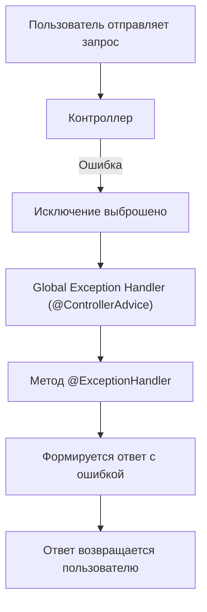

## 📋 Содержание
- [🚀 Введение](#-введение)
- [🛡️ Что такое Global Exception Handler?](#-что-такое-global-exception-handler)
- [🔧 Как работает @ControllerAdvice?](#-как-работает-controlleradvice)
- [📝 Пример реализации](#-пример-реализации)
- [📊 Схема обработки исключений](#-схема-обработки-исключений)
- [💡 Советы и типичные ошибки](#-советы-и-типичные-ошибки)
- [❓ Вопросы для самопроверки](#-вопросы-для-самопроверки)
- [🔗 Полезные ссылки](#-полезные-ссылки)

---

## 🚀 Введение
Глобальная обработка исключений — это способ централизованно обрабатывать ошибки, возникающие в контроллерах Spring-приложения. Это упрощает поддержку кода и делает обработку ошибок единообразной.

## 🛡️ Что такое Global Exception Handler?
Global Exception Handler — это специальный класс, который перехватывает и обрабатывает исключения, выбрасываемые любым контроллером в приложении.

## 🔧 Как работает @ControllerAdvice?
Аннотация `@ControllerAdvice` помечает класс как глобальный обработчик исключений. Внутри этого класса методы с аннотацией `@ExceptionHandler` определяют, как реагировать на разные типы ошибок.

## 📝 Пример реализации

```java
@ControllerAdvice
public class GlobalExceptionHandler {

    @ExceptionHandler(Exception.class)
    public ResponseEntity<String> handleAllExceptions(Exception ex) {
        return new ResponseEntity<>("Произошла ошибка: " + ex.getMessage(), HttpStatus.INTERNAL_SERVER_ERROR);
    }

    @ExceptionHandler(ResourceNotFoundException.class)
    public ResponseEntity<String> handleNotFound(ResourceNotFoundException ex) {
        return new ResponseEntity<>("Ресурс не найден: " + ex.getMessage(), HttpStatus.NOT_FOUND);
    }
}
```

## 📊 Схема обработки исключений



## 💡 Советы и типичные ошибки

- Не забывайте указывать конкретные типы исключений в `@ExceptionHandler`.
- Можно возвращать кастомные объекты с описанием ошибки, а не просто строку.
- Не используйте обработку Exception.class для всех ошибок — это затруднит отладку.

## ❓ Вопросы для самопроверки

- Для чего нужен @ControllerAdvice?
- Как связаны @ExceptionHandler и @ControllerAdvice?
- Как вернуть кастомный JSON-ответ при ошибке?

## 🔗 Полезные ссылки

- [Официальная документация Spring: @ControllerAdvice](https://docs.spring.io/spring-framework/docs/current/javadoc-api/org/springframework/web/bind/annotation/ControllerAdvice.html)
- [Spring Guides: Handling Form Submission](https://spring.io/guides/gs/handling-form-submission/)
