# Конфигурация Spring REST приложения без XML

## 📋 Содержание
- [Введение](#-введение)
- [Структура проекта](#-структура-проекта)
- [Шаг 1: Настройка зависимостей](#-шаг-1-настройка-зависимостей)
- [Шаг 2: Создание конфигурационного класса](#-шаг-2-создание-конфигурационного-класса)
- [Шаг 3: Настройка базы данных](#-шаг-3-настройка-базы-данных)
- [Шаг 4: Создание WebInitializer](#-шаг-4-создание-webinitializer)
- [Шаг 5: Создание простого REST контроллера](#-шаг-5-создание-простого-rest-контроллера)
- [Шаг 6: Тестирование приложения](#-шаг-6-тестирование-приложения)
- [Часто задаваемые вопросы](#-часто-задаваемые-вопросы)
- [Troubleshooting](#-troubleshooting)

## 🎯 Введение

### Что такое конфигурация без XML?

Раньше Spring Framework использовал XML файлы для конфигурации приложений. Это было неудобно, потому что:
- XML файлы были большими и сложными
- Нет проверки типов на этапе компиляции
- Сложно рефакторить код
- Меньше поддержки IDE

**Современный подход** - использовать Java-аннотации для конфигурации. Это дает:
- ✅ Проверку типов на этапе компиляции
- ✅ Лучшую поддержку IDE (автодополнение, рефакторинг)
- ✅ Более читаемый код
- ✅ Меньше файлов конфигурации

### Сравнение подходов конфигурации

| Аспект | XML конфигурация | Java аннотации |
|--------|------------------|----------------|
| **Читаемость** | ❌ Сложно читать | ✅ Понятный код |
| **Типобезопасность** | ❌ Нет проверки типов | ✅ Проверка на этапе компиляции |
| **Рефакторинг** | ❌ Сложно | ✅ Легко с IDE |
| **Размер** | ❌ Много файлов | ✅ Все в коде |
| **Поддержка IDE** | ❌ Ограниченная | ✅ Полная поддержка |

### Архитектура Spring REST приложения

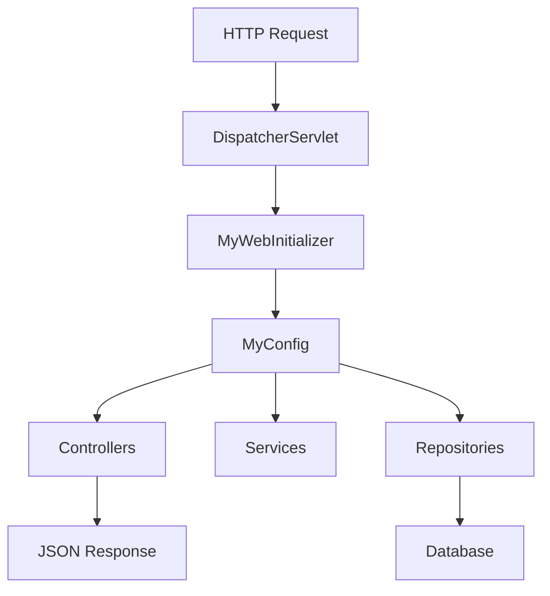

### Визуальное сравнение: XML vs Java конфигурация

**XML подход (старый):**
```xml
<!-- applicationContext.xml -->
<beans xmlns="http://www.springframework.org/schema/beans">
    <bean id="dataSource" class="com.mchange.v2.c3p0.ComboPooledDataSource">
        <property name="driverClass" value="org.postgresql.Driver"/>
        <property name="jdbcUrl" value="jdbc:postgresql://localhost:5432/my_db"/>
    </bean>
    
    <bean id="entityManagerFactory" class="org.springframework.orm.jpa.LocalContainerEntityManagerFactoryBean">
        <property name="dataSource" ref="dataSource"/>
    </bean>
</beans>

<!-- web.xml -->
<servlet>
    <servlet-name>dispatcher</servlet-name>
    <servlet-class>org.springframework.web.servlet.DispatcherServlet</servlet-class>
</servlet>
```

**Java подход (современный):**
```java
@Configuration
@EnableWebMvc
public class MyConfig {
    
    @Bean
    public DataSource dataSource() {
        // Конфигурация в коде
    }
    
    @Bean
    public EntityManagerFactory entityManagerFactory() {
        // Конфигурация в коде
    }
}
```

## 📁 Структура проекта

```
src/
├── main/
│   ├── java/
│   │   └── com/
│   │       └── safronov/
│   │           └── spring/
│   │               └── rest/
│   │                   ├── configuration/
│   │                   │   ├── MyConfig.java
│   │                   │   └── MyWebInitializer.java
│   │                   ├── controller/
│   │                   │   └── TestController.java
│   │                   ├── entity/
│   │                   │   └── Employee.java
│   │                   ├── service/
│   │                   │   └── EmployeeService.java
│   │                   └── repository/
│   │                       └── EmployeeRepository.java
│   └── webapp/
│       └── WEB-INF/
│           └── web.xml (опционально)
├── test/
│   └── java/
└── pom.xml
```

### Диаграмма пакетов

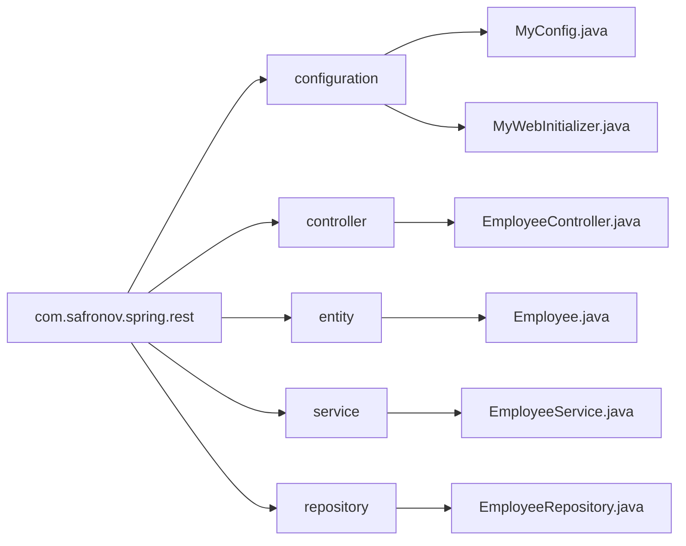

## 🔧 Шаг 1: Настройка зависимостей

### Maven зависимости

Добавьте следующие зависимости в ваш `pom.xml`:

```xml
<?xml version="1.0" encoding="UTF-8"?>
<project xmlns="http://maven.apache.org/POM/4.0.0"
         xmlns:xsi="http://www.w3.org/2001/XMLSchema-instance"
         xsi:schemaLocation="http://maven.apache.org/POM/4.0.0 
         http://maven.apache.org/xsd/maven-4.0.0.xsd">
    <modelVersion>4.0.0</modelVersion>

    <groupId>com.safronov</groupId>
    <artifactId>spring-rest</artifactId>
    <version>1.0-SNAPSHOT</version>
    <packaging>war</packaging>

    <properties>
        <maven.compiler.source>17</maven.compiler.source>
        <maven.compiler.target>17</maven.compiler.target>
        <spring.version>6.1.10</spring.version>
    </properties>

    <dependencies>
        <!-- Spring Web MVC -->
        <dependency>
            <groupId>org.springframework</groupId>
            <artifactId>spring-webmvc</artifactId>
            <version>${spring.version}</version>
        </dependency>
        
        <!-- Jakarta Servlet API -->
        <dependency>
            <groupId>jakarta.servlet</groupId>
            <artifactId>jakarta.servlet-api</artifactId>
            <version>6.0.0</version>
            <scope>provided</scope>
        </dependency>

        <!-- Hibernate ORM -->
        <dependency>
            <groupId>org.hibernate.orm</groupId>
            <artifactId>hibernate-core</artifactId>
            <version>6.5.2.Final</version>
        </dependency>
        
        <!-- PostgreSQL Driver -->
        <dependency>
            <groupId>org.postgresql</groupId>
            <artifactId>postgresql</artifactId>
            <version>42.7.2</version>
        </dependency>
        
        <!-- Connection Pool (C3P0) -->
        <dependency>
            <groupId>com.mchange</groupId>
            <artifactId>c3p0</artifactId>
            <version>0.10.1</version>
        </dependency>
        
        <!-- Spring ORM -->
        <dependency>
            <groupId>org.springframework</groupId>
            <artifactId>spring-orm</artifactId>
            <version>${spring.version}</version>
        </dependency>

        <!-- Spring Data JPA -->
        <dependency>
            <groupId>org.springframework.data</groupId>
            <artifactId>spring-data-jpa</artifactId>
            <version>3.2.10</version>
        </dependency>

        <!-- Lombok (упрощает написание кода) -->
        <dependency>
            <groupId>org.projectlombok</groupId>
            <artifactId>lombok</artifactId>
            <version>1.18.38</version>
            <scope>provided</scope>
        </dependency>

        <!-- Jackson (JSON обработка) -->
        <dependency>
            <groupId>com.fasterxml.jackson.core</groupId>
            <artifactId>jackson-databind</artifactId>
            <version>2.15.4</version>
        </dependency>

        <!-- Spring Test -->
        <dependency>
            <groupId>org.springframework</groupId>
            <artifactId>spring-test</artifactId>
            <version>${spring.version}</version>
            <scope>test</scope>
        </dependency>

        <!-- JUnit 5 -->
        <dependency>
            <groupId>org.junit.jupiter</groupId>
            <artifactId>junit-jupiter</artifactId>
            <version>5.10.2</version>
            <scope>test</scope>
        </dependency>
    </dependencies>

    <build>
        <finalName>spring-rest</finalName>
        <plugins>
            <plugin>
                <groupId>org.apache.maven.plugins</groupId>
                <artifactId>maven-war-plugin</artifactId>
                <version>3.4.0</version>
            </plugin>
            <plugin>
                <groupId>org.apache.maven.plugins</groupId>
                <artifactId>maven-compiler-plugin</artifactId>
                <version>3.12.1</version>
                <configuration>
                    <source>17</source>
                    <target>17</target>
                </configuration>
            </plugin>
        </plugins>
    </build>
</project>
```

### 📝 Объяснение зависимостей

| Зависимость | Назначение | Визуализация |
|-------------|------------|--------------|
| `spring-webmvc` | Основной модуль Spring MVC для веб-приложений | 🌐 Web Layer |
| `jakarta.servlet-api` | API для работы с сервлетами | 🔌 Servlet Container |
| `hibernate-core` | ORM фреймворк для работы с БД | 🗄️ Database Layer |
| `postgresql` | Драйвер для PostgreSQL | 🐘 Database Driver |
| `c3p0` | Пул соединений с БД | 🔄 Connection Pool |
| `spring-orm` | Интеграция Spring с ORM | 🔗 ORM Integration |
| `spring-data-jpa` | Упрощает работу с JPA | 📊 Data Access |
| `lombok` | Автоматически генерирует boilerplate код | ⚡ Code Generation |
| `jackson-databind` | Конвертация Java объектов ↔ JSON | 🔄 JSON Converter |

### Диаграмма зависимостей

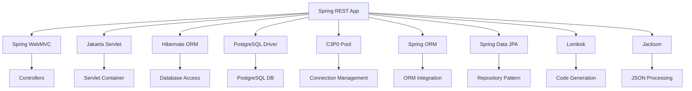

## ⚙️ Шаг 2: Создание конфигурационного класса

### Основной конфигурационный класс

```java
package com.safronov.spring.rest.configuration;

import com.mchange.v2.c3p0.ComboPooledDataSource;
import org.springframework.context.annotation.Bean;
import org.springframework.context.annotation.ComponentScan;
import org.springframework.context.annotation.Configuration;
import org.springframework.orm.jpa.JpaTransactionManager;
import org.springframework.orm.jpa.LocalContainerEntityManagerFactoryBean;
import org.springframework.orm.jpa.vendor.HibernateJpaVendorAdapter;
import org.springframework.transaction.annotation.EnableTransactionManagement;
import org.springframework.web.servlet.config.annotation.EnableWebMvc;
import org.springframework.web.servlet.config.annotation.WebMvcConfigurer;

import javax.sql.DataSource;
import java.beans.PropertyVetoException;
import java.util.Properties;

@Configuration
@ComponentScan(basePackages = "com.safronov.spring.rest")
@EnableWebMvc
@EnableTransactionManagement
public class MyConfig implements WebMvcConfigurer {

    // Конфигурация будет добавлена в следующих шагах
}
```

### 🔍 Детальное объяснение аннотаций

#### `@Configuration`
```java
@Configuration
public class MyConfig {
    // Этот класс содержит определения бинов Spring
}
```
- **Назначение**: Помечает класс как источник определений бинов
- **Аналог XML**: `<beans>` элемент
- **Что происходит**: Spring создает экземпляр этого класса и использует его методы для создания бинов

#### `@ComponentScan`
```java
@ComponentScan(basePackages = "com.safronov.spring.rest")
```
- **Назначение**: Указывает Spring сканировать пакеты для поиска компонентов
- **Аналог XML**: `<context:component-scan>`
- **Что ищет**: Классы с аннотациями `@Component`, `@Service`, `@Repository`, `@Controller`

#### `@EnableWebMvc`
```java
@EnableWebMvc
```
- **Назначение**: Включает поддержку Spring MVC
- **Аналог XML**: `<mvc:annotation-driven>`
- **Что регистрирует**:
  - `RequestMappingHandlerMapping` - обработка URL маппингов
  - `RequestMappingHandlerAdapter` - вызов методов контроллеров
  - `HttpMessageConverter` - конвертация JSON ↔ Java объекты
  - Поддержка `@RequestBody`, `@ResponseBody`, `@RestController`

#### `@EnableTransactionManagement`
```java
@EnableTransactionManagement
```
- **Назначение**: Включает поддержку транзакций
- **Аналог XML**: `<tx:annotation-driven>`
- **Что позволяет**: Использовать `@Transactional` для автоматического управления транзакциями

### Визуализация работы аннотаций

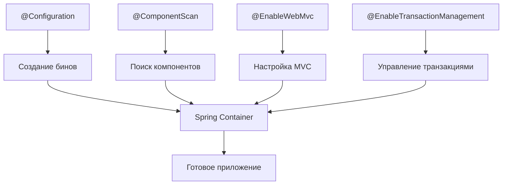

### Сравнение: XML vs Java конфигурация

| Функция | XML | Java аннотации |
|---------|-----|----------------|
| **Определение бинов** | `<bean id="..." class="...">` | `@Bean` методы |
| **Сканирование компонентов** | `<context:component-scan>` | `@ComponentScan` |
| **Включение MVC** | `<mvc:annotation-driven>` | `@EnableWebMvc` |
| **Транзакции** | `<tx:annotation-driven>` | `@EnableTransactionManagement` |

## 🗄️ Шаг 3: Настройка базы данных

### 3.1 Настройка DataSource

```java
@Bean
public DataSource dataSource() {
    ComboPooledDataSource dataSource = new ComboPooledDataSource();
    try {
        // Настройка драйвера БД
        dataSource.setDriverClass("org.postgresql.Driver");
        
        // URL подключения к БД
        dataSource.setJdbcUrl("jdbc:postgresql://localhost:5432/my_db?useSSL=false&serverTimezone=UTC");
        
        // Учетные данные
        dataSource.setUser("bestuser");
        dataSource.setPassword("bestuser");
        
        // Настройки пула соединений
        dataSource.setInitialPoolSize(5);
        dataSource.setMinPoolSize(5);
        dataSource.setMaxPoolSize(20);
        dataSource.setMaxIdleTime(3000);
        
    } catch (PropertyVetoException e) {
        throw new RuntimeException("Ошибка настройки DataSource", e);
    }
    return dataSource;
}
```

### 3.2 Настройка EntityManagerFactory

```java
@Bean
public LocalContainerEntityManagerFactoryBean entityManagerFactory() {
    LocalContainerEntityManagerFactoryBean em = new LocalContainerEntityManagerFactoryBean();
    
    // Указываем DataSource
    em.setDataSource(dataSource());
    
    // Пакет с Entity классами
    em.setPackagesToScan("com.safronov.spring.rest.entity");

    // Настройка Hibernate как JPA провайдера
    HibernateJpaVendorAdapter vendorAdapter = new HibernateJpaVendorAdapter();
    em.setJpaVendorAdapter(vendorAdapter);

    // Свойства Hibernate
    Properties properties = new Properties();
    properties.setProperty("hibernate.dialect", "org.hibernate.dialect.PostgreSQLDialect");
    properties.setProperty("hibernate.show_sql", "true");
    properties.setProperty("hibernate.format_sql", "true");
    properties.setProperty("hibernate.hbm2ddl.auto", "update");
    properties.setProperty("hibernate.connection.characterEncoding", "UTF-8");
    
    em.setJpaProperties(properties);

    return em;
}
```

### 3.3 Настройка TransactionManager

```java
@Bean
public JpaTransactionManager transactionManager() {
    JpaTransactionManager transactionManager = new JpaTransactionManager();
    transactionManager.setEntityManagerFactory(entityManagerFactory().getObject());
    return transactionManager;
}
```

### 📊 Схема работы с БД

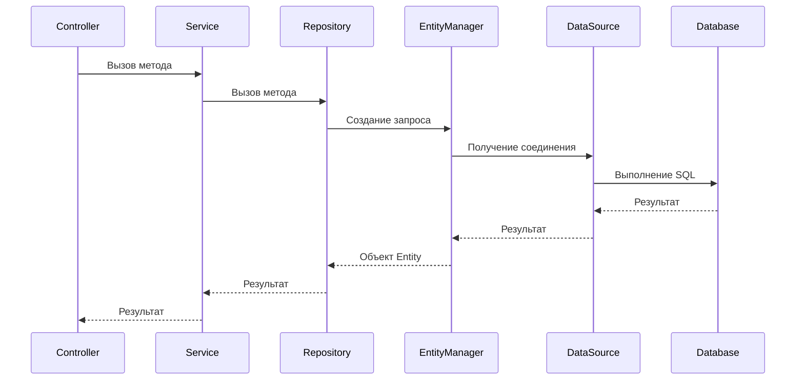

### Архитектура слоев приложения

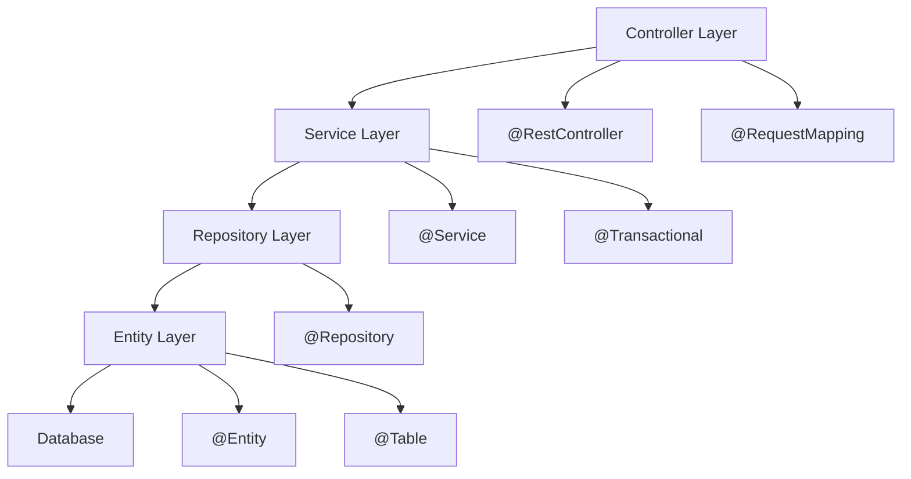

## 🌐 Шаг 4: Создание WebInitializer

### Замена web.xml на Java класс

```java
package com.safronov.spring.rest.configuration;

import org.springframework.web.servlet.support.AbstractAnnotationConfigDispatcherServletInitializer;

public class MyWebInitializer extends AbstractAnnotationConfigDispatcherServletInitializer {

    @Override
    protected Class<?>[] getRootConfigClasses() {
        return null; // Корневой контекст не используется
    }

    @Override
    protected Class<?>[] getServletConfigClasses() {
        return new Class[] {MyConfig.class}; // Указываем наш конфигурационный класс
    }

    @Override
    protected String[] getServletMappings() {
        return new String[] {"/"}; // Обрабатываем все URL
    }
}
```

### 🔄 Сравнение с web.xml

| web.xml | Java класс |
|---------|------------|
| ```xml<br><servlet><br>  <servlet-name>dispatcher</servlet-name><br>  <servlet-class>org.springframework.web.servlet.DispatcherServlet</servlet-class><br></servlet>``` | ```java<br>extends AbstractAnnotationConfigDispatcherServletInitializer``` |
| ```xml<br><servlet-mapping><br>  <servlet-name>dispatcher</servlet-name><br>  <url-pattern>/</url-pattern><br></servlet-mapping>``` | ```java<br>getServletMappings() { return new String[] {"/"}; }``` |

### Визуализация замены web.xml

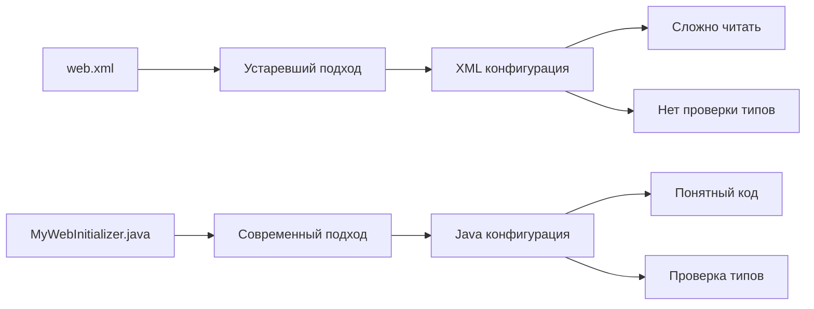

## 🎮 Шаг 5: Создание простого REST контроллера

### 5.1 Создание Entity

```java
package com.safronov.spring.rest.entity;

import jakarta.persistence.*;
import lombok.Data;
import lombok.NoArgsConstructor;
import lombok.AllArgsConstructor;

@Entity
@Table(name = "employees")
@Data
@NoArgsConstructor
@AllArgsConstructor
public class Employee {
    
    @Id
    @GeneratedValue(strategy = GenerationType.IDENTITY)
    private Long id;
    
    @Column(name = "name")
    private String name;
    
    @Column(name = "surname")
    private String surname;
    
    @Column(name = "department")
    private String department;
    
    @Column(name = "salary")
    private Integer salary;
}
```

### 5.2 Создание Repository

```java
package com.safronov.spring.rest.repository;

import com.safronov.spring.rest.entity.Employee;
import org.springframework.data.jpa.repository.JpaRepository;
import org.springframework.stereotype.Repository;

import java.util.List;

@Repository
public interface EmployeeRepository extends JpaRepository<Employee, Long> {
    
    List<Employee> findAllByName(String name);
    
    List<Employee> findAllBySalaryGreaterThan(Integer salary);
}
```

### 5.3 Создание Service

```java
package com.safronov.spring.rest.service;

import com.safronov.spring.rest.entity.Employee;
import com.safronov.spring.rest.repository.EmployeeRepository;
import org.springframework.beans.factory.annotation.Autowired;
import org.springframework.stereotype.Service;
import org.springframework.transaction.annotation.Transactional;

import java.util.List;

@Service
@Transactional
public class EmployeeService {
    
    @Autowired
    private EmployeeRepository employeeRepository;
    
    public List<Employee> getAllEmployees() {
        return employeeRepository.findAll();
    }
    
    public Employee getEmployee(Long id) {
        return employeeRepository.findById(id)
                .orElseThrow(() -> new RuntimeException("Employee not found"));
    }
    
    public Employee saveEmployee(Employee employee) {
        return employeeRepository.save(employee);
    }
    
    public void deleteEmployee(Long id) {
        employeeRepository.deleteById(id);
    }
}
```

### 5.4 Создание REST Controller

```java
package com.safronov.spring.rest.controller;

import com.safronov.spring.rest.entity.Employee;
import com.safronov.spring.rest.service.EmployeeService;
import org.springframework.beans.factory.annotation.Autowired;
import org.springframework.http.ResponseEntity;
import org.springframework.web.bind.annotation.*;

import java.util.List;

@RestController
@RequestMapping("/api/employees")
public class EmployeeController {
    
    @Autowired
    private EmployeeService employeeService;
    
    @GetMapping
    public List<Employee> getAllEmployees() {
        return employeeService.getAllEmployees();
    }
    
    @GetMapping("/{id}")
    public Employee getEmployee(@PathVariable Long id) {
        return employeeService.getEmployee(id);
    }
    
    @PostMapping
    public Employee createEmployee(@RequestBody Employee employee) {
        return employeeService.saveEmployee(employee);
    }
    
    @PutMapping("/{id}")
    public Employee updateEmployee(@PathVariable Long id, @RequestBody Employee employee) {
        employee.setId(id);
        return employeeService.saveEmployee(employee);
    }
    
    @DeleteMapping("/{id}")
    public ResponseEntity<?> deleteEmployee(@PathVariable Long id) {
        employeeService.deleteEmployee(id);
        return ResponseEntity.ok().build();
    }
    
    @GetMapping("/test")
    public String test() {
        return "Hello from Spring REST!";
    }
}
```

### Архитектура REST API

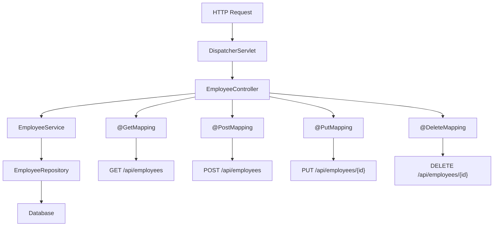

### Схема HTTP методов

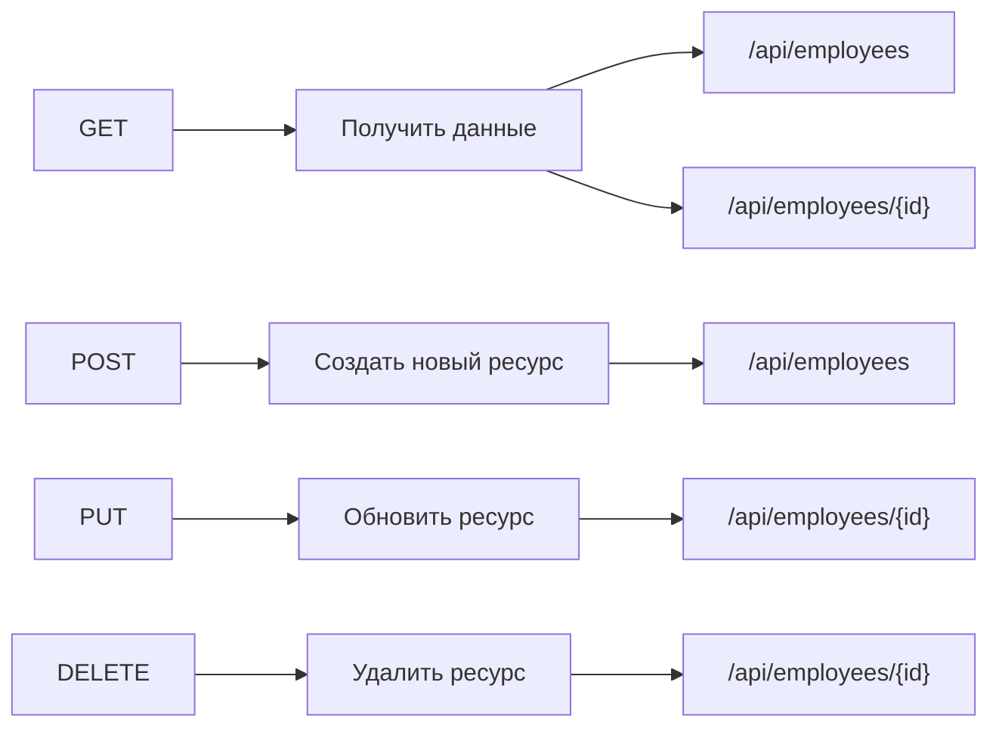

## 🧪 Шаг 6: Тестирование приложения

### 6.1 Создание тестового класса

```java
package com.safronov.spring.rest.controller;

import org.junit.jupiter.api.Test;
import org.springframework.beans.factory.annotation.Autowired;
import org.springframework.boot.test.autoconfigure.web.servlet.WebMvcTest;
import org.springframework.test.web.servlet.MockMvc;

import static org.springframework.test.web.servlet.request.MockMvcRequestBuilders.get;
import static org.springframework.test.web.servlet.result.MockMvcResultMatchers.content;
import static org.springframework.test.web.servlet.result.MockMvcResultMatchers.status;

@WebMvcTest(EmployeeController.class)
public class EmployeeControllerTest {
    
    @Autowired
    private MockMvc mockMvc;
    
    @Test
    public void testEndpoint() throws Exception {
        mockMvc.perform(get("/api/employees/test"))
                .andExpect(status().isOk())
                .andExpect(content().string("Hello from Spring REST!"));
    }
}
```

### 6.2 Ручное тестирование с помощью cURL

```bash
# Тест базового endpoint
curl http://localhost:8080/spring-rest/api/employees/test

# Получить всех сотрудников
curl http://localhost:8080/spring-rest/api/employees

# Создать нового сотрудника
curl -X POST http://localhost:8080/spring-rest/api/employees \
  -H "Content-Type: application/json" \
  -d '{"name":"John","surname":"Doe","department":"IT","salary":50000}'

# Получить сотрудника по ID
curl http://localhost:8080/spring-rest/api/employees/1

# Обновить сотрудника
curl -X PUT http://localhost:8080/spring-rest/api/employees/1 \
  -H "Content-Type: application/json" \
  -d '{"name":"John","surname":"Smith","department":"IT","salary":55000}'

# Удалить сотрудника
curl -X DELETE http://localhost:8080/spring-rest/api/employees/1
```

### 6.3 Тестирование с помощью Postman

1. **GET** `http://localhost:8080/spring-rest/api/employees/test`
2. **GET** `http://localhost:8080/spring-rest/api/employees`
3. **POST** `http://localhost:8080/spring-rest/api/employees`
   ```json
   {
     "name": "John",
     "surname": "Doe",
     "department": "IT",
     "salary": 50000
   }
   ```

### Схема тестирования

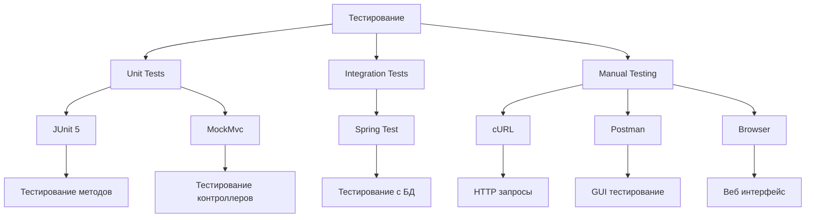

## ❓ Часто задаваемые вопросы

### Q: Зачем нужен `@EnableWebMvc`?
**A**: Эта аннотация автоматически настраивает все необходимые компоненты Spring MVC:
- Регистрирует обработчики запросов
- Настраивает JSON конвертеры
- Включает поддержку аннотаций `@RestController`, `@RequestMapping`

### Q: Что такое `@ComponentScan`?
**A**: Указывает Spring сканировать указанные пакеты для поиска компонентов:
- `@Component` - базовые компоненты
- `@Service` - сервисные классы
- `@Repository` - классы доступа к данным
- `@Controller` - контроллеры

### Q: Зачем нужен `@EnableTransactionManagement`?
**A**: Включает поддержку транзакций, позволяя использовать `@Transactional` для автоматического управления транзакциями БД.

### Q: Что такое `AbstractAnnotationConfigDispatcherServletInitializer`?
**A**: Базовый класс для замены `web.xml`. Автоматически регистрирует `DispatcherServlet` и настраивает его.

## 🔧 Troubleshooting

### Проблема: "No qualifying bean of type"
```
Error: No qualifying bean of type 'com.safronov.spring.rest.service.EmployeeService' available
```
**Решение**: Убедитесь, что класс помечен аннотацией `@Service` и находится в пакете, указанном в `@ComponentScan`.

### Проблема: "Could not autowire"
```
Error: Could not autowire. No beans of 'EmployeeRepository' type found.
```
**Решение**: Убедитесь, что интерфейс помечен аннотацией `@Repository`.

### Проблема: "Database connection failed"
```
Error: Connection to localhost:5432 refused
```
**Решение**: 
1. Проверьте, что PostgreSQL запущен
2. Убедитесь, что БД `my_db` существует
3. Проверьте учетные данные в `dataSource()`

### Проблема: "404 Not Found"
```
Error: 404 - The requested resource is not available
```
**Решение**:
1. Проверьте URL маппинг в контроллере
2. Убедитесь, что приложение развернуто правильно
3. Проверьте логи сервера

### Проблема: "JSON parsing error"
```
Error: JSON parse error: Cannot deserialize
```
**Решение**:
1. Проверьте структуру JSON
2. Убедитесь, что поля JSON соответствуют полям Entity
3. Проверьте, что Jackson зависимость добавлена

### Диаграмма диагностики проблем

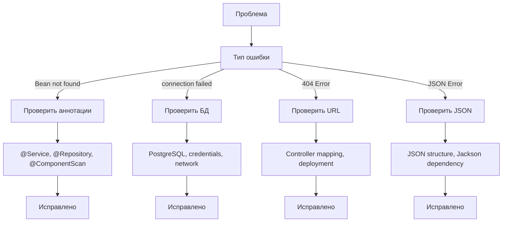

## 📚 Дополнительные ресурсы

- [Spring Framework Documentation](https://spring.io/projects/spring-framework)
- [Spring Boot Reference](https://docs.spring.io/spring-boot/docs/current/reference/html/)
- [Hibernate User Guide](https://hibernate.org/orm/documentation/)
- [PostgreSQL Documentation](https://www.postgresql.org/docs/)

## 🎯 Заключение

Теперь у вас есть полностью настроенное Spring REST приложение без XML конфигурации. Основные преимущества такого подхода:

✅ **Типобезопасность** - проверка на этапе компиляции  
✅ **Лучшая поддержка IDE** - автодополнение, рефакторинг  
✅ **Читаемость кода** - все в одном месте  
✅ **Меньше файлов** - нет XML конфигурации  

### Схема итоговой архитектуры

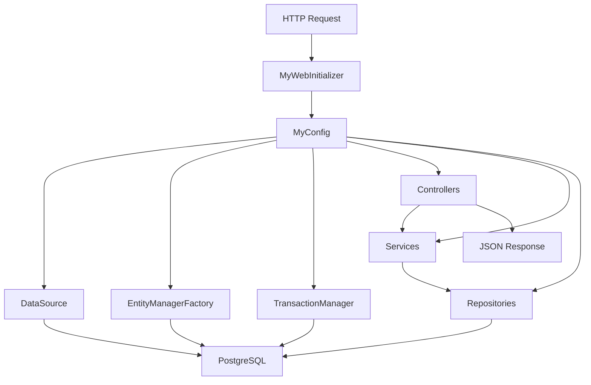

### Следующие шаги для развития:
1. Добавьте валидацию данных
2. Настройте обработку ошибок
3. Добавьте логирование
4. Настройте CORS для фронтенда
5. Добавьте аутентификацию и авторизацию 