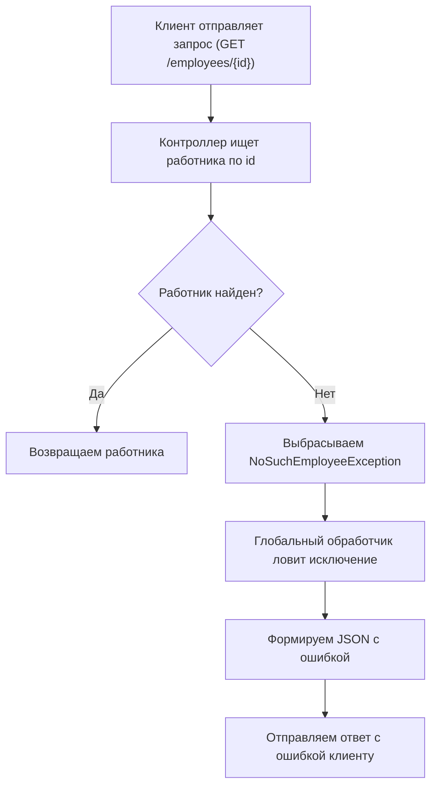

## 📋 Содержание
- [🚨 Введение в обработку исключений в Spring REST](#-введение-в-обработку-исключений-в-spring-rest)
- [🛠️ Создание пользовательского исключения](#-создание-пользовательского-исключения)
- [📦 Класс для передачи информации об ошибке](#-класс-для-передачи-информации-об-ошибке)
- [🎯 Обработка исключений в контроллере](#-обработка-исключений-в-контроллере)
- [🔄 Пример выбрасывания исключения в контроллере](#-пример-выбрасывания-исключения-в-контроллере)
- [🌐 Глобальный обработчик исключений](#-глобальный-обработчик-исключений)
- [🧩 Визуализация процесса обработки исключений](#-визуализация-процесса-обработки-исключений)
- [📝 Практический пример: пошагово](#-практический-пример-пошагово)
- [❗ Возможные ошибки и их обработка](#-возможные-ошибки-и-их-обработка)
- [💡 Рекомендации и доработки](#-рекомендации-и-доработки)

---

## 🚨 Введение в обработку исключений в Spring REST

Обработка исключений — важная часть любого REST API. Она позволяет возвращать понятные сообщения об ошибках клиенту, а не просто stacktrace или стандартные ошибки сервера.

**Зачем это нужно новичку?**
- Упрощает отладку и интеграцию с фронтендом.
- Позволяет централизованно управлять ошибками.
- Делает API предсказуемым и удобным.

---

## 🛠️ Создание пользовательского исключения

Создаём собственное исключение, чтобы явно сигнализировать о специфических ошибках (например, "Работник не найден").

```java
package com.safronov.spring.rest.exeption_handling;

public class NoSuchEmployeeExtension extends RuntimeException {
    public NoSuchEmployeeException(String message) {
        super(message);
    }
}
```
---

## 📦 Класс для передачи информации об ошибке

Этот класс нужен, чтобы возвращать структурированный JSON с описанием ошибки.

```java
package com.safronov.spring.rest.exeption_handling;

public class EmployeeIncorrectData {
    private String info;

    public EmployeeIncorrectData() {}

    public String getInfo() { return info; }
    public void setInfo(String info) { this.info = info; }
}
```

---

## 🎯 Обработка исключений в контроллере

Добавляем методы, которые будут перехватывать исключения и возвращать корректный ответ клиенту.

```java
@ExceptionHandler
public ResponseEntity<EmployeeIncorrectData> handleNoSuchEmployeeException(NoSuchEmployeeException e) {
    EmployeeIncorrectData data = new EmployeeIncorrectData();
    data.setInfo(e.getMessage());
    return new ResponseEntity<>(data, HttpStatus.NOT_FOUND);
}
```

```java
@ExceptionHandler
public ResponseEntity<EmployeeIncorrectData> handleOtherExceptions(Exception e) {
    EmployeeIncorrectData data = new EmployeeIncorrectData();
    data.setInfo(e.getMessage());
    return new ResponseEntity<>(data, HttpStatus.BAD_REQUEST);
}
```

---

## 🔄 Пример выбрасывания исключения в контроллере

```java
@GetMapping("employees/{id}")
public Employee getEmployeeById(@PathVariable("id") int id) {
    Employee employee = employeeService.getEmployeeById(id);
    if (employee == null) {
        throw new NoSuchEmployeeException(String.format("Работника с id = '%d' нет в БД", id));
    }
    return employee;
}
```

---

## 🌐 Глобальный обработчик исключений

Лучше вынести обработку ошибок в отдельный класс с аннотацией `@ControllerAdvice` — это позволит централизованно обрабатывать ошибки для всех контроллеров.

```java
@ControllerAdvice
public class GlobalExceptionHandler {

    @ExceptionHandler
    public ResponseEntity<EmployeeIncorrectData> handleNoSuchEmployeeException(NoSuchEmployeeException e) {
        EmployeeIncorrectData data = new EmployeeIncorrectData();
        data.setInfo(e.getMessage());
        return new ResponseEntity<>(data, HttpStatus.NOT_FOUND);
    }

    @ExceptionHandler
    public ResponseEntity<EmployeeIncorrectData> handleOtherExceptions(Exception e) {
        EmployeeIncorrectData data = new EmployeeIncorrectData();
        data.setInfo(e.getMessage());
        return new ResponseEntity<>(data, HttpStatus.BAD_REQUEST);
    }
}
```

---

## 🧩 Визуализация процесса обработки исключений



---

## 📝 Практический пример: пошагово

1. **Клиент** отправляет запрос: `GET /employees/123`
2. **Контроллер** ищет работника с id=123
3. Если работник не найден — выбрасывается `NoSuchEmployeeException`
4. **Глобальный обработчик** ловит исключение и формирует JSON:
   ```json
   {
     "info": "Работника с id = '123' нет в БД"
   }
   ```
5. Клиент получает понятный ответ с ошибкой и статусом 404

---

## ❗ Возможные ошибки и их обработка

- **Неверный тип id** (например, строка вместо числа): обработается вторым `@ExceptionHandler`, клиент получит ошибку с описанием.
- **Работник не найден**: обработается первым `@ExceptionHandler`, клиент получит понятное сообщение.

---
