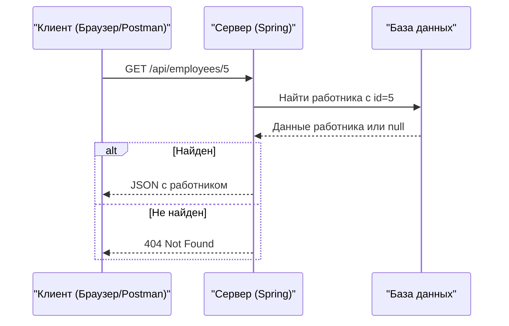

# Получение одного работника по ID через REST API

## 📋 Содержание
- [📝 Введение](#-введение)
- [🔍 Как работает получение работника по ID](#-как-работает-получение-работника-по-id)
- [🛠 Пример кода контроллера](#-пример-кода-контроллера)
- [📦 Пример ответа сервера (JSON)](#-пример-ответа-сервера-json)
- [🔗 Визуальная схема процесса (Mermaid)](#-визуальная-схема-процесса-mermaid)
- [❓ Частые вопросы и ошибки](#-частые-вопросы-и-ошибки)
- [📚 Полезные ссылки](#-полезные-ссылки)

---

## 📝 Введение

В этом материале разберём, как получить информацию об одном работнике по его ID с помощью Spring REST API. Всё объясняется максимально просто, с примерами и схемами.

---

## 🔍 Как работает получение работника по ID

1. **Клиент** (браузер, Postman) отправляет GET-запрос на сервер по адресу `/api/employees/{id}` (например, `/api/employees/5`).
2. **Сервер** принимает запрос, извлекает ID из URL и ищет работника с этим ID.
3. Если работник найден — возвращается его информация в формате JSON. Если нет — возвращается ошибка (например, 404).

---

## 🛠 Пример кода контроллера

```java
@RestController
@RequestMapping("/api")
public class EmployeeController {
    @GetMapping("/employees/{id}")
    public Employee getEmployeeById(@PathVariable("id") int id) {
        return employeeService.getEmployeeById(id);
    }
}
```

**Пояснения:**
- `@GetMapping("/employees/{id}")` — метод обрабатывает запросы вида `/api/employees/5`
- `@PathVariable("id")` — извлекает значение ID из URL
- `employeeService.getEmployeeById(id)` — ищет работника по ID

---

## 📦 Пример ответа сервера (JSON)

```json
{
  "id": 5,
  "name": "Анна Смирнова",
  "position": "HR-менеджер"
}
```

---

## 🔗 Визуальная схема процесса (Mermaid)



---

## ❓ Частые вопросы и ошибки

- **Ошибка 404:** Работник с таким ID не найден. Проверь, что ID существует в базе.
- **Ошибка 500:** Проблема в сервисе или контроллере. Проверь логи.
- **Неправильный путь:** Убедись, что URL запроса совпадает с аннотацией в контроллере.

---

## 📚 Полезные ссылки
- [Документация Spring @PathVariable](https://docs.spring.io/spring-framework/docs/current/javadoc-api/org/springframework/web/bind/annotation/PathVariable.html)
- [Spring Guides: Building a RESTful Web Service](https://spring.io/guides/gs/rest-service/)

---

> **Что доработать:**
> - Добавить пример обработки случая, когда работник не найден (возврат 404)
> - Привести пример класса Employee
> - Показать, как подключить сервис и репозиторий
> - Добавить раздел по тестированию этого метода


