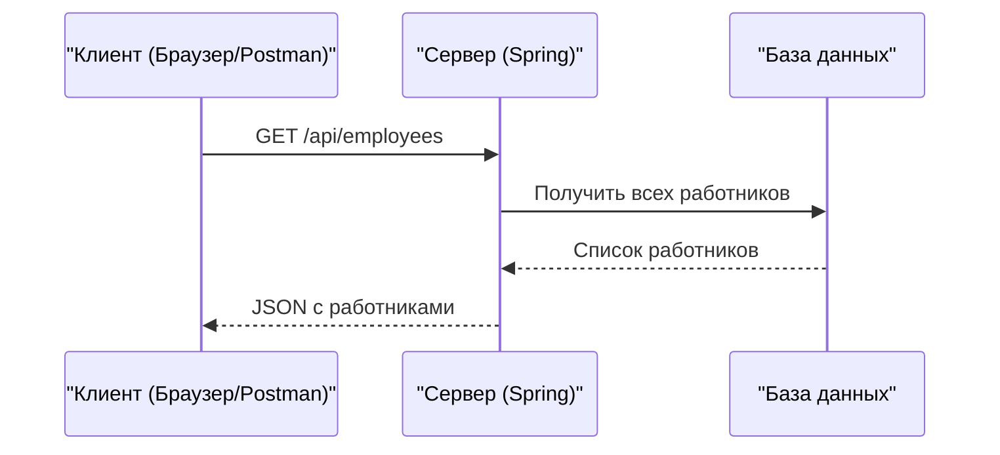

# Получение списка всех работников через REST API

## 📋 Содержание
- [📝 Введение](#-введение)
- [🔍 Что такое @RestController?](#-что-такое-restcontroller)
- [⚙️ Как работает процесс получения списка работников](#️-как-работает-процесс-получения-списка-работников)
- [🛠 Пример кода контроллера](#-пример-кода-контроллера)
- [📦 Пример ответа сервера (JSON)](#-пример-ответа-сервера-json)
- [🔗 Визуальная схема процесса (Mermaid)](#-визуальная-схема-процесса-mermaid)
- [❓ Частые вопросы и ошибки](#-частые-вопросы-и-ошибки)
- [📚 Полезные ссылки](#-полезные-ссылки)

---

## 📝 Введение

В этом материале разберём, как с помощью Spring REST API получить список всех работников с сервера. Материал рассчитан на новичков и содержит пошаговые инструкции, примеры и схемы.

---

## 🔍 Что такое @RestController?

`@RestController` — это специальная аннотация Spring, которая делает класс контроллером для обработки REST-запросов. Такой контроллер возвращает данные (например, JSON), а не HTML-страницы.

**Просто:**
- Обычный контроллер = страницы
- REST-контроллер = данные (JSON, XML)

---

## ⚙️ Как работает процесс получения списка работников

1. **Клиент** (например, браузер или Postman) отправляет GET-запрос на сервер по адресу `/api/employees`.
2. **Сервер** (Spring-приложение) принимает запрос и вызывает соответствующий метод контроллера.
3. Контроллер возвращает список работников в формате JSON.
4. Клиент получает и отображает этот список.

---

## 🛠 Пример кода контроллера

```java
@RestController
@RequestMapping("/api")
public class EmployeeController {
    @GetMapping("/employees")
    public List<Employee> getAllEmployees() {
        // Здесь обычно обращение к сервису или базе данных
        return employeeService.findAll();
    }
}
```

**Пояснения:**
- `@RestController` — помечает класс как REST-контроллер
- `@RequestMapping("/api")` — базовый путь для всех методов
- `@GetMapping("/employees")` — метод обрабатывает GET-запросы по адресу `/api/employees`
- `employeeService.findAll()` — получение списка работников (логика может отличаться)

---

## 📦 Пример ответа сервера (JSON)

```json
[
  {
    "id": 1,
    "name": "Иван Иванов",
    "position": "Разработчик"
  },
  {
    "id": 2,
    "name": "Петр Петров",
    "position": "Тестировщик"
  }
]
```

---

## 🔗 Визуальная схема процесса (Mermaid)



---

## ❓ Частые вопросы и ошибки

- **Ошибка 404:** Проверь, что путь в аннотации совпадает с URL запроса.
- **Ошибка 500:** Проверь, что сервис и база данных работают корректно.
- **Пустой список:** Убедись, что в базе есть данные.
- **CORS:** Если делаешь запрос с другого домена, настрой CORS.

---

## 📚 Полезные ссылки
- [Документация Spring @RestController](https://docs.spring.io/spring-framework/docs/current/javadoc-api/org/springframework/web/bind/annotation/RestController.html)
- [Spring Guides: Building a RESTful Web Service](https://spring.io/guides/gs/rest-service/)

---

> **Что доработать:**
> - Добавить больше примеров запросов (curl, Postman)
> - Привести пример класса Employee
> - Показать, как подключить сервис и репозиторий
> - Добавить раздел по тестированию REST-контроллеров